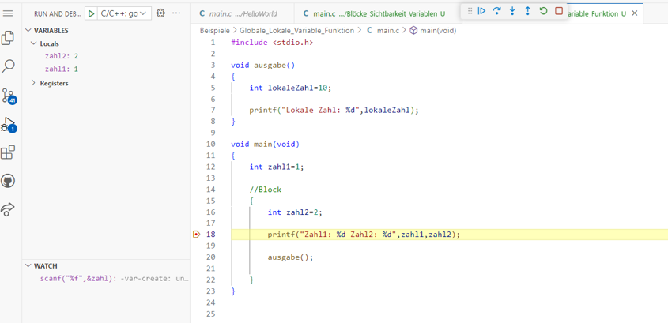
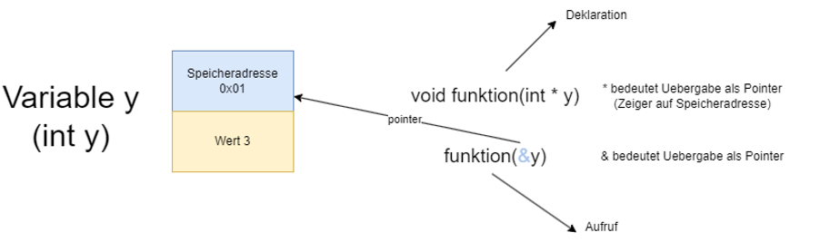
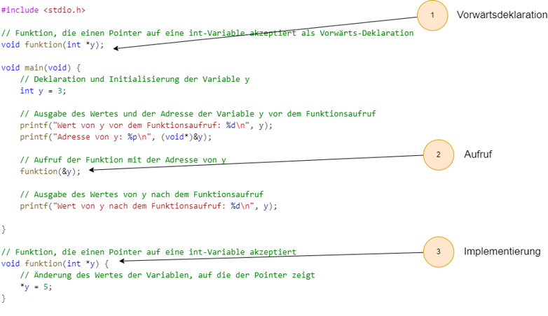

|                             |                          |                               |
| --------------------------- | ------------------------ | ----------------------------- |
| **Elektrotechniker/-in HF** | **Programmiertechnik B** |  |

- [1. Blöcke](#1-blöcke)
  - [1.1. Einleitung](#11-einleitung)
  - [1.2. Schachtelung von Codeblöcken in C](#12-schachtelung-von-codeblöcken-in-c)
  - [1.3. Sichtbarkeit in Block](#13-sichtbarkeit-in-block)
  - [1.4. Sichtbarkeit lokal und global](#14-sichtbarkeit-lokal-und-global)
- [2. Funktionen](#2-funktionen)
  - [2.1. Warum Funktionen?](#21-warum-funktionen)
  - [2.2. Funktionsdefinition](#22-funktionsdefinition)
  - [2.3. Beispiel – Funktion mit Rückgabewert](#23-beispiel--funktion-mit-rückgabewert)
  - [2.4. Funktionsdeklaration (Prototyp)](#24-funktionsdeklaration-prototyp)
  - [2.5. Funktionsaufruf](#25-funktionsaufruf)
  - [2.6. Rückgabewert einer Funktion](#26-rückgabewert-einer-funktion)
  - [2.7. Funktionen ohne Rückgabewert (`void` Funktionen)](#27-funktionen-ohne-rückgabewert-void-funktionen)
  - [2.8. Übergabe von Parametern an Funktionen](#28-übergabe-von-parametern-an-funktionen)
    - [2.8.1. Definition von call-by-value](#281-definition-von-call-by-value)
    - [2.8.2. Definition von call-by-pointer](#282-definition-von-call-by-pointer)
  - [2.9. Vergleich: Value vs. Pointer](#29-vergleich-value-vs-pointer)
  - [2.10. Praxisbeispiel – Zwei Rückgabewerte via Pointer](#210-praxisbeispiel--zwei-rückgabewerte-via-pointer)
  - [2.11. Variablenbereich (Scope)](#211-variablenbereich-scope)
    - [2.11.1. Lokale Variablen](#2111-lokale-variablen)
    - [2.11.2. Globale Variablen](#2112-globale-variablen)
  - [2.12. Vorwärtsdeklarationen von Funktionen (Function Prototype)](#212-vorwärtsdeklarationen-von-funktionen-function-prototype)
- [3. Standardbibliotheken und Funktionen](#3-standardbibliotheken-und-funktionen)
  - [3.1. Wichtige Bibliotheken im Überblick](#31-wichtige-bibliotheken-im-überblick)
  - [3.2. Praxisbeispiel mit mehreren Bibliotheken](#32-praxisbeispiel-mit-mehreren-bibliotheken)
- [4. Aufgaben](#4-aufgaben)
  - [4.1. Sichtbarkeit von lokalen Variablen (Blocks)](#41-sichtbarkeit-von-lokalen-variablen-blocks)
  - [4.2. Sololearn Funktionen und Zeiger](#42-sololearn-funktionen-und-zeiger)
  - [4.3. Erste eigene Funktion](#43-erste-eigene-funktion)
  - [4.4. Temperaturumrechnung](#44-temperaturumrechnung)
  - [4.5. Swap-Funktion](#45-swap-funktion)
  - [4.6. Einfacher Taschenrechner in C programmieren](#46-einfacher-taschenrechner-in-c-programmieren)

---

</br>

# 1. Blöcke

## 1.1. Einleitung

- Ein Block stellt eine beliebige Folge von Anweisungen dar.
- Diese Folge von Anweisungen wird sequenziell im Programmcode ausgeführt.

```c
{
  Anweisung1; 
  Anweisung2;
}
```

## 1.2. Schachtelung von Codeblöcken in C

- Die Schachtelung von **Codeblöcken** in C ermöglicht eine detailliertere Steuerung des Programmablaufs.
- Sie ist besonders wichtig, um die Logik eines Programms klar zu strukturieren.
- **Schachtelung** bedeutet, dass Codeblöcke innerhalb anderer Codeblöcke enthalten sind.
- Zu den wichtigsten Mechanismen gehören:
  - Bedingte Anweisungen (if, else, else if)
  - Schleifen (for, while, do-while)
  - Funktionen

```c
#include <stdio.h>

int myFunc()
{
  return 0;
}

void myFunc2()
{

}

int main(void)
{
  int zahl1 = 1;

  // Block
  {
    int zahl2 = 2;
    printf("Zahl1: %d Zahl2: %d", zahl1, zahl2);
  }

  return 0;
}

```

## 1.3. Sichtbarkeit in Block

- Ein Variable welche innerhalb eines Blockes definiert wurde ist nur sichtbar
- Ein Variable ausserhalb des Blockes ist auch innerhalb des Blockes sichtbar

```c
int main(void)
{
  int zahl1 = 1;

  // Block
  {
    int zahl2 = 2;
    printf("Zahl1: %d Zahl2: %d", zahl1, zahl2);
  }

  zahl2 = 0;  // Fehler, Variable steht nicht mehr im Zugriff

  return 0;
}
```

```c
#include <stdio.h>

int main(void)
{
  int zahl1=1;

  //Block
  {
     int zahl2=2;
     printf("Zahl1: %d Zahl2: %d",zahl1,zahl2);  // Zugriff auf lokale Variable zahl2 funktioniert
  }

  return 0;
}
```

## 1.4. Sichtbarkeit lokal und global

- Eine lokale Variable einer Funktion lebt nur so lange wie die Funktion läuft
- Eine globale Variable ist verfügbar und läuft so lange wie das Programm läuft. (ist aber nicht sichtbar in der Funktion)



Beispiel:

```c
#include <stdio.h>

void ausgabe(void)
{
  int lokaleZahl = 10;

  printf("Lokale Zahl ist: %d", lokaleZahl);
}

int main(void)
{
  int zahl1 = 1;

  {
    int zahl2 = 2;

    printf("Zahl1: %d, Zahl2: %d", zahl1, zahl2);
  }

  return 0;
}
```

---

</br>

# 2. Funktionen

## 2.1. Warum Funktionen?

Stell dir vor, du schreibst ein Programm, das dreimal denselben Berechnungsblock benötigt. Copy-Paste funktioniert – aber was passiert, wenn du einen Fehler findest? Du musst ihn dreimal korrigieren.
**Funktionen** sind ein zentraler Bestandteil der C-Programmierung, da sie es ermöglichen, Code zu **modularisieren** und zu **strukturieren**.

- **Wiederverwendbarkeit** – einmal schreiben, beliebig oft aufrufen Lesbarkeit – `berechneFlaeche(5, 3)` ist selbsterklärender als 15 Zeilen Code
**Wartbarkeit** – Änderungen an einer Stelle wirken überall
**Testbarkeit** – einzelne Funktionen lassen sich isoliert prüfen
- Eine **Funktion** hat immer einen **Rückgabetyp**, einen **Namen** und ggf. **Parameter**.
- **Funktionen** können Parameter nach **Wert** oder nach **Referenz** übergeben (mit Zeigern).
- Rekursive **Funktionen** rufen sich selbst auf und lösen wiederkehrende Probleme.

> **Merksatz**: Eine Funktion sollte genau eine Aufgabe erledigen (Single Responsibility Principle). Wenn du den Funktionsnamen nicht in einem Satz beschreiben kannst, ist sie zu gross.

## 2.2. Funktionsdefinition

- Eine Funktion wird durch ihre **Signatur** und **Implementierung** definiert.
- Die Signatur umfasst den **Rückgabetyp** der Funktion, ihren **Namen** und die **Parameter** (Eingabewerte).

**Syntax der Funktionsdefinition:**

```c
Rückgabetyp Funktionsname(Parameter1, Parameter2, ...) {
    // Funktionskörper
}
```

- **Rückgabetyp:**
  - Gibt an, welchen Typ von Wert die Funktion zurückgibt (z. B. `int`, `float`, `void` für keine Rückgabe).
- **Funktionsname:**
  - Der Name der Funktion, der verwendet wird, um sie aufzurufen.
- **Parameter:**
  - Die Werte, die an die Funktion übergeben werden (optional).

## 2.3. Beispiel – Funktion mit Rückgabewert

```c
#include <stdio.h>

// Funktionsdefinition
int addiere(int a, int b) {
    int summe = a + b;
    return summe;
}

int main(void) {
    int ergebnis = addiere(3, 7);   // Funktionsaufruf
    printf("Ergebnis: %d\n", ergebnis);
    return 0;
}
```

## 2.4. Funktionsdeklaration (Prototyp)

- Bevor eine **Funktion** verwendet wird, muss sie entweder definiert oder ihr Prototyp deklariert werden.
- Der Funktionsprototyp wird häufig am Anfang einer Datei oder in einer Header-Datei (`.h`) platziert.

**Syntax des Funktionsprototyps:**

```c
Rückgabetyp Funktionsname(Parameter1, Parameter2, ...);
```

- Ein Funktionsprototyp gibt an, welche Parameter die Funktion erwartet und welchen Rückgabetyp sie hat.
- Es ist nicht notwendig, den Funktionskörper zu definieren.

**Beispiel eines Prototyps:**

```c
int addiere(int a, int b);
```

## 2.5. Funktionsaufruf

- Ein Funktionsaufruf erfolgt durch den Funktionsnamen und Übergabe der Argumente (falls vorhanden).

**Syntax des Funktionsaufrufs:**

```c
Funktionsname(Argument1, Argument2, ...);
```

**Beispiel eines Funktionsaufrufs:**

```c
int ergebnis = addiere(5, 3);
```

## 2.6. Rückgabewert einer Funktion

- Eine Funktion kann einen Wert zurückgeben, der an den Funktionsaufrufer übergeben wird.
- Der Rückgabewert wird durch das Schlüsselwort `return` angegeben.

**Syntax:**

```c
return Wert;
```

Der Rückgabetyp der Funktion muss mit dem Datentyp des Wertes übereinstimmen.

**Beispiel:**

```c
int addiere(int a, int b) {
    return a + b;  // Gibt die Summe von a und b zurück
}
```

## 2.7. Funktionen ohne Rückgabewert (`void` Funktionen)

- Wenn eine Funktion keinen Wert zurückgeben soll, wird der Rückgabetyp mit `void` angegeben.
- Diese Funktionen werden oft verwendet, um eine Aufgabe auszuführen, ohne etwas zurückzugeben.

**Beispiel:**

```c
void druckeGruss() {
    printf("Hallo, Welt!\n");
}
```

**Aufruf:**

```c
druckeGruss();  // Ruft die Funktion auf, die nichts zurückgibt
```

## 2.8. Übergabe von Parametern an Funktionen

In C gibt es zwei Hauptmethoden, um Parameter an eine Funktion zu übergeben: **Pass-by-Value** und **Pass-by-Reference**.

### 2.8.1. Definition von call-by-value

- **call-by-value** ist ein Übergabemechanismus von Parametern in Funktionen oder Methoden, bei dem der Wert der Argumente **kopiert** und in die aufrufende Funktion eingefügt wird.
- Dies bedeutet, dass Änderungen an den Parametern innerhalb der Funktion die ursprünglichen Variablen ausserhalb der Funktion **nicht** beeinflussen.

```c
#include <stdio.h>

void verdopple(int x) {
    x = x * 2;   // ändert nur die lokale Kopie!
    printf("In der Funktion: x = %d\n", x);
}

int main(void) {
    int zahl = 10;
    verdopple(zahl);
    printf("Nach dem Aufruf: zahl = %d\n", zahl);  // immer noch 10
    return 0;
}
```

> **Analogie**: Du gibst jemandem eine Fotokopie deines Dokuments. Was er damit macht, beeinflusst dein Original nicht.

### 2.8.2. Definition von call-by-pointer

- Bei **call-by-pointer** wird im Gegensatz zum **call-by-value** die **Adresse** einer Variablen übergeben.
- Dies ermöglicht es der aufgerufenen Funktion oder Methode, direkt auf die übergebene Variable zuzugreifen und ihre Werte zu modifizieren.
- Folglich sind alle Änderungen an der Variable in der Funktion auch ausserhalb dieser sichtbar.

> **C hat keine Referenzen - Eine Parameterübergabe und gleichzeitige Verwendung von einer Variablen in einer Funktion ist bei C nur über einen Pointer möglich**



```c
#include <stdio.h>

void verdopple(int *x) {      // x ist ein Zeiger auf int
    *x = *x * 2;             // *x dereferenziert den Zeiger → Originalwert ändern
    printf("In der Funktion: *x = %d\n", *x);
}

int main(void) {
    int zahl = 10;
    verdopple(&zahl);         // &zahl = Adresse von zahl
    printf("Nach dem Aufruf: zahl = %d\n", zahl);  // jetzt 20!
    return 0;
}
```

> **Analogie**: Du gibst jemandem deine Wohnungsadresse. Er kann direkt in deine Wohnung gehen und Dinge verändern.

## 2.9. Vergleich: Value vs. Pointer

| **Eigenschaft**                | **Call by Value**               | **Call by Pointer**                 |
| ------------------------------ | ------------------------------- | ----------------------------------- |
| **Originaldaten veränderbar?** | Nein                            | Ja                                  |
| **Syntax beim Aufruf**         | `funktion(zahl)`                | `funktion(&zahl)`                   |
| **Syntax im Parameter**        | `int x`                         | `int *x`                            |
| **Syntax beim Zugriff**        | `x`                             | `*x`                                |
| **Typischer Einsatz**          | Berechnung, keine Seiteneffekte | Mehrere Rückgabewerte, grosse Daten |

## 2.10. Praxisbeispiel – Zwei Rückgabewerte via Pointer

```c
#include <stdio.h>

// Funktion berechnet Quotient UND Rest gleichzeitig
void division(int dividend, int divisor, int *quotient, int *rest) {
    *quotient = dividend / divisor;
    *rest = dividend % divisor;
}

int main(void) {
    int q, r;
    division(17, 5, &q, &r);
    printf("17 / 5 = %d Rest %d\n", q, r);  // 17 / 5 = 3 Rest 2
    return 0;
}
```

## 2.11. Variablenbereich (Scope)

- Der **Scope** einer Variablen gibt an, in welchem Bereich des Programms sie **sichtbar** und **verfügbar** ist.
- Variablen, die innerhalb einer Funktion deklariert werden, haben nur in dieser Funktion Gültigkeit (lokaler Scope).

### 2.11.1. Lokale Variablen

Eine Variable, die **innerhalb einer Funktion oder eines Blocks** `{}` deklariert wird, ist nur dort sichtbar.

```c
#include <stdio.h>

void funktion_a(void) {
    int x = 10;           // lokale Variable in funktion_a
    printf("In A: x = %d\n", x);
}

void funktion_b(void) {
    int x = 99;           // ANDERE Variable, zufällig gleicher Name
    printf("In B: x = %d\n", x);
}

int main(void) {
    funktion_a();
    funktion_b();

    // printf("%d", x);   // FEHLER! x existiert hier nicht
    
    return 0;
}
```

### 2.11.2. Globale Variablen

Variablen **ausserhalb aller Funktionen** sind überall sichtbar. Sparsam verwenden!

```c
#include <stdio.h>

int zaehler = 0;   // globale Variable

void erhoehe(void) {
    zaehler++;     // direkt zugreifbar
}

int main(void) {
    erhoehe();
    erhoehe();
    printf("Zaehler: %d\n", zaehler);  // 2
    return 0;
}
```

> Vorsicht mit globalen Variablen:
> Sie können von jeder Funktion verändert werden → schwer nachverfolgbare Fehler
> Erschwertes Testen und Wiederverwenden von Code
> **Faustregel**: Nur verwenden, wenn wirklich nötig (z.B. Konfigurationskonstanten mit `const`)

## 2.12. Vorwärtsdeklarationen von Funktionen (Function Prototype)

- Der C-Compiler liest Code von oben nach unten. Wenn main() eine Funktion aufruft, die erst später definiert wird, entsteht ein Fehler – ausser du verwendest eine **Vorwärtsdeklaration**.
- Der Compiler kennt dank Vorwärtsdeklaration der Rumpf (**Funktionsprototyp**) der Funktion
- Die Funktion wird erst nach dem Aufruf implementiert.
- Ohne Vorwärtsdeklaration gibt es einen Compiler-Fehler



**Problem ohne Vorwärtsdeklaration:**

```c
int main(void) {
    int r = quadrat(4);   // Compiler kennt quadrat() noch nicht!
    return 0;
}

int quadrat(int x) {
    return x * x;
}
```

**Vorwärtsdeklaration (Prototyp):**

```c
#include <stdio.h>

int quadrat(int x);   // Prototyp: informiert den Compiler über Signatur

int main(void) {
    printf("%d\n", quadrat(4));   // ✅ Compiler weiss nun: quadrat(int) → int
    return 0;
}

int quadrat(int x) {   // eigentliche Definition
    return x * x;
}
```

> **Best Practice**: Header-Dateien (.h) enthalten üblicherweise nur Prototypen. So können Funktionen aus anderen Dateien genutzt werden, ohne die vollständige Implementierung zu sehen.

---

</br>

# 3. Standardbibliotheken und Funktionen

Die C-Standardbibliothek enthält viele nützliche Funktionen, die in Programmen verwendet werden können, z.B. Funktionen zur Eingabe/Ausgabe, String-Manipulation oder mathematische Funktionen.
Einbinden per `#include`.

## 3.1. Wichtige Bibliotheken im Überblick

| **Header**   | **Enthält**             | **Beispielfunktionen**     |
| ------------ | ----------------------- | -------------------------- |
| `<stdio.h>`  | Ein-/Ausgabe            | `printf, scanf, fopen`     |
| `<stdlib.h>` | Allgemeine Utilities    | `malloc, free, atoi, rand` |
| `<string.h>` | Zeichenketten           | `strlen, strcpy, strcmp`   |
| `<math.h>`   | Mathematik              | `sqrt, pow, fabs, sin`     |
| `<ctype.h>`  | Zeichenklassifikationis | `digit, isalpha, toupper`  |
| `<time.h>`   | Zeit und Datum          | `time, clock, difftime`    |

## 3.2. Praxisbeispiel mit mehreren Bibliotheken

```c
#include <stdio.h>
#include <math.h>
#include <stdlib.h>

double berechneHypotenuse(double a, double b) {
    return sqrt(a * a + b * b);   // sqrt aus <math.h>
}

int main(void) {
    double c = berechneHypotenuse(3.0, 4.0);
    printf("Hypotenuse: %.2f\n", c);   // Ausgabe: 5.00

    int zufallszahl = rand() % 100;    // rand aus <stdlib.h>
    printf("Zufallszahl: %d\n", zufallszahl);

    return 0;
}
```

---

</br>

# 4. Aufgaben

## 4.1. Sichtbarkeit von lokalen Variablen (Blocks)

| **Vorgabe**         | **Beschreibung**                                                                |
| :------------------ | :------------------------------------------------------------------------------ |
| **Lernziele**       | Kennt die Sichtbarkeit von Variablen (lokal u. global)                          |
|                     | Kennt die Sichtbarkeit von Variablen in Code Blöcken                            |
|                     | Kann Entscheiden, wann eine lokale oder globale Variable eingesetzt werden soll |
| **Sozialform**      | Einzelarbeit                                                                    |
| **Auftrag**         | siehe unten                                                                     |
| **Hilfsmittel**     |                                                                                 |
| **Zeitbedarf**      | 20min                                                                           |
| **Lösungselemente** |                                                                                 |

**Auftrag:**

- Kopieren den Programmcode unten in dein Editor und führe das Programm mit dem Debugger Schritt für Schritt aus.
- Kontrolliere im VARIABLES-Fenster (links) wann welche lokale Variablen zur Verfügung stehen und wann der Zugriff verloren geht.

```c
#include <stdio.h>

void ausgabe(void)
{
  // welche Variablen stehen zur Verfügung?
  
  int lokaleZahl = 10;

  printf("Lokale Zahl ist: %d", lokaleZahl);
}

int main(void)
{
  int zahl1 = 1;

  // Funktion wird aufgerufen
  ausgabe();

  // Ein neuer Block beginnt
  {
    int zahl2 = 2;

    printf("Zahl1: %d, Zahl2: %d", zahl1, zahl2);
  }

  // Steht die Variable zahl1 noch zur Verfügung?
  // Steht die Variable zahl2 noch zur Verfügung?
  
  printf("Ende");

  return 0;
}
```

---

## 4.2. Sololearn Funktionen und Zeiger

| **Vorgabe**         | **Beschreibung**                                                        |
| :------------------ | :---------------------------------------------------------------------- |
| **Lernziele**       | Kennt die Möglichkeiten zur Modularisierung und Strukturierung von Code |
|                     | Kann Funktionen mit und ohne Parameter implementieren                   |
|                     | Kann Funktionen korrekt aufrufen                                        |
| **Sozialform**      | Einzelarbeit                                                            |
| **Auftrag**         | siehe unten                                                             |
| **Hilfsmittel**     |                                                                         |
| **Zeitbedarf**      | 15min                                                                   |
| **Lösungselemente** | Sololearn Kapitel erfolgreich abgeschlossen                             |

Starte auf Sololearn den Kurs [**Einführung in C**](https://www.sololearn.com/de/learn/courses/c-introduction?location=2) und arbeite die Lektion **Funktionen und Zeiger** durch.

---

## 4.3. Erste eigene Funktion

| **Vorgabe**         | **Beschreibung**                                                        |
| :------------------ | :---------------------------------------------------------------------- |
| **Lernziele**       | Kennt die Möglichkeiten zur Modularisierung und Strukturierung von Code |
|                     | Kann Funktionen mit und ohne Parameter implementieren                   |
|                     | Kann Funktionen korrekt aufrufen                                        |
| **Sozialform**      | Einzelarbeit                                                            |
| **Auftrag**         | siehe unten                                                             |
| **Hilfsmittel**     |                                                                         |
| **Zeitbedarf**      | 20min                                                                   |
| **Lösungselemente** |                                                                         |

**Auftrag:**

Schreibe ein Programm mit folgenden Funktionen:

1. `int quadrat(int zahl)` – gibt das Quadrat der Zahl zurück
2. `void trennlinie(void)` – gibt eine Linie `----------` aus (kein Rückgabewert)

Rufe beide Funktionen in `main()` auf und teste sie mit verschiedenen Werten.

**Erwartete Ausgabe (Beispiel):**

```console
----------
Quadrat von 4 = 16
Quadrat von 7 = 49
----------
```

---

## 4.4. Temperaturumrechnung

| **Vorgabe**         | **Beschreibung**                                                        |
| :------------------ | :---------------------------------------------------------------------- |
| **Lernziele**       | Kennt die Möglichkeiten zur Modularisierung und Strukturierung von Code |
|                     | Kann Funktionen mit und ohne Parameter implementieren                   |
|                     | Kann Funktionen korrekt aufrufen                                        |
| **Sozialform**      | Einzelarbeit                                                            |
| **Auftrag**         | siehe unten                                                             |
| **Hilfsmittel**     |                                                                         |
| **Zeitbedarf**      | 30min                                                                   |
| **Lösungselemente** | Funktionierendes Programm                                               |

Schreibe eine Funktion `double celsiusZuFahrenheit(double celsius)`, die Celsius in Fahrenheit umrechnet.
**Formel**: `F = C × 1.8 + 32`
Gib in `main()` eine Tabelle mit den Werten 0, 20, 37, 100 °C aus.

**Erwartete Ausgabe:**

```console
| Celsius | Fahrenheit |
| ------- | ---------- |
| 0.0     | 32.0       |
| 20.0    | 68.0       |
| 37.0    | 98.6       |
| 100.0   | 212.0      |
```

---

## 4.5. Swap-Funktion

| **Vorgabe**         | **Beschreibung**                                                        |
| :------------------ | :---------------------------------------------------------------------- |
| **Lernziele**       | Kennt die Möglichkeiten zur Modularisierung und Strukturierung von Code |
|                     | Kann Funktionen mit und ohne Parameter implementieren                   |
|                     | Kann Funktionen korrekt aufrufen                                        |
|                     | Kann zwischen "call by value" und "call by pointer" unterscheiden       |
| **Sozialform**      | Einzelarbeit                                                            |
| **Auftrag**         | siehe unten                                                             |
| **Hilfsmittel**     |                                                                         |
| **Zeitbedarf**      | 30min                                                                   |
| **Lösungselemente** | Funktionierendes Programm                                               |

Schreibe ein C-Programm, dass in einer Funktion `swap()` zwei Ganzzahlen tauscht.

Vervollständige das nachfolgende C-Programm mit folgenden Elementen:

- Erweitere die `swap()` Funktion, sodass diese zwei Ganzzahlen als Parameter erhalten kann.
- Tausche die beiden Ganzzahlen in der Funktion
- Überlege, wie die Ganzzahlen an die Funktion zu übergeben sind, sodass die Zahlen im `main` vertauscht ausgegeben werden.

```c
#include <stdio.h>

void swap()
{
}

void main(void)
{
  int Zahl1 = 10,
      Zahl2 = 20;

  printf("Vor Swap(): Zahl1=%d, Zahl2=%d\n", Zahl1, Zahl2);

  // Hier ist die Funktion swap() aufzurufen

  printf("Nach Swap(): Zahl1=%d, Zahl2=%d\n", Zahl1, Zahl2);
}
```

---

## 4.6. Einfacher Taschenrechner in C programmieren

| **Vorgabe**         | **Beschreibung**                                                      |
| :------------------ | :-------------------------------------------------------------------- |
| **Lernziele**       | Kennt die Ablaufstrukturen in Programmiersprache C                    |
|                     | Kann einige Ablaufstruktur nach Vorgabe implementieren                |
|                     | Kann eine effiziente Ablaufstrukturen problemlösungsbezogen bestimmen |
| **Sozialform**      | Einzelarbeit                                                          |
| **Auftrag**         | siehe unten                                                           |
| **Hilfsmittel**     |                                                                       |
| **Zeitbedarf**      | 40min                                                                 |
| **Lösungselemente** | Korrekte und lauffähige Implementation                                |

Schreibe ein kleines **Taschenrechner-Programm** mit folgenden Anforderungen:

1. `main()` steht ganz oben in der Datei
2. Alle Hilfsfunktionen stehen **unterhalb** von `main()`
3. Nutze **Vorwärtsdeklarationen (Prototypen)** damit der Compiler die Funktionen kennt

**Zu implementierende Funktionen:**

```c
double addiere(double a, double b);
double subtrahiere(double a, double b);
double multipliziere(double a, double b);
double dividiere(double a, double b);    // Division durch 0 abfangen!
void zeigeErgebnis(char *operation, double a, double b, double ergebnis);
```

`zeigeErgebnis` soll eine formatierte Ausgabe produzieren:

```console
5.00 + 3.00 = 8.00
5.00 - 3.00 = 2.00
5.00 * 3.00 = 15.00
5.00 / 3.00 = 1.67
```

---

© 2026 Lukas Müller – Licensed under CC BY-NC-ND 4.0
See [LICENSE](..\license.md) file for details.
