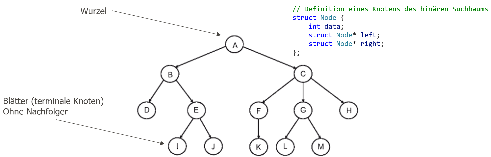
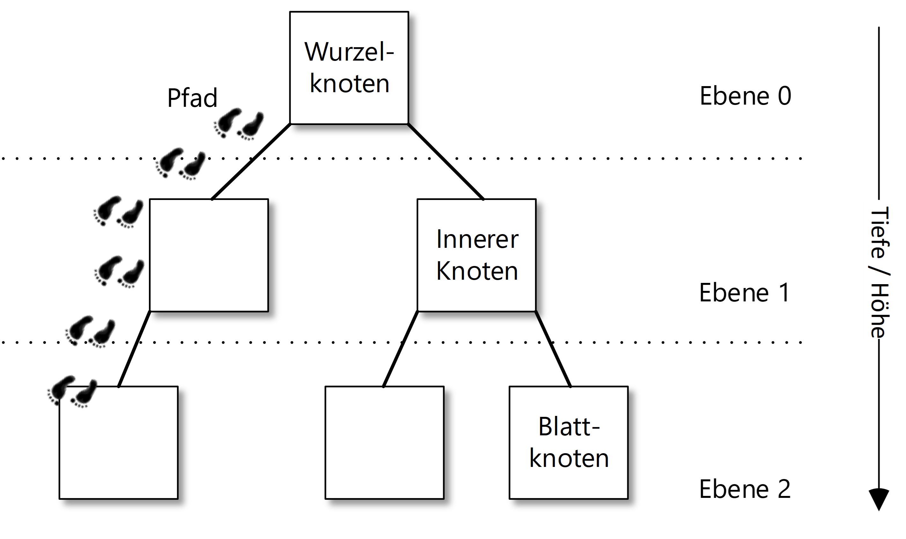
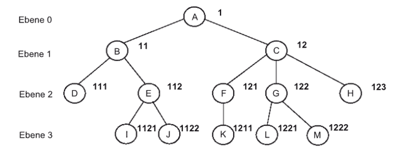
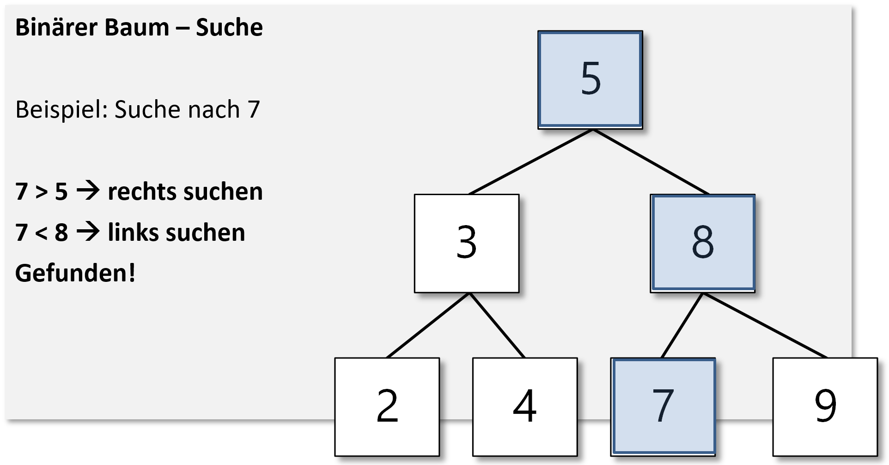
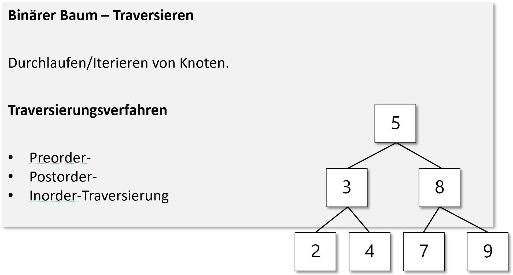
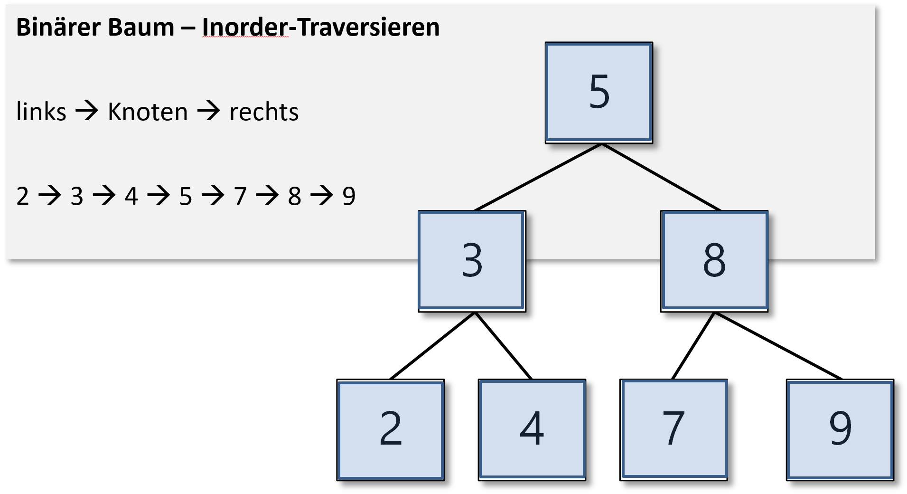
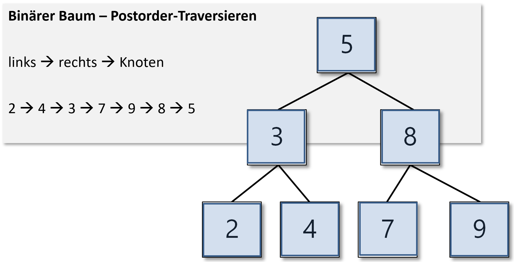
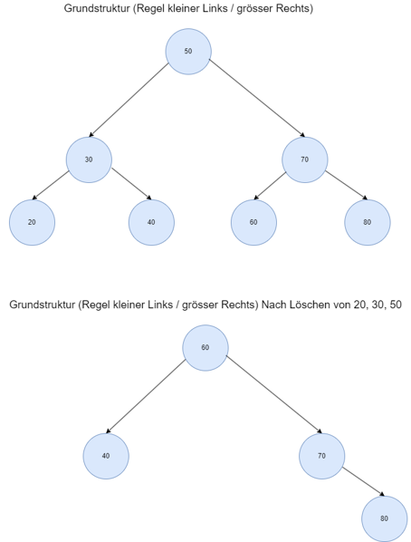

|                             |                          |                               |
| --------------------------- | ------------------------ | ----------------------------- |
| **Elektrotechniker/-in HF** | **Programmiertechnik B** |  |

- [1. Baumstruktur](#1-baumstruktur)
  - [1.1. Was ist eine Baumstruktur](#11-was-ist-eine-baumstruktur)
  - [1.2. Eigenschaften einer Baum-Struktur](#12-eigenschaften-einer-baum-struktur)
  - [1.3. Arten von Bäumen](#13-arten-von-bäumen)
  - [1.4. Grundstruktur eines Baumes](#14-grundstruktur-eines-baumes)
  - [1.5. Operationen auf Bäumen](#15-operationen-auf-bäumen)
  - [1.6. Typische Anwendungen einer Stack-Struktur](#16-typische-anwendungen-einer-stack-struktur)
  - [1.7. Vorteile](#17-vorteile)
  - [1.8. Implementierung in C](#18-implementierung-in-c)
  - [1.9. Beispiel Binärbaumstruktur](#19-beispiel-binärbaumstruktur)
- [2. Aufgaben](#2-aufgaben)
  - [2.1. Baumstruktur implementieren und testen](#21-baumstruktur-implementieren-und-testen)

---

</br>

# 1. Baumstruktur

## 1.1. Was ist eine Baumstruktur

- Ein Baum ist eine **hierarchische Datenstruktur**, die aus Knoten (nodes) besteht.
- Die Knoten sind durch **Kanten (edges)** verbunden, wobei es einen einzigen **Wurzelknoten (root)** gibt, von dem aus alle anderen Knoten erreichbar sind.
- Ein Baum modelliert eine **Eltern-Kind-Beziehung**: Jeder Knoten kann null oder mehr Kindknoten besitzen.

## 1.2. Eigenschaften einer Baum-Struktur

- Keine Zyklen: Es gibt keinen Weg, bei dem man von einem Knoten über Kanten wieder zu sich selbst zurückkehrt.
- Eindeutiger Pfad zwischen der Wurzel und jedem anderen Knoten.
- Ein Baum mit **𝑛 Knoten** hat genau **𝑛−1 Kanten**.
- Jeder Teilbaum ist selbst wieder ein Baum.

## 1.3. Arten von Bäumen

- **Binärbaum**: Jeder Knoten hat höchstens zwei Kinder (links und rechts).
- **Vollständiger Binärbaum**: Alle Ebenen sind vollständig gefüllt, ausser evtl. die letzte Ebene, die von links gefüllt ist.
- **Perfekter Binärbaum**: Alle Ebenen sind vollständig gefüllt, alle Blätter haben die gleiche Tiefe.
- **Balancierter Baum**: Höhenunterschied zwischen Teilbäumen ist minimal (z. B. AVL-Baum, Red-Black-Tree).
- **Suchbaum**: Speichert Daten so, dass schnelle Suche möglich ist (z. B. Binary Search Tree).
- **B-Baum / B+-Baum**: Für Datenbanken optimierte Bäume mit vielen Kindern pro Knoten.
- **Heap**: Spezieller Baum, der für Prioritätswarteschlangen genutzt wird (Min-Heap, Max-Heap).

## 1.4. Grundstruktur eines Baumes

- Die Elemente werden in einer Baumstruktur unter einem Wurzelknoten in einer Eltern-Kind Beziehung eingeordnet.

**Grundstrukturelemente:**



---
**Navigation:**



Die Reihenfolge der Knotenelemente folgt einer bestimmten Ordnung

- Beispiel: Ebene 0 = Wuzel = 1 Ziffer / Ebene 1 = 2 Ziffern / Ebene 2 = 3 Ziffern, Nummern werden von rechts nach links verteilt



## 1.5. Operationen auf Bäumen

- Einfügen neuer Knoten.
- Löschen von Knoten.
- **Suchen nach einem bestimmten Wert.**
  - 
- **Traversieren (Durchlaufen) des Baumes:**
  - 
  - **Preorder (Wurzel → Links → Rechts)**
    - 
  - **Inorder (Links → Wurzel → Rechts)**
    - 
  - **Postorder (Links → Rechts → Wurzel)**
    - 

## 1.6. Typische Anwendungen einer Stack-Struktur

- **Hierarchische Daten**: Dateisysteme, Organisationsstrukturen.
- **Suchalgorithmen**: Suchbäume, Indexstrukturen in Datenbanken.
- **Parsing**: Syntaxbäume in Compilern.
- **Routing**: Netzwerkpfade und Entscheidungsbäume.
- **KI**: Entscheidungsbäume in Machine Learning.
- **Prioritätswarteschlangen**: Heap-Strukturen.

## 1.7. Vorteile

- Effiziente **Suche**, **Einfügung** und **Löschung** (bei balancierten Bäumen oft in 𝑂(log 𝑛).
- Natürliche Modellierung von **hierarchischen Daten**.
- **Teilbaum-Eigenschaft**: Jeder Teilbaum ist wieder ein Baum.

## 1.8. Implementierung in C

```c
#include <stdio.h>
#include <stdlib.h>

// Definition eines Knotens des binären Suchbaums
struct Node {
    int data;
    struct Node* left;
    struct Node* right;
};

// Funktion zur Erstellung eines neuen Knotens
struct Node* newNode(int data) {
    struct Node* node = (struct Node*)malloc(sizeof(struct Node));
    node->data = data;
    node->left = NULL;
    node->right = NULL;
    return node;
}

// Funktion zum Einfügen eines neuen Knotens in den Baum
struct Node* insert(struct Node* node, int data) {
    // Falls der Baum leer ist, wird ein neuer Knoten zurückgegeben
    if (node == NULL) return newNode(data);

    // Ansonsten durchläuft den Baum rekursiv
    if (data < node->data)
        node->left = insert(node->left, data);
    else if (data > node->data)
        node->right = insert(node->right, data);

    // Rückgabe des (unveränderten) Knotenszeigers
    return node;
}

// Funktion zur Durchführung einer In-Order-Traversierung
void inorder(struct Node* root) {
    if (root != NULL) {
        inorder(root->left);
        printf("%d -> ", root->data);
        inorder(root->right);
    }
}

// Funktion zum Finden des kleinsten Wertes in einem Baum
struct Node* minValueNode(struct Node* node) {
    struct Node* current = node;

    // Schleife zum Finden des linken Blattes (minimales Element)
    while (current && current->left != NULL)
        current = current->left;
    return current;
}
```

## 1.9. Beispiel Binärbaumstruktur



```c
// Hauptprogramm zur Demonstration der obigen Funktionen
void main() {
    struct Node* root = NULL;
    root = insert(root, 50);
    root = insert(root, 30);
    root = insert(root, 20);
    root = insert(root, 40);
    root = insert(root, 70);
    root = insert(root, 60);
    root = insert(root, 80);

    printf("In-Order-Traversierung des ursprünglichen Baums: ");
    inorder(root);
    printf("NULL\n");

    printf("Lösche 20\n");
    root = deleteNode(root, 20);
    printf("In-Order-Traversierung des modifizierten Baums: ");
    inorder(root);
    printf("NULL\n");

    printf("Lösche 30\n");
    root = deleteNode(root, 30);
    printf("In-Order-Traversierung des modifizierten Baums: ");
    inorder(root);
    printf("NULL\n");

    printf("Lösche 50\n");
    root = deleteNode(root, 50);
    printf("In-Order-Traversierung des modifizierten Baums: ");
    inorder(root);
    printf("NULL\n");
}
```

---

</br>

# 2. Aufgaben

## 2.1. Baumstruktur implementieren und testen

| **Vorgabe**         | **Beschreibung**                                                            |
| :------------------ | :-------------------------------------------------------------------------- |
| **Lernziele**       | Kennt die Basiselemente einer Baum-Datenstruktur                            |
|                     | Kann eine Baum-Datenstruktur mit den erforderlichen Methoden implementieren |
| **Sozialform**      | Einzelarbeit                                                                |
| **Auftrag**         | siehe unten                                                                 |
| **Hilfsmittel**     | [Wiki Datenstrukturen](https://de.wikipedia.org/wiki/Datenstruktur)         |
| **Zeitbedarf**      | 50min                                                                       |
| **Lösungselemente** |                                                                             |

a)
Führe das nachfolgende Programm aus und teste die einzelnen Funktionen.

b)
Erweitere das nachfolgende Beispiel mit einem Funktion `search(...)` welche den Knoten mit einem bestimmten Inhalt sucht und diese ausgibt, ob er gefunden wurde

```c
#include <stdio.h>
#include <stdlib.h>

// Definition eines Knotens des binären Suchbaums
struct Node {
    int data;
    struct Node* left;
    struct Node* right;
};

// Funktion zur Erstellung eines neuen Knotens
struct Node* newNode(int data) {
    struct Node* node = (struct Node*)malloc(sizeof(struct Node));
    node->data = data;
    node->left = NULL;
    node->right = NULL;
    return node;
}

// Funktion zum Einfügen eines neuen Knotens in den Baum
struct Node* insert(struct Node* node, int data) {
    // Falls der Baum leer ist, wird ein neuer Knoten zurückgegeben
    if (node == NULL) return newNode(data);

    // Ansonsten durchläuft den Baum rekursiv
    if (data < node->data)
        node->left = insert(node->left, data);
    else if (data > node->data)
        node->right = insert(node->right, data);

    // Rückgabe des (unveränderten) Knotenszeigers
    return node;
}

// Funktion zur Durchführung einer In-Order-Traversierung
void inorder(struct Node* root) {
    if (root != NULL) {
        inorder(root->left);
        printf("%d -> ", root->data);
        inorder(root->right);
    }
}

// Funktion zum Finden des kleinsten Wertes in einem Baum
struct Node* minValueNode(struct Node* node) {
    struct Node* current = node;

    // Schleife zum Finden des linken Blattes (minimales Element)
    while (current && current->left != NULL)
        current = current->left;

    return current;
}

// Funktion zum Löschen eines Knotens im Baum
struct Node* deleteNode(struct Node* root, int data) {
    // Basisfall
    if (root == NULL) return root;

    // Falls der zu löschende Wert kleiner als der Wurzelwert ist, 
    // befindet er sich im linken Teilbaum
    if (data < root->data)
        root->left = deleteNode(root->left, data);

    // Falls der zu löschende Wert grösser als der Wurzelwert ist, 
    // befindet er sich im rechten Teilbaum
    else if (data > root->data)
        root->right = deleteNode(root->right, data);

    // Falls der Wert derselbe wie der Wurzelwert ist, dann wird dieser Knoten gelöscht
    else {
        // Knoten mit nur einem Kind oder keinem Kind
        if (root->left == NULL) {
            struct Node* temp = root->right;
            free(root);
            return temp;
        }
        else if (root->right == NULL) {
            struct Node* temp = root->left;
            free(root);
            return temp;
        }

        // Knoten mit zwei Kindern: Erhalte den In-Order-Nachfolger (kleinster im rechten Teilbaum)
        struct Node* temp = minValueNode(root->right);

        // Kopiere den In-Order-Nachfolgerinhalt in diesen Knoten
        root->data = temp->data;

        // Lösche den In-Order-Nachfolger
        root->right = deleteNode(root->right, temp->data);
    }
    return root;
}

// Hauptprogramm zur Demonstration der obigen Funktionen
void main() {
    struct Node* root = NULL;
    root = insert(root, 50);
    root = insert(root, 30);
    root = insert(root, 20);
    root = insert(root, 40);
    root = insert(root, 70);
    root = insert(root, 60);
    root = insert(root, 80);

    printf("In-Order-Traversierung des ursprünglichen Baums: ");
    inorder(root);
    printf("NULL\n");

    printf("Lösche 20\n");
    root = deleteNode(root, 20);
    printf("In-Order-Traversierung des modifizierten Baums: ");
    inorder(root);
    printf("NULL\n");

    printf("Lösche 30\n");
    root = deleteNode(root, 30);
    printf("In-Order-Traversierung des modifizierten Baums: ");
    inorder(root);
    printf("NULL\n");

    printf("Lösche 50\n");
    root = deleteNode(root, 50);
    printf("In-Order-Traversierung des modifizierten Baums: ");
    inorder(root);
    printf("NULL\n");
}
```
