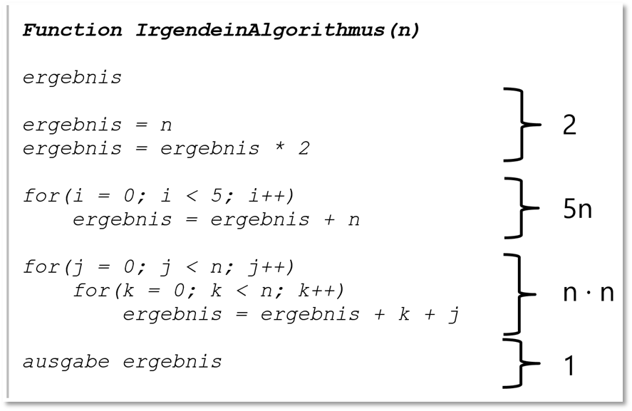
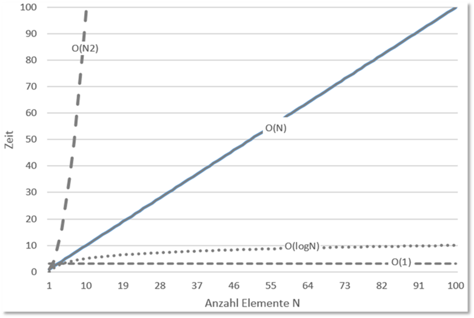
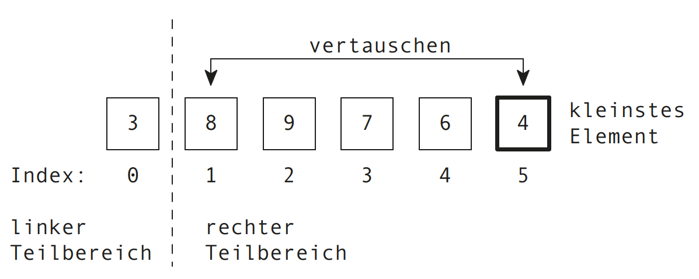
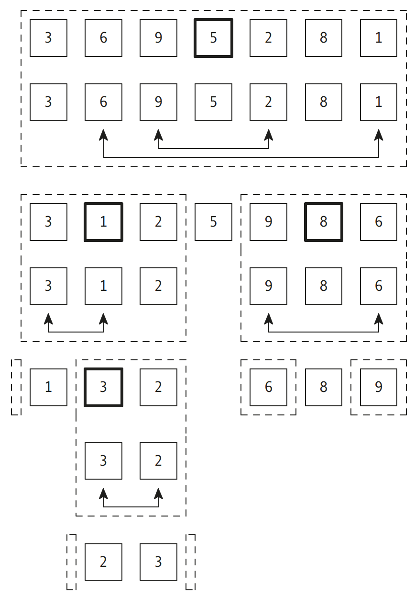

|                             |                          |                               |
| --------------------------- | ------------------------ | ----------------------------- |
| **Elektrotechniker/-in HF** | **Programmiertechnik B** |  |

- [1. Sortieren und Suchen](#1-sortieren-und-suchen)
  - [1.1. Einführung](#11-einführung)
  - [1.2. Ziele des Sortierens](#12-ziele-des-sortierens)
  - [1.3. Gross O-Notation](#13-gross-o-notation)
  - [1.4. Direktes Auswählen (Selection-Sort)](#14-direktes-auswählen-selection-sort)
  - [1.5. Implementierung](#15-implementierung)
  - [1.6. Wichtige Sortierverfahren](#16-wichtige-sortierverfahren)
    - [1.6.1. Bubblesort (einfach, aber langsam)](#161-bubblesort-einfach-aber-langsam)
    - [1.6.2. Selectionsort](#162-selectionsort)
    - [1.6.3. Insertionsort](#163-insertionsort)
    - [1.6.4. Mergesort](#164-mergesort)
    - [1.6.5. Quicksort](#165-quicksort)
    - [1.6.6. Heapsort](#166-heapsort)
  - [1.7. Komplexitätsklasse (O-Notation)](#17-komplexitätsklasse-o-notation)
  - [1.8. Implementierung](#18-implementierung)
    - [1.8.1. Quicksort](#181-quicksort)
- [2. Funktionszeiger – Sortierverhalten austauschbar machen](#2-funktionszeiger--sortierverhalten-austauschbar-machen)
  - [2.1. Das Problem](#21-das-problem)
  - [2.2. Was ist ein Funktionszeiger?](#22-was-ist-ein-funktionszeiger)
  - [2.3. Sortieren mit austauschbarem Vergleich](#23-sortieren-mit-austauschbarem-vergleich)
  - [2.4. Die Vergleichsfunktion – Konvention](#24-die-vergleichsfunktion--konvention)
  - [2.5. `qsort()` aus der Standardbibliothek](#25-qsort-aus-der-standardbibliothek)
  - [2.6. Praxisbeispiel – Strukturen nach verschiedenen Kriterien sortieren](#26-praxisbeispiel--strukturen-nach-verschiedenen-kriterien-sortieren)
  - [2.7. Weitere Einsatzbereiche](#27-weitere-einsatzbereiche)
  - [2.8. Zusammenfassung Funktionszeiger](#28-zusammenfassung-funktionszeiger)
- [3. Aufgaben](#3-aufgaben)
  - [3.1. Vergleich Quicksort – Selectionsort](#31-vergleich-quicksort--selectionsort)
  - [3.2. Aufgabe Sortieren mit Funktionszeigern](#32-aufgabe-sortieren-mit-funktionszeigern)

---

</br>

# 1. Sortieren und Suchen

## 1.1. Einführung

**Sortieren** und **Suchen** sind fundamentale Operationen in der Informatik und spielen eine zentrale Rolle bei der Verarbeitung von Daten.
Während Sortieren bedeutet, eine Menge von Elementen in eine bestimmte Reihenfolge zu bringen (z. B. aufsteigend oder absteigend nach einem Schlüssel), bezeichnet Suchen das Auffinden eines bestimmten Elements oder einer Teilmenge innerhalb einer Datenmenge.

Effiziente Sortier- und Suchalgorithmen sind entscheidend für:

- die Performance von Programmen
- die Datenanalyse
- Datenbankabfragen
- die Speicher- und Rechenoptimierung

## 1.2. Ziele des Sortierens

- **Schnelleres Suchen** (z.B. binäre Suche funktioniert nur auf sortierten Daten)
- **Einfache Auswertung** (z.B. Ranglisten, Statistiken)
- **Datenorganisation** (z.B. in Datenbanken oder Dateisystemen)

## 1.3. Gross O-Notation

- Die **Gross-O-Notation** (Big-O-Notation) beschreibt, wie schnell der Rechenaufwand eines Algorithmus im schlimmsten Fall wächst, wenn die Eingabemenge **𝑛** grösser wird.
- Sie betrachtet dabei nur den dominanten Term und ignoriert konstante Faktoren und kleinere Terme.
- Die Notation dient zum Vergleichen von Algorithmen hinsichtlich ihrer Skalierbarkeit und Effizienz, ohne sich an konkrete Hardware oder Programmiersprachen zu binden.



- **O(1)** → Konstante Zeit, unabhängig von der Eingabegrösse
- **O(log n)** → Logarithmisch, wächst sehr langsam
- **O(n)** → Linear, Aufwand steigt proportional zu
- **O(n log n)** → „Fast linear“, oft bei effizienten Sortierverfahren
- **O(n^2)** → Quadratisch, Aufwand wächst stark bei grösseren Datenmengen




## 1.4. Direktes Auswählen (Selection-Sort)

**Verfahren:**

- Leere sortierte Liste, volle unsortierte Liste
- Suche nach Element mit dem kleinsten Wert
- Element tauschen unsortiert zu sortiert




## 1.5. Implementierung

```c
#include <stdio.h>

// Funktion zum Vertauschen von zwei Werten
void swap(int *xp, int *yp) {
    int temp = *xp;
    *xp = *yp;
    *yp = temp;
}

// Funktion zur Durchführung von Selection Sort
void selectionSort(int arr[], int n) {
    int i, j, min_idx;
    // Ein Element nach dem anderen im unsortierten Array verschieben
    for (i = 0; i < n-1; i++) {
        // Das kleinste Element im unsortierten Array finden
        min_idx = i;
        for (j = i+1; j < n; j++) {
            if (arr[j] < arr[min_idx])
                min_idx = j;
        }

        // Das gefundene kleinste Element mit dem ersten Element vertauschen
        swap(&arr[min_idx], &arr[i]);
    }
}

// Funktion zum Drucken eines Arrays
void printArray(int arr[], int size) {
    int i;
    for (i = 0; i < size; i++)
        printf("%d ", arr[i]);
    printf("\n");
}

// Hauptprogramm zur Demonstration von Selection Sort
void main() {
    int arr[] = {64, 25, 12, 22, 11};
    int n = sizeof(arr)/sizeof(arr[0]);
    printf("Unsortiertes Array: \n");
    printArray(arr, n);

    selectionSort(arr, n);
    printf("Sortiertes Array: \n");
    printArray(arr, n);
}
```

## 1.6. Wichtige Sortierverfahren

### 1.6.1. Bubblesort (einfach, aber langsam)

- **Prinzip**
  - Vergleicht benachbarte Elemente und vertauscht sie, wenn sie in der falschen Reihenfolge stehen. Wiederholen, bis keine Vertauschungen mehr nötig sind.
- **Laufzeit**
  - Best Case: 𝑂(𝑛) (bereits sortiert)
    - Average/Worst Case: 𝑂(𝑛2)
- **Einsatz**
  - Nur für kleine Datenmengen oder Lehrzwecke.

### 1.6.2. Selectionsort

- **Prinzip**
  - Findet das kleinste Element und tauscht es mit dem ersten Element, dann mit dem zweiten usw.
  - **Laufzeit**
    - 𝑂(𝑛2)
    - (unabhängig von der Ausgangsreihenfolge)
- **Einsatz**
  - Einfach zu implementieren, aber ineffizient bei grossen Daten.

### 1.6.3. Insertionsort

- **Prinzip**
  - Baut schrittweise eine sortierte Liste auf, indem jedes Element an der richtigen Stelle eingefügt wird.
- **Laufzeit**
  - Best Case: 𝑂(𝑛) (fast sortiert)
  - Average/Worst Case: 𝑂(𝑛2)
- **Einsatz**
  - Gut bei kleinen oder fast sortierten Datenmengen.

### 1.6.4. Mergesort

- **Prinzip**
  - Teilt die Liste rekursiv in zwei Hälften, sortiert diese und fügt sie wieder zusammen.
- **Laufzeit**
  - 𝑂(𝑛 log⁡𝑛)
- **Einsatz**
  - Grosse Datenmengen, besonders bei externer Sortierung.

### 1.6.5. Quicksort

- Das Quicksort-Verfahren wurde von **Hoare** entwickelt. Es ist ein **effizientes Sortierverfahren** und ein gutes Beispiel für die Anwendung eines rekursiven Algorithmus.
- Das Verfahren arbeitet nach dem Prinzip „**teile und herrsche**“ (auf Englisch „divide and conquer“): Man teilt das Array in zwei Teile – oder genauer gesagt – in zwei Teilarrays auf.
- Wähle ein Element als **Pivot** (z.B. erstes, letztes, zufälliges oder Median-ähnliches Element).
- Partitioniere das Array so, dass auf der linken Seite **alle Elemente ≤ Pivot und auf der rechten Seite alle Elemente ≥ Pivot stehen** (genaue Invarianten hängen von der Partition-Variante ab).
- Sortiere rekursiv die linke und rechte Teilmenge
- In der Praxis sehr schnell (durchschnittlich O(n log n)), aber im schlechtesten Fall O(n^2).



- **Prinzip**
  - Wählt ein Pivot-Element, teilt die Liste in kleiner/gleich und grösser, sortiert rekursiv.
- **Laufzeit**
  - Best/Average Case: 𝑂(𝑛 log⁡𝑛)
  - Worst Case: 𝑂(𝑛2) (ungünstige Pivot-Wahl)
- **Einsatz**
  - Häufig in Standardbibliotheken, **sehr effizient** in der Praxis.

### 1.6.6. Heapsort

- **Prinzip**
  - Bildet einen Heap (Max-Heap oder Min-Heap) und entnimmt schrittweise das grösste/kleinste Element.
- **Laufzeit**
  - 𝑂(𝑛log⁡𝑛)
- **Einsatz**
  - Effizient, benötigt keinen zusätzlichen Speicher wie **Mergesort**.

## 1.7. Komplexitätsklasse (O-Notation)

| **Verfahren** | **Best Case** | **Average Case** | **Worst Case** | **Speicherbedarf** | **Stabil** | **Geeignet für**           |
| ------------- | ------------- | ---------------- | -------------- | ------------------ | ---------- | -------------------------- |
| Bubblesort    | O(n)          | O(n²)            | O(n²)          | O(1)               | Ja         | Sehr kleine Listen         |
| Selectionsort | O(n²)         | O(n²)            | O(n²)          | O(1)               | Nein       | Sehr kleine Listen         |
| Insertionsort | O(n)          | O(n²)            | O(n²)          | O(1)               | Ja         | Kleine oder fast sortierte |
| Mergesort     | O(n log n)    | O(n log n)       | O(n log n)     | O(n)               | Ja         | Grosse Datenmengen         |
| Quicksort     | O(n log n)    | O(n log n)       | O(n²)          | O(log n)           | Nein       | Allgemein, sehr schnell    |
| Heapsort      | O(n log n)    | O(n log n)       | O(n log n)     | O(1)               | Nein       | Speicherarme Anwendungen   |
| Counting Sort | O(n + k)      | O(n + k)         | O(n + k)       | O(n + k)           | Ja         | Ganzzahlen mit kleinem k   |

## 1.8. Implementierung

### 1.8.1. Quicksort

```c
#include <stdio.h>
#include <stdlib.h>

// Vergleichsfunktion für qsort
int compare(const void *a, const void *b) {
    return (*(int*)a - *(int*)b);
}

// Funktion zum Drucken eines Arrays
void printArray(int arr[], int size) {
    for (int i = 0; i < size; i++)
        printf("%d ", arr[i]);
    printf("\n");
}

// Hauptprogramm zur Demonstration von qsort
void main() {
    int arr[] = {10, 7, 8, 9, 1, 5};
    int n = sizeof(arr) / sizeof(arr[0]);

    printf("Unsortiertes Array: \n");
    printArray(arr, n);

    // Verwenden von qsort zum Sortieren des Arrays
    qsort(arr, n, sizeof(int), compare);

    printf("Sortiertes Array: \n");
    printArray(arr, n);
    
}
```

---

# 2. Funktionszeiger – Sortierverhalten austauschbar machen

## 2.1. Das Problem

Wir haben nun mehrere Sortieralgorithmen implementiert. Aber alle haben eine feste Einschränkung: Sie sortieren **immer aufsteigend**.

Was, wenn wir absteigend sortieren wollen? Der naheliegende Weg wäre, den Algorithmus zu kopieren und den Vergleich umzudrehen:

```c
void sortiereAufsteigend(int arr[], int n) {
    // ...
    if (arr[j] > arr[j + 1]) { /* tauschen */ }
    // ...
}

void sortiereAbsteigend(int arr[], int n) {
    // ...
    if (arr[j] < arr[j + 1]) { /* tauschen */ }   // nur EIN Zeichen anders!
    // ...
}
```

Der komplette Algorithmus wird dupliziert, um **ein einziges Vergleichszeichen** zu ändern. Bei Mergesort oder Quicksort wären das jeweils 30+ Zeilen doppelter Code – und jede Fehlerkorrektur müsste an zwei Stellen erfolgen.

> Genau dieses Problem – Wiederholung vermeiden – kennen wir bereits aus der
> Modularisierung. Die Lösung heisst hier **Funktionszeiger**.

## 2.2. Was ist ein Funktionszeiger?

> Ein **Funktionszeiger** (*function pointer*) ist eine Variable, die nicht auf Daten zeigt, sondern auf eine **Funktion**. Damit lässt sich eine Funktion wie ein Wert behandeln: in einer Variable speichern, an eine andere Funktion übergeben oder in einem Array ablegen.

**Deklaration:**

```c
Rückgabetyp (*zeigername)(Parametertypen);
```

```c
int (*vergleich)(int, int);
//  ↑          ↑  ↑
//  │          │  └─ Parametertypen der Funktion
//  │          └──── Name des Zeigers
//  └─────────────── Rückgabetyp der Funktion
```

> **Die Klammern um `*zeigername` sind zwingend!**
>
> ```c
> int (*p)(int, int);   // Zeiger auf Funktion, die int zurückgibt
> int  *p (int, int);   // Funktion, die einen int-Zeiger zurückgibt!
> ```

**Zuweisung und Aufruf:**

```c
int addiere(int a, int b) { return a + b; }

int (*rechne)(int, int);      // Zeiger deklarieren
rechne = addiere;              // Funktion zuweisen (ohne Klammern!)

int ergebnis = rechne(3, 4);   // Aufruf wie eine normale Funktion → 7
```

> **Bezug zu Datenzeigern:** Ein normaler Zeiger speichert die Adresse einer
> Variable. Ein Funktionszeiger speichert die Adresse einer **Funktion** im
> Code-Segment. Das Prinzip ist identisch – nur der Inhalt ist anderer Natur.

## 2.3. Sortieren mit austauschbarem Vergleich

Statt zwei getrennter Sortierfunktionen übergeben wir die **Vergleichslogik als Parameter**:

```c
#include <stdio.h>

/* Zwei Vergleichsfunktionen mit IDENTISCHER Signatur */
int aufsteigend(int a, int b)  { return a - b; }   /* >0 wenn a nach b kommt */
int absteigend(int a, int b)   { return b - a; }   /* umgekehrt              */

/* EINE Sortierfunktion für BEIDE Reihenfolgen */
void sortiere(int arr[], int n, int (*vergleich)(int, int)) {
    for (int i = 0; i < n - 1; i++) {
        for (int j = 0; j < n - 1 - i; j++) {
            if (vergleich(arr[j], arr[j + 1]) > 0) {    /* ← austauschbar! */
                int temp   = arr[j];
                arr[j]     = arr[j + 1];
                arr[j + 1] = temp;
            }
        }
    }
}

void zeige(int arr[], int n) {
    for (int i = 0; i < n; i++) printf("%d ", arr[i]);
    printf("\n");
}

int main(void) {
    int werte[] = {5, 2, 9, 1, 6};
    int n = 5;

    sortiere(werte, n, aufsteigend);
    printf("aufsteigend:  "); zeige(werte, n);

    sortiere(werte, n, absteigend);
    printf("absteigend:   "); zeige(werte, n);

    return 0;
}
```

```bash
Ausgabe:
aufsteigend:  1 2 5 6 9
absteigend:   9 6 5 2 1
```

> **Der entscheidende Punkt:** Der Sortieralgorithmus wurde **kein einziges Mal
> dupliziert**. Für eine neue Sortierreihenfolge schreibt man nur noch eine neue
> Vergleichsfunktion von 1 Zeile.

## 2.4. Die Vergleichsfunktion – Konvention

Damit der Sortieralgorithmus weiss, wie zu sortieren ist, gilt eine feste Konvention:

| Rückgabewert | Bedeutung                     |
| ------------ | ----------------------------- |
| **< 0**      | `a` kommt **vor** `b`         |
| **= 0**      | `a` und `b` sind gleichwertig |
| **> 0**      | `a` kommt **nach** `b`        |

```c
int aufsteigend(int a, int b) { return a - b; }
// a=3, b=7  →  3-7 = -4  → negativ → 3 kommt vor 7  ✓

int absteigend(int a, int b) { return b - a; }
// a=3, b=7  →  7-3 = +4  → positiv → 3 kommt nach 7 ✓
```

> **Vorsicht bei `a - b`:** Bei sehr grossen Zahlen kann die Subtraktion
> überlaufen. Sicherer ist:
>
> ```c
> int aufsteigend(int a, int b) {
>     return (a > b) - (a < b);   // liefert -1, 0 oder +1
> }
> ```

## 2.5. `qsort()` aus der Standardbibliothek

C bringt bereits einen fertigen, hochoptimierten Sortieralgorithmus mit – und dieser funktioniert **genau nach diesem Prinzip**:

```c
#include <stdlib.h>

void qsort(void *basis, size_t anzahl, size_t groesse,
           int (*vergleich)(const void *, const void *));
```

| Parameter   | Bedeutung                                  |
| ----------- | ------------------------------------------ |
| `basis`     | Zeiger auf das Array                       |
| `anzahl`    | Anzahl Elemente                            |
| `groesse`   | Grösse **eines** Elements (`sizeof`)       |
| `vergleich` | Funktionszeiger auf die Vergleichsfunktion |

**Beispiel mit `int`:**

```c
#include <stdio.h>
#include <stdlib.h>

int cmpInt(const void *a, const void *b) {
    int x = *(const int *)a;      /* void* muss zurückgecastet werden */
    int y = *(const int *)b;
    return (x > y) - (x < y);
}

int main(void) {
    int zahlen[] = {42, 7, 19, 3, 88};
    int n = 5;

    qsort(zahlen, n, sizeof(int), cmpInt);

    for (int i = 0; i < n; i++) printf("%d ", zahlen[i]);
    printf("\n");
    return 0;
}
```

```bash
Ausgabe:
3 7 19 42 88
```

> **Warum `const void *`?** `qsort` funktioniert mit **jedem** Datentyp – daher
> der typlose `void`-Zeiger. In der Vergleichsfunktion wird er auf den tatsächlichen
> Typ zurückgecastet. Das ist der Preis für die Universalität.

## 2.6. Praxisbeispiel – Strukturen nach verschiedenen Kriterien sortieren

Hier zeigt sich die volle Stärke des Konzepts: **dieselben Daten**, **derselbe Algorithmus**, nur unterschiedliche Vergleichsfunktionen.

```c
#include <stdio.h>
#include <stdlib.h>
#include <string.h>

typedef struct {
    char   name[30];
    int    punkte;
    double note;
} Student;

/* Nach Punkten – absteigend (bester zuerst) */
int cmpPunkte(const void *a, const void *b) {
    const Student *s1 = a;
    const Student *s2 = b;
    return s2->punkte - s1->punkte;
}

/* Nach Name – alphabetisch */
int cmpName(const void *a, const void *b) {
    const Student *s1 = a;
    const Student *s2 = b;
    return strcmp(s1->name, s2->name);      /* strcmp liefert bereits <0/0/>0! */
}

int main(void) {
    Student klasse[] = {
        {"Meier",  78, 4.5},
        {"Anna",   92, 5.5},
        {"Berger", 65, 4.0}
    };
    int n = 3;

    qsort(klasse, n, sizeof(Student), cmpPunkte);
    printf("Nach Punkten (absteigend):\n");
    for (int i = 0; i < n; i++)
        printf("  %-10s %3d\n", klasse[i].name, klasse[i].punkte);

    qsort(klasse, n, sizeof(Student), cmpName);
    printf("Nach Name (alphabetisch):\n");
    for (int i = 0; i < n; i++)
        printf("  %-10s %3d\n", klasse[i].name, klasse[i].punkte);

    return 0;
}
```

```bash
Ausgabe:
Nach Punkten (absteigend):
  Anna         92
  Meier        78
  Berger       65
Nach Name (alphabetisch):
  Anna         92
  Berger       65
  Meier        78
```

> **`strcmp` als Vergleichsfunktion:** `strcmp` liefert bereits genau die
> geforderte Konvention (negativ / 0 / positiv) – deshalb kann das Ergebnis
> direkt zurückgegeben werden.

## 2.7. Weitere Einsatzbereiche

Funktionszeiger sind weit über das Sortieren hinaus relevant:

| Einsatzgebiet         | Beispiel                                                              |
| --------------------- | --------------------------------------------------------------------- |
| **Callbacks**         | Eine Bibliothek ruft „deine" Funktion auf, wenn ein Ereignis eintritt |
| **Menüsteuerung**     | Array von Funktionszeigern statt langer `switch`-Kaskade              |
| **Zustandsautomaten** | Jeder Zustand ist eine Funktion, Übergänge über Zeiger                |
| **Interrupt-Handler** | In der Embedded-Programmierung: Zeiger auf ISR-Funktionen             |

**Beispiel Menü – Array von Funktionszeigern:**

```c
void neuAnlegen(void)  { printf("Neuer Datensatz\n"); }
void bearbeiten(void)  { printf("Bearbeiten\n"); }
void loeschen(void)    { printf("Löschen\n"); }

void (*menue[3])(void) = { neuAnlegen, bearbeiten, loeschen };

/* Statt switch/case einfach: */
menue[auswahl]();
```

> **Ausblick auf Tag 10 (WPF/C#):** Wenn wir dort einen Button mit
> `Click="ButtonKlick"` an eine Methode binden, ist das exakt dasselbe Prinzip –
> eine Funktion wird als Wert übergeben und später aufgerufen. C# nennt das
> *Delegate* bzw. *Eventhandler*, das zugrundeliegende Konzept ist der Funktionszeiger.

## 2.8. Zusammenfassung Funktionszeiger

```bash
┌──────────────────────────────────────────────────────────────────┐
│ Deklaration      │ Rückgabetyp (*name)(Parametertypen);          │
│ Klammern         │ ZWINGEND um *name – sonst andere Bedeutung!   │
│ Zuweisung        │ zeiger = funktionsname;   (ohne Klammern)     │
│ Aufruf           │ zeiger(argumente);                            │
│ Vergleichs-      │ < 0 : a vor b                                 │
│ konvention       │ = 0 : gleichwertig                            │
│                  │ > 0 : a nach b                                │
│ qsort()          │ qsort(arr, n, sizeof(Typ), vergleichsFkt)     │
│ Nutzen           │ Verhalten austauschbar, ohne Code zu kopieren │
└──────────────────────────────────────────────────────────────────┘
```

> **Goldene Regel:** Wenn sich zwei Funktionen nur in einem einzigen Vergleich oder
> einer einzigen Operation unterscheiden, ist das ein sicheres Zeichen für einen
> Funktionszeiger – schreibe **eine** Funktion und übergib das Unterschiedliche als Parameter.

---

</br>

# 3. Aufgaben

## 3.1. Vergleich Quicksort – Selectionsort

| **Vorgabe**         | **Beschreibung**                                                                  |
| :------------------ | :-------------------------------------------------------------------------------- |
| **Lernziele**       | Kann die beiden Sortierverfahren selection-sort und quick-sort implementieren     |
|                     | Kein die beiden Sortierverfahren mit Datenwerten testen und die Rechenzeit messen |
| **Sozialform**      | Einzelarbeit                                                                      |
| **Auftrag**         | siehe unten                                                                       |
| **Hilfsmittel**     | [Wiki Datenstrukturen](https://de.wikipedia.org/wiki/Datenstruktur)               |
| **Zeitbedarf**      | 50min                                                                             |
| **Lösungselemente** |                                                                                   |

Vergleich die Leistung von Quicksort und Selection-Sort

Generiere ein Zufallsarray benutze den nachfolgenden Code

```c
#include <stdio.h>
#include <stdlib.h>
#include <time.h>

// Funktion zur Generierung eines Arrays zufälliger Zahlen
void generateRandomArray(int *array, int size)
{
    for (int i = 0; i < size; i++)
    {
        array[i] = rand() % 100;    // Zahlen zwischen 0 und 99
    }
}
```

Messe die Zeit für die Sortierung der beiden Algorithmen benutze nachfolgenden Code

```c
clock_t start = clock();
sortFunction(arrayCopy, size, sizeof(int), compare)
clock_t end = clock();
```

**Ausgabe:**

```console
qsort took 0.000161 seconds to sort the array.
selection-sort took 0.000734 seconds to sort the array.
```

---

## 3.2. Aufgabe Sortieren mit Funktionszeigern

| **Vorgabe**         | **Beschreibung**                                       |
| :------------------ | :----------------------------------------------------- |
| **Lernziele**       | Kann einen Funktionszeiger deklarieren und zuweisen    |
|                     | Kann eine Funktion als Parameter übergeben             |
|                     | Kennt die Vergleichsfunktions-Konvention (<0 / 0 / >0) |
|                     | Kann `qsort()` aus der Standardbibliothek einsetzen    |
| **Sozialform**      | Partnerarbeit                                          |
| **Auftrag**         | siehe unten                                            |
| **Hilfsmittel**     |                                                        |
| **Zeitbedarf**      | 30min                                                  |
| **Lösungselemente** | Funktionierendes Programm                              |

**Teil A – Eigene Sortierfunktion mit Funktionszeiger:**

Schreibe **eine einzige** Bubblesort-Funktion mit folgender Signatur:

```c
void sortiere(int arr[], int n, int (*vergleich)(int, int));
```

Implementiere dazu **drei** Vergleichsfunktionen:

| Funktion      | Sortierreihenfolge                            |
| ------------- | --------------------------------------------- |
| `aufsteigend` | 1, 2, 3, ...                                  |
| `absteigend`  | 9, 8, 7, ...                                  |
| `nachBetrag`  | nach Absolutwert aufsteigend (−5 kommt vor 3) |

Teste alle drei mit dem Array `{-7, 3, -1, 8, -5, 2}` und gib jeweils das Ergebnis aus.

**Teil B – Strukturen mit `qsort` sortieren:**

Gegeben ist folgende Struktur:

```c
typedef struct {
    char   bezeichnung[40];
    int    bestand;
    double preis;
} Artikel;
```

Verwende **genau diese Testdaten** (die Preise sind bewusst so gewählt – siehe Teil C):

```c
Artikel lager[] = {
    {"Zange",   12,  8.10},
    {"Kabel",   50,  8.90},
    {"Bohrer",  48,  8.50},
    {"Hammer",  15, 12.00},
    {"Schraube", 500, 0.05}
};
```

Sortiere das Array mit `qsort()` nacheinander:

1. alphabetisch nach `bezeichnung`
2. nach `bestand` aufsteigend
3. nach `preis` **absteigend** (teuerster zuerst)

Gib das Array nach jeder Sortierung formatiert aus.

**Teil C – Verständnisfragen (schriftlich):**

1. Warum verwendet `qsort()` `const void *` statt `const int *` als Parametertyp?

2. **Experiment:** Schreibe eine zweite Preis-Vergleichsfunktion, die den Preis
   fälschlicherweise nach `int` castet:

   ```c
   int x = (int)((const Artikel*)a)->preis;
   int y = (int)((const Artikel*)b)->preis;
   return y - x;
   ```

   Sortiere damit dieselben Daten. Was passiert mit den drei Artikeln, deren Preis
   zwischen 8.00 und 9.00 liegt – und warum? Erkläre, was der `int`-Cast mit den
   Nachkommastellen macht.

3. Warum kann `strcmp()` **direkt** als Rückgabewert einer Vergleichsfunktion
   verwendet werden, ohne Umrechnung?

4. Wie viele Zeilen Code müsstest du **zusätzlich** schreiben, um eine vierte
   Sortierreihenfolge zu ergänzen? Vergleiche mit dem Ansatz „für jede
   Reihenfolge eine eigene Sortierfunktion".

---

© 2026 Lukas Müller – Licensed under CC BY-NC-ND 4.0
See [LICENSE](../license.md) file for details.
