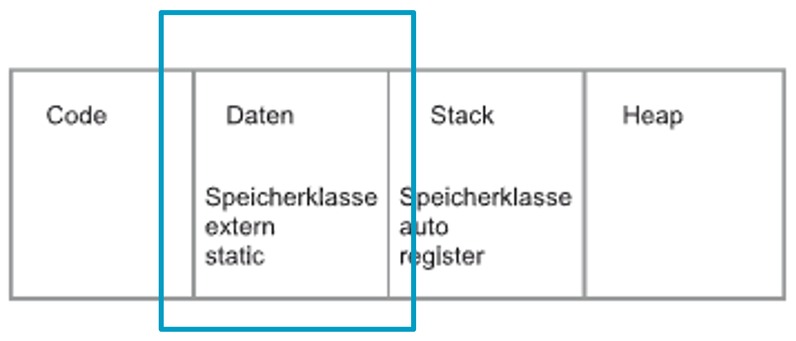
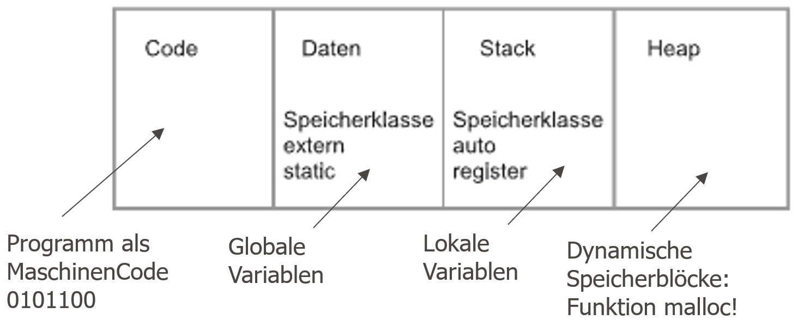
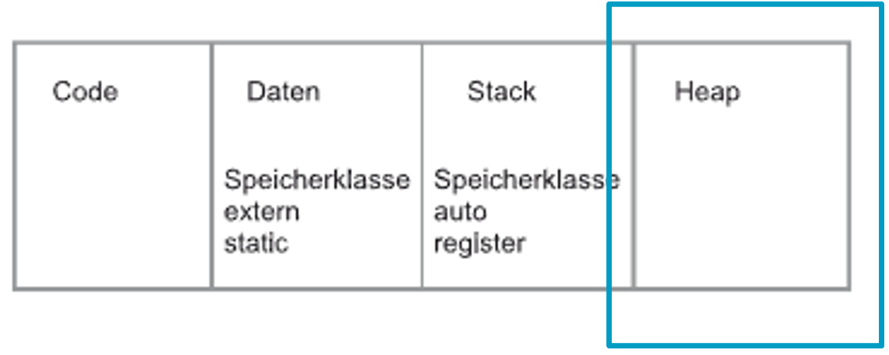

|                             |                          |                               |
| --------------------------- | ------------------------ | ----------------------------- |
| **Elektrotechniker/-in HF** | **Programmiertechnik B** |  |

- [1. Dynamische Speicherverwaltung (Allokation)](#1-dynamische-speicherverwaltung-allokation)
  - [1.1. Laufzeit von Variablen und ihre Adressen](#11-laufzeit-von-variablen-und-ihre-adressen)
    - [1.1.1. Adressen sichtbar machen](#111-adressen-sichtbar-machen)
    - [1.1.2. Lebensdauer (*Lifetime*) – wie lange existiert eine Variable?](#112-lebensdauer-lifetime--wie-lange-existiert-eine-variable)
  - [1.2. Speicherklassen: `extern`, `static`, `auto`, `register`](#12-speicherklassen-extern-static-auto-register)
    - [1.2.1. Was ist eine Speicherklasse?](#121-was-ist-eine-speicherklasse)
    - [1.2.2. `auto` – die Standard-Speicherklasse](#122-auto--die-standard-speicherklasse)
    - [1.2.3. `register` – Hinweis an den Compiler](#123-register--hinweis-an-den-compiler)
    - [1.2.4. `static` – verlängerte Lebensdauer](#124-static--verlängerte-lebensdauer)
    - [1.2.5. `extern` – Sichtbarkeit über Dateigrenzen](#125-extern--sichtbarkeit-über-dateigrenzen)
    - [1.2.6. Vergleichstabelle: Lebensdauer vs. Sichtbarkeit](#126-vergleichstabelle-lebensdauer-vs-sichtbarkeit)
  - [1.3. Speichersegmente eines Programms](#13-speichersegmente-eines-programms)
    - [1.3.1. Die Aufteilung des Programmspeichers](#131-die-aufteilung-des-programmspeichers)
    - [1.3.2. Die Segmente im Detail](#132-die-segmente-im-detail)
    - [1.3.3. Stack und Heap im Vergleich](#133-stack-und-heap-im-vergleich)
  - [1.4. Was macht der Compiler, was macht der Linker?](#14-was-macht-der-compiler-was-macht-der-linker)
    - [1.4.1. Die Übersetzung im Detail](#141-die-übersetzung-im-detail)
    - [1.4.2. Aufgabenteilung im Detail](#142-aufgabenteilung-im-detail)
    - [1.4.3. Praktische Demonstration](#143-praktische-demonstration)
    - [1.4.4. Typischer Linker-Fehler](#144-typischer-linker-fehler)
  - [1.5. Speicherallokation mit `malloc()` und Freigabe mit `free()`](#15-speicherallokation-mit-malloc-und-freigabe-mit-free)
    - [1.5.1. Das Problem mit festen Array-Grössen](#151-das-problem-mit-festen-array-grössen)
    - [1.5.2. `malloc()` – Speicher zur Laufzeit reservieren](#152-malloc--speicher-zur-laufzeit-reservieren)
    - [1.5.3. Warum `sizeof(...)` bei `malloc()`?](#153-warum-sizeof-bei-malloc)
    - [1.5.4. `free()` – Speicher zurückgeben](#154-free--speicher-zurückgeben)
    - [1.5.5. `calloc()` und `realloc()` – verwandte Funktionen](#155-calloc-und-realloc--verwandte-funktionen)
  - [1.6. Lebensdauer dynamischer Speicherblöcke](#16-lebensdauer-dynamischer-speicherblöcke)
    - [1.6.1. Der entscheidende Unterschied zu lokalen Variablen](#161-der-entscheidende-unterschied-zu-lokalen-variablen)
    - [1.6.2. Gefährliches Gegenbeispiel – Adresse einer lokalen Variable zurückgeben](#162-gefährliches-gegenbeispiel--adresse-einer-lokalen-variable-zurückgeben)
    - [1.6.3. Übersicht: Lebensdauer im Vergleich](#163-übersicht-lebensdauer-im-vergleich)
  - [1.7. Memory Leaks](#17-memory-leaks)
    - [1.7.1. Was ist ein Memory Leak?](#171-was-ist-ein-memory-leak)
    - [1.7.2. Das einfachste Beispiel eines Leaks](#172-das-einfachste-beispiel-eines-leaks)
    - [1.7.3. Visualisierung des Problems](#173-visualisierung-des-problems)
    - [1.7.4. Weitere typische Leak-Ursachen](#174-weitere-typische-leak-ursachen)
    - [1.7.5. Warum sind Memory Leaks gefährlich?](#175-warum-sind-memory-leaks-gefährlich)
  - [1.8. Was muss speziell bei dynamischem Speicher beachtet werden?](#18-was-muss-speziell-bei-dynamischem-speicher-beachtet-werden)
    - [1.8.1. Checkliste für sicheren Umgang mit `malloc`/`free`](#181-checkliste-für-sicheren-umgang-mit-mallocfree)
    - [1.8.2. Use-After-Free – Zugriff auf bereits freigegebenen Speicher](#182-use-after-free--zugriff-auf-bereits-freigegebenen-speicher)
    - [1.8.3. Double Free – doppeltes Freigeben](#183-double-free--doppeltes-freigeben)
    - [1.8.4. Die Lösung für beide Probleme: Zeiger auf `NULL` setzen](#184-die-lösung-für-beide-probleme-zeiger-auf-null-setzen)
    - [1.8.5. Speicherüberlauf vermeiden – die korrekte `sizeof`-Verwendung](#185-speicherüberlauf-vermeiden--die-korrekte-sizeof-verwendung)
    - [1.8.6. Struct-Arrays dynamisch allokieren – Praxisbeispiel](#186-struct-arrays-dynamisch-allokieren--praxisbeispiel)
    - [1.8.7. Die goldene Regel](#187-die-goldene-regel)
- [2. Aufgaben](#2-aufgaben)
  - [2.1. Externe Variablen u. Funktionen](#21-externe-variablen-u-funktionen)
  - [2.2. Speicherverwaltung auto, register, static](#22-speicherverwaltung-auto-register-static)
  - [2.3. Speicherallokierung `malloc()`](#23-speicherallokierung-malloc)

---

</br>

# 1. Dynamische Speicherverwaltung (Allokation)

## 1.1. Laufzeit von Variablen und ihre Adressen

**Eine Frage zum Einstieg:** Wir haben bisher viele Variablen deklariert – aber drei Fragen wurden nie wirklich beantwortet:

```c
int main(void) {
    int zahl = 5;
    // Wo genau im Speicher liegt "zahl"?
    // Wie lange existiert "zahl"?
    // Was passiert mit dem Speicher, wenn main() endet?
}
```

> **Kernidee dieser Lektion:** Jede Variable hat nicht nur einen **Wert**, sondern auch eine **Adresse** (wo im Speicher sie liegt) und eine **Lebensdauer** (wie lange dieser Speicherplatz für sie reserviert ist). Bisher hat der Compiler diese Entscheidungen automatisch für uns getroffen – jetzt schauen wir hinter die Kulissen und lernen, wie wir selbst Kontrolle darüber übernehmen können.

### 1.1.1. Adressen sichtbar machen

```c
#include <stdio.h>

int main(void) {
    int zahl = 5;
    printf("Wert von zahl:   %d\n", zahl);
    printf("Adresse von zahl: %p\n", (void*)&zahl);   // &  liefert die Adresse
    return 0;
}
```

```console
Ausgabe (Beispiel - Adressen variieren bei jedem Programmstart!):
Wert von zahl:   5
Adresse von zahl: 0x7ffeeb1c3a4c
```

> Der `%p`-Formatbezeichner gibt eine Adresse aus. Adressen sind **Hexadezimalzahlen**, die eine konkrete Speicherzelle im Arbeitsspeicher des Prozesses bezeichnen.

### 1.1.2. Lebensdauer (*Lifetime*) – wie lange existiert eine Variable?

```c
#include <stdio.h>

void zeigeAdresse(void) {
    int lokal = 42;
    printf("Adresse von 'lokal': %p\n", (void*)&lokal);
}

int main(void) {
    zeigeAdresse();
    zeigeAdresse();   // gleiche Funktion, zweiter Aufruf
    return 0;
}
```

```console
Ausgabe (Beispiel - Adresse ist bei beiden Aufrufen IDENTISCH):
Adresse von 'lokal': 0x7ffeeb1c3a2c
Adresse von 'lokal': 0x7ffeeb1c3a2c
```

> **Beobachtung:** Obwohl `lokal` bei jedem Aufruf **neu erzeugt** wird, liegt sie an derselben Adresse – weil der Speicherplatz nach dem Ende von `zeigeAdresse()` wieder freigegeben und beim nächsten Aufruf erneut belegt wird. Diese Zuteilung passiert auf dem sogenannten **Stack** (siehe Abschnitt 3).

---

## 1.2. Speicherklassen: `extern`, `static`, `auto`, `register`

### 1.2.1. Was ist eine Speicherklasse?

> Eine **Speicherklasse** (*Storage Class*) bestimmt **wo** eine Variable im Speicher liegt, **wie lange** sie existiert (Lebensdauer) und **wo im Code** sie sichtbar ist (Sichtbarkeit/Scope).

```console
┌───────────────────────────────────────────────────────────────────────┐
│                     Vier Speicherklassen in C                         │
├──────────┬─────────────────┬─────────────────────┬────────────────────┤
│ Klasse   │ Lebensdauer     │ Sichtbarkeit        │ Speicherort        │
├──────────┼─────────────────┼─────────────────────┼────────────────────┤
│ auto     │ Funktionsaufruf │ Lokal (Block)       │ Stack              │
│ register │ Funktionsaufruf │ Lokal (Block)       │ CPU-Register*      │
│ static   │ ganzes Programm │ Lokal (Block/Datei) │ Statischer Bereich │
│ extern   │ ganzes Programm │ Global (mehrere .c) │ Statischer Bereich │
└──────────┴─────────────────┴─────────────────────┴────────────────────┘
*) Wunsch an den Compiler, keine Garantie
```

### 1.2.2. `auto` – die Standard-Speicherklasse

```c
void funktion(void) {
    auto int zahl = 5;   // "auto" ist der Standardfall - wird fast nie geschrieben
    int zahl2 = 5;        // exakt dasselbe wie oben, ohne explizites Schlüsselwort
}
```


> **In der Praxis:** Jede lokale Variable, die wir bisher geschrieben haben, war implizit `auto`. Das Schlüsselwort wird in modernem C praktisch nie ausgeschrieben.

### 1.2.3. `register` – Hinweis an den Compiler

```c
void summiere(void) {
    register int i;          // Hinweis: "diese Variable wird sehr häufig genutzt"
    register int summe = 0;

    for (i = 0; i < 1000000; i++) {
        summe += i;
    }
    printf("%d\n", summe);
}
```

> `register` ist eine **Empfehlung** an den Compiler, die Variable möglichst in einem schnellen CPU-Register statt im normalen Speicher zu halten – für Variablen, die in Schleifen sehr oft gelesen/geschrieben werden. Moderne Compiler optimieren ohnehin automatisch sehr gut, daher wird `register` heute kaum noch manuell verwendet. Wichtig: man kann **keine Adresse** (`&`) von einer `register`-Variable nehmen, da Register keine Speicheradresse im klassischen Sinn haben.

### 1.2.4. `static` – verlängerte Lebensdauer

Wir kennen `static` bereits aus der Modularisierungslektion. Hier nochmals im Kontext der Lebensdauer:

```c
#include <stdio.h>

void zaehler(void) {
    static int aufrufe = 0;   // wird NUR BEIM ERSTEN AUFRUF initialisiert
    aufrufe++;
    printf("Diese Funktion wurde %d mal aufgerufen.\n", aufrufe);
}

int main(void) {
    zaehler();   // "1 mal aufgerufen"
    zaehler();   // "2 mal aufgerufen"
    zaehler();   // "3 mal aufgerufen"
    return 0;
}
```

> **Unterschied zu `auto`:** Eine `auto`-Variable wird bei jedem Funktionsaufruf neu erzeugt und verschwindet beim Verlassen der Funktion. Eine `static`-Variable wird **einmal** erzeugt und **behält ihren Wert** zwischen den Aufrufen – ihre Lebensdauer ist das **gesamte Programm**, auch wenn ihre Sichtbarkeit weiterhin nur lokal ist.

### 1.2.5. `extern` – Sichtbarkeit über Dateigrenzen

```c
// datei1.c
int globalerZaehler = 0;    // Definition - Speicher wird hier angelegt
```

```c
// datei2.c
extern int globalerZaehler;  // Deklaration - "diese Variable existiert anderswo"

void erhoehe(void) {
    globalerZaehler++;        // Zugriff auf die Variable aus datei1.c
}
```



> `extern` haben wir bereits bei der Modularisierung kennengelernt. Im Kontext der Lebensdauer gilt: `extern`-Variablen haben, wie `static`-Variablen, eine Lebensdauer über das **gesamte Programm** – der Unterschied liegt nur in der **Sichtbarkeit** (`extern` = global über mehrere Dateien, `static` = beschränkt auf eine Datei oder einen Block).

### 1.2.6. Vergleichstabelle: Lebensdauer vs. Sichtbarkeit

```console
┌──────────────────────────────────────────────────────────────────┐
│  Wichtig: Lebensdauer und Sichtbarkeit sind ZWEI verschiedene    │
│  Eigenschaften, die oft verwechselt werden!                      │
├──────────────────────────┬───────────────────────────────────────┤
│ Lebensdauer              │ Wie lange existiert der Speicher?     │
│ Sichtbarkeit (Scope)     │ Wo im Code kann man darauf zugreifen? │
└──────────────────────────┴───────────────────────────────────────┘

Beispiel: static int x; (innerhalb einer Funktion)
  Lebensdauer:   GANZES PROGRAMM (wie eine globale Variable)
  Sichtbarkeit:  NUR innerhalb dieser einen Funktion (wie eine lokale Variable)

  → static kombiniert "globale Lebensdauer" mit "lokaler Sichtbarkeit"!
```

---

## 1.3. Speichersegmente eines Programms

### 1.3.1. Die Aufteilung des Programmspeichers

Wenn ein C-Programm ausgeführt wird, teilt das Betriebssystem ihm einen Speicherbereich zu, der in **Segmente** unterteilt ist:



```console
┌─────────────────────────────────────┐  hohe Adressen
│         Stack                       │  ← lokale (auto-) Variablen,
│         (wächst nach unten)         │     Funktionsaufrufe
├─────────────────────────────────────┤
│              ↓                      │
│         (freier Speicher)           │
│              ↑                      │
├─────────────────────────────────────┤
│         Heap                        │  ← dynamisch reservierter Speicher
│         (wächst nach oben)          │     (malloc/free, Thema dieser Lektion!)
├─────────────────────────────────────┤
│   BSS-Segment                       │  ← uninitialisierte globale/
│   (uninitialisierte globale/        │     static Variablen
│    static Variablen)                │
├─────────────────────────────────────┤
│   Data-Segment                      │  ← initialisierte globale/
│   (initialisierte globale/          │     static Variablen
│    static Variablen)                │
├─────────────────────────────────────┤
│   Text-/Code-Segment                │  ← der kompilierte Programmcode
│   (Maschinenbefehle, read-only)     │     selbst (Funktionen)
└─────────────────────────────────────┘  niedrige Adressen
```

### 1.3.2. Die Segmente im Detail

| **Segment**   | **Inhalt**                                               | **Beispiel**                            | **Lebensdauer**                      |
| ------------- | -------------------------------------------------------- | --------------------------------------- | ------------------------------------ |
| **Text/Code** | Kompilierte Maschinenbefehle                             | der Funktionscode selbst                | Programmlaufzeit                     |
| **Data**      | Initialisierte globale/`static`-Variablen                | `int x = 5;` (global)                   | Programmlaufzeit                     |
| **BSS**       | Uninitialisierte globale/`static`-Variablen              | `int y;` (global, kein Wert zugewiesen) | Programmlaufzeit                     |
| **Heap**      | Dynamisch reservierter Speicher                          | `malloc(...)`                           | Bis manuell mit `free()` freigegeben |
| **Stack**     | Lokale Variablen, Funktionsparameter, Rücksprungadressen | `int lokal;` in einer Funktion          | Bis Funktion endet                   |

> **Warum „BSS"?** Der Name stammt historisch von *„Block Started by Symbol"* – uninitialisierte globale Variablen werden beim Programmstart automatisch auf `0` gesetzt, ohne dass dafür Platz in der Programmdatei selbst reserviert werden muss.

### 1.3.3. Stack und Heap im Vergleich

```console
┌────────────────────┬─────────────────────────┬────────────────────────────┐
│ Eigenschaft        │ Stack                   │ Heap                       │
├────────────────────┼─────────────────────────┼────────────────────────────┤
│ Verwaltung         │ automatisch             │ manuell (malloc/free)      │
│ Geschwindigkeit    │ sehr schnell            │ langsamer                  │
│ Grösse             │ begrenzt (oft 1-8 MB)   │ deutlich grösser           │
│ Lebensdauer        │ Funktionsaufruf         │ bis free() aufgerufen wird │
│ Typische Nutzung   │ lokale Variablen        │ Arrays unbekannter/        │
│                    │                         │ variabler Grösse           │
│ Risiko bei Fehler  │ Stack Overflow          │ Memory Leak                │
└────────────────────┴─────────────────────────┴────────────────────────────┘
```

> **Merksatz:** Der **Stack** wird automatisch verwaltet – wie ein Hotelzimmer, das automatisch aufgeräumt wird, wenn man auscheckt. Der **Heap** muss **manuell** verwaltet werden – wie eine gemietete Lagerbox, die man selbst wieder leeren und kündigen muss, sonst zahlt man (Speicherplatz) ewig weiter.

---

## 1.4. Was macht der Compiler, was macht der Linker?

### 1.4.1. Die Übersetzung im Detail

Wir wissen bereits aus der Makefile-Lektion, dass `gcc` in zwei Schritten arbeitet. Jetzt schauen wir genauer hin, **was** in jedem Schritt passiert:

```console
Quellcode (.c)
      │
      ▼
┌──────────────┐
│ PRÄPROZESSOR │  → #include, #define werden aufgelöst/ersetzt
└──────────────┘
      │
      ▼
┌──────────────┐
│  COMPILER    │  → übersetzt C-Code in Maschinencode (Assembler → Objektcode)
└──────────────┘     → reserviert (noch nicht final) Speicherplätze für Variablen
      │              → erkennt Syntaxfehler
      ▼
  Objektdatei (.o)  → enthält Maschinencode + eine Liste offener Referenzen
      │              (z.B. "ich rufe printf() auf, weiss aber noch nicht wo das liegt")
      ▼
┌──────────────┐
│   LINKER     │  → verbindet mehrere .o-Dateien zu einem Programm
└──────────────┘     → löst offene Referenzen auf (z.B. wo liegt printf() in der Bibliothek?)
      │              → legt die FINALEN Adressen für globale/static Variablen fest
      ▼
  Ausführbare Datei (.exe / a.out)
```


### 1.4.2. Aufgabenteilung im Detail

| Aufgabe                                                                  | Compiler | Linker |
| ------------------------------------------------------------------------ | :------: | :----: |
| Syntax prüfen                                                            |   [X]    |        |
| C-Code in Maschinencode übersetzen                                       |   [X]    |        |
| Speicherplatz für lokale Variablen einplanen (Stack-Layout)              |   [X]    |        |
| Mehrere `.o`-Dateien zusammenfügen                                       |          |  [X]   |
| Aufrufe externer Funktionen (`printf`, eigene Module) korrekt verknüpfen |          |  [X]   |
| Finale Speicheradressen für globale/`static`-Variablen festlegen         |          |  [X]   |
| Bibliotheken (`-lm`, Standardbibliothek) einbinden                       |          |  [X]   |
| Eine lauffähige Datei erzeugen                                           |          |  [X]   |

### 1.4.3. Praktische Demonstration

```bash
# Schritt 1: NUR Compiler - erzeugt Objektdatei, OHNE zu linken
gcc -c main.c -o main.o

# main.o existiert jetzt, aber kann NICHT ausgeführt werden!
./main.o     # Fehler: "Permission denied" oder "cannot execute binary file"

# Schritt 2: Linker - verbindet main.o mit der Standardbibliothek
gcc main.o -o programm

./programm   # Jetzt funktioniert es!
```

> **Bezug zur Modularisierungslektion:** Genau deshalb konnte `main.c` Funktionen aus `rechner.c` aufrufen, ohne `rechner.c` einzubinden – der **Linker** löst diese Verbindung erst beim Zusammenfügen der `.o`-Dateien auf, nicht der Compiler!

### 1.4.4. Typischer Linker-Fehler

```c
// main.c
int main(void) {
    nichtExistierendeFunktion();   // existiert nirgends!
    return 0;
}
```

```bash
$ gcc main.c -o programm
/usr/bin/ld: /tmp/cc.../ccXXXX.o: in function 'main':
main.c:(.text+0x...): undefined reference to 'nichtExistierendeFunktion'
collect2: error: ld returned 1 exit status
```

> **Wichtige Beobachtung:** Dieser Fehler kommt vom **Linker** (`ld`), nicht vom Compiler! Der Compiler akzeptiert den Aufruf zunächst (er weiss noch nicht, ob die Funktion irgendwo existiert) – erst der Linker stellt beim Zusammenfügen fest, dass die Referenz nicht aufgelöst werden kann.

---

## 1.5. Speicherallokation mit `malloc()` und Freigabe mit `free()`

### 1.5.1. Das Problem mit festen Array-Grössen

Bisher kannten wir nur Arrays mit **fester, zur Compile-Zeit bekannter** Grösse:

```c
int werte[10];   // Grösse 10 ist FEST in den Code geschrieben

// Was, wenn die benötigte Grösse erst zur LAUFZEIT bekannt ist?
int anzahl;
scanf("%d", &anzahl);
int werte2[anzahl];   // funktioniert in C (VLA), ist aber eingeschränkt nutzbar
                       // und liegt weiterhin auf dem STACK (begrenzte Grösse!)
```

**Die Lösung: Dynamische Speicherallokation auf dem Heap.**



### 1.5.2. `malloc()` – Speicher zur Laufzeit reservieren

```c
void *malloc(size_t groesse);
```

```c
#include <stdio.h>
#include <stdlib.h>   // für malloc/free benötigt

int main(void) {
    int anzahl;
    printf("Wie viele Zahlen? ");
    scanf("%d", &anzahl);

    int *werte = malloc(anzahl * sizeof(int));   // Speicher für "anzahl" int-Werte

    if (werte == NULL) {
        printf("Fehler: Speicher konnte nicht reserviert werden!\n");
        return 1;
    }

    for (int i = 0; i < anzahl; i++) {
        werte[i] = i * i;   // Zugriff wie bei einem normalen Array!
    }

    for (int i = 0; i < anzahl; i++) {
        printf("%d ", werte[i]);
    }
    printf("\n");

    free(werte);   // Speicher wieder freigeben - SEHR WICHTIG!

    return 0;
}
```

> **Zwingend nötig:** Nach jedem `malloc()` muss auf `NULL` geprüft werden! Wenn nicht genug Speicher verfügbar ist, gibt `malloc()` `NULL` zurück, statt eine gültige Adresse zu liefern.

### 1.5.3. Warum `sizeof(...)` bei `malloc()`?

```c
int *p = malloc(5 * sizeof(int));      // Speicher für 5 int-Werte
double *d = malloc(3 * sizeof(double)); // Speicher für 3 double-Werte
```

> `malloc()` weiss nicht, **für welchen Datentyp** der Speicher gedacht ist – es kennt nur die Anzahl **Bytes**. Deshalb wird immer mit `sizeof(Typ)` multipliziert: *„Anzahl Elemente × Grösse eines Elements in Bytes"*.

### 1.5.4. `free()` – Speicher zurückgeben

```c
void free(void *zeiger);
```

```c
int *p = malloc(10 * sizeof(int));
// ... Speicher verwenden ...
free(p);    // gibt den Speicher ans Betriebssystem/die Heap-Verwaltung zurück
p = NULL;   // guter Stil: Zeiger danach auf NULL setzen (siehe Abschnitt 8)
```

> **Wichtig:** `free()` gibt den **Speicher** frei, **nicht** den Zeiger selbst! Die Variable `p` existiert nach `free(p)` weiterhin (sie liegt ja auf dem Stack) – sie zeigt jetzt aber auf ungültigen Speicher.

### 1.5.5. `calloc()` und `realloc()` – verwandte Funktionen

```c
// calloc: wie malloc, aber initialisiert den Speicher automatisch mit 0
int *p1 = calloc(10, sizeof(int));   // 10 int-Werte, ALLE auf 0 initialisiert

// malloc gibt UNINITIALISIERTEN (zufälligen) Speicher zurück:
int *p2 = malloc(10 * sizeof(int));  // Inhalt ist zufällig - NICHT 0!

// realloc: vergrössert/verkleinert einen bereits reservierten Block
int *p3 = malloc(5 * sizeof(int));
p3 = realloc(p3, 10 * sizeof(int));  // jetzt Platz für 10 statt 5 Elemente
```

> **Wichtiger Unterschied `malloc` vs. `calloc`:** `malloc()` reserviert Speicher, lässt dessen Inhalt aber **zufällig** (was vorher dort lag) – `calloc()` setzt jedes Byte explizit auf `0`. Das ist nützlich, möchte aber bezahlt werden: `calloc()` ist tendenziell etwas langsamer.

---

## 1.6. Lebensdauer dynamischer Speicherblöcke

### 1.6.1. Der entscheidende Unterschied zu lokalen Variablen

```c
#include <stdio.h>
#include <stdlib.h>

int *erzeugeArray(int groesse) {
    int *array = malloc(groesse * sizeof(int));
    for (int i = 0; i < groesse; i++) {
        array[i] = i * 10;
    }
    return array;   // Adresse wird zurückgegeben - der Speicher bleibt GÜLTIG!
}

int main(void) {
    int *meinArray = erzeugeArray(5);   // Funktion ist beendet, Speicher lebt weiter!

    for (int i = 0; i < 5; i++) {
        printf("%d ", meinArray[i]);    // funktioniert einwandfrei
    }
    printf("\n");

    free(meinArray);   // jetzt, im aufrufenden Code, freigeben
    return 0;
}
```

> **Der entscheidende Vorteil:** Anders als eine lokale `auto`-Variable überlebt dynamisch allokierter Speicher das Ende der Funktion, in der er erzeugt wurde. Das ist **der zentrale Grund**, warum man überhaupt `malloc()` verwendet – um Daten über Funktionsgrenzen hinweg am Leben zu halten, ohne sie als `static` oder global deklarieren zu müssen.

### 1.6.2. Gefährliches Gegenbeispiel – Adresse einer lokalen Variable zurückgeben

```c
int *gefaehrlich(void) {
    int lokal = 42;
    return &lokal;   // ⚠️ GEFÄHRLICH! lokal liegt auf dem STACK
}                     // und wird ungültig, sobald die Funktion endet!

int main(void) {
    int *p = gefaehrlich();
    printf("%d\n", *p);   // UNDEFINIERTES VERHALTEN - kann "zufällig" funktionieren
                            // oder zu falschen Werten/Abstürzen führen!
    return 0;
}
```

> **Merksatz:** Lokale (`auto`) Variablen sterben mit dem Ende ihrer Funktion. Wer Daten über das Funktionsende hinaus benötigt, **muss** sie entweder dynamisch (`malloc`) anlegen oder über einen vom Aufrufer bereitgestellten Speicherbereich (Pointer-Parameter) arbeiten.

### 1.6.3. Übersicht: Lebensdauer im Vergleich

```console
┌────────────────────────┬──────────────────────────────────────────┐
│ Speicherart            │ Lebensdauer endet...                     │
├────────────────────────┼──────────────────────────────────────────┤
│ auto (lokal, Stack)    │ ...beim Verlassen der Funktion/des Blocks│
│ static (lokal)         │ ...beim Programmende                     │
│ extern/global          │ ...beim Programmende                     │
│ malloc/calloc (Heap)   │ ...EXPLIZIT durch free() - oder nie!     │
└────────────────────────┴──────────────────────────────────────────┘
```

> **Die zentrale Konsequenz:** Heap-Speicher ist die **einzige** Speicherart in C, deren Lebensdauer **vollständig in der Verantwortung der Entwicklerin/des Entwicklers** liegt – nichts geschieht automatisch.

---

## 1.7. Memory Leaks

### 1.7.1. Was ist ein Memory Leak?

> Ein **Memory Leak** (Speicherleck) entsteht, wenn dynamisch reservierter Speicher **nicht mehr erreichbar** ist (kein Zeiger zeigt mehr darauf), aber **nie** mit `free()` freigegeben wurde. Der Speicher bleibt für das Betriebssystem als „belegt" markiert, obwohl das Programm ihn nicht mehr nutzen kann.

### 1.7.2. Das einfachste Beispiel eines Leaks

```c
#include <stdlib.h>

void funktionMitLeck(void) {
    int *p = malloc(100 * sizeof(int));   // Speicher reservieren
    // ... Speicher wird genutzt ...
    // KEIN free(p) hier!
}   // p (der Zeiger) verschwindet beim Funktionsende - aber der Speicher bleibt belegt!

int main(void) {
    for (int i = 0; i < 1000; i++) {
        funktionMitLeck();   // 1000 mal aufgerufen → 1000 nicht freigegebene Blöcke!
    }
    return 0;
}
```

> **Was genau passiert hier?** Jeder Aufruf von `funktionMitLeck()` reserviert neuen Speicher. Die lokale Variable `p` (der **Zeiger**) wird beim Funktionsende vom Stack entfernt – aber der Speicher, auf den `p` zeigte, bleibt auf dem **Heap** belegt, weil niemand mehr eine Adresse dorthin kennt. Das Programm „vergisst" diesen Speicher – daher der Name *Leak* (Leck).

### 1.7.3. Visualisierung des Problems

```console
Vor dem Funktionsaufruf:
  Heap: [ leer ]

Während funktionMitLeck() läuft:
  Stack: p ──────► Heap: [ 100 int-Werte reserviert ]

Nach dem Funktionsende (OHNE free):
  Stack: (p existiert nicht mehr)
  Heap:  [ 100 int-Werte reserviert ]   ← niemand zeigt mehr darauf!
          ↑
       UNERREICHBAR, aber weiterhin als "belegt" markiert
```

### 1.7.4. Weitere typische Leak-Ursachen

**Ursache 1 – Zeiger wird überschrieben, bevor `free()` aufgerufen wurde:**

```c
int *p = malloc(10 * sizeof(int));
p = malloc(20 * sizeof(int));     // Die ERSTE Adresse ist jetzt verloren - Leak!
free(p);                          // gibt nur den ZWEITEN Block frei
```

**Ursache 2 – Frühzeitiges `return` ohne Freigabe:**

```c
int verarbeite(int *daten, int anzahl) {
    int *zwischenspeicher = malloc(anzahl * sizeof(int));

    if (anzahl <= 0) {
        return -1;   // free(zwischenspeicher) wird hier ÜBERSPRUNGEN - Leak!
    }

    // ... Verarbeitung ...
    free(zwischenspeicher);
    return 0;
}
```

**Ursache 3 – Schleife, die wiederholt allokiert, ohne zwischendurch freizugeben:**

```c
int *p = NULL;
for (int i = 0; i < 100; i++) {
    p = malloc(50 * sizeof(int));   // jeder Durchlauf überschreibt p - 99 Lecks!
    // p wird benutzt...
    // free(p) fehlt hier in der Schleife!
}
free(p);   // gibt nur den LETZTEN Block frei
```

### 1.7.5. Warum sind Memory Leaks gefährlich?

| **Auswirkung**               | **Erklärung**                                                                                                         |
| ---------------------------- | --------------------------------------------------------------------------------------------------------------------- |
| Steigender Speicherverbrauch | Das Programm verbraucht mit der Zeit immer mehr Speicher                                                              |
| Verlangsamung                | Das Betriebssystem muss mit immer weniger freiem Speicher umgehen                                                     |
| Programmabsturz              | Bei vollständig erschöpftem Speicher: `malloc()` gibt `NULL` zurück oder das Programm wird vom Betriebssystem beendet |
| Schwer zu finden             | Leaks fallen oft erst nach **langer** Laufzeit auf (z.B. Server, die wochenlang laufen)                               |

> **Werkzeug-Tipp:** Programme wie **Valgrind** (`valgrind --leak-check=full ./programm`) können Memory Leaks systematisch aufspüren und zeigen genau, wo Speicher reserviert, aber nie freigegeben wurde.


[Memory Leak Finder Dr. Memory](https://drmemory.org/)


---

## 1.8. Was muss speziell bei dynamischem Speicher beachtet werden?

### 1.8.1. Checkliste für sicheren Umgang mit `malloc`/`free`

```console
┌─────────────────────────────────────────────────────────────────┐
│        Goldene Regeln für dynamische Speicherverwaltung         │
├─────────────────────────────────────────────────────────────────┤
│ 1. IMMER auf NULL prüfen nach malloc()/calloc()/realloc()       │
│ 2. JEDER malloc() braucht GENAU EIN passendes free()            │
│ 3. NIE auf bereits freigegebenen Speicher zugreifen             │
│ 4. NIE denselben Speicher zweimal freigeben (Double Free)       │
│ 5. NIE die Adresse einer lokalen Variable zurückgeben            │
│ 6. Nach free() den Zeiger auf NULL setzen                        │
│ 7. Bei Arrays/Structs aus malloc: sizeof(Typ) korrekt verwenden │
└─────────────────────────────────────────────────────────────────┘
```

### 1.8.2. Use-After-Free – Zugriff auf bereits freigegebenen Speicher

```c
int *p = malloc(sizeof(int));
*p = 42;
free(p);

printf("%d\n", *p);     // UNDEFINIERTES VERHALTEN! p zeigt auf bereits
                        // freigegebenen Speicher - "Use After Free"
```

> Nach `free(p)` ist der Speicher, auf den `p` zeigt, **ungültig**. Der Zeiger selbst (`p`) ändert seinen Wert dabei nicht automatisch – er zeigt immer noch auf dieselbe (jetzt ungültige) Adresse. Das macht diesen Fehler besonders gefährlich: Es **sieht aus**, als würde es funktionieren, das Verhalten ist aber nicht garantiert.

### 1.8.3. Double Free – doppeltes Freigeben

```c
int *p = malloc(sizeof(int));
free(p);
free(p);    // DOPPELTES FREIGEBEN! Undefiniertes Verhalten,
            // kann zum Programmabsturz führen
```

### 1.8.4. Die Lösung für beide Probleme: Zeiger auf `NULL` setzen

```c
int *p = malloc(sizeof(int));
*p = 42;
free(p);
p = NULL;    // guter Stil!

// Spätere fehlerhafte Verwendung wird dadurch SICHTBAR statt UNDEFINIERT:
if (p != NULL) {
    printf("%d\n", *p);   // wird nicht ausgeführt, da p == NULL
}

free(p);     // free(NULL) ist in C explizit ERLAUBT und macht nichts (sicher!)
```

> **Wichtiger Fakt:** `free(NULL)` ist laut C-Standard **sicher** und bewirkt nichts. Das ist der Grund, warum „Zeiger nach `free()` auf `NULL` setzen" eine derart wirksame Schutzmassnahme ist – ein versehentliches zweites `free()` auf einen bereits genullten Zeiger ist **harmlos**.

### 1.8.5. Speicherüberlauf vermeiden – die korrekte `sizeof`-Verwendung

```c
// Fehleranfällig - Grösse "von Hand" geschätzt:
int *p = malloc(40);            // "40 Bytes sollten für 10 ints reichen..."
                                  // funktioniert nur zufällig auf manchen Systemen!

// Korrekt - sizeof verwenden:
int *p = malloc(10 * sizeof(int));   // garantiert korrekt, unabhängig von der Plattform
```

> Die Grösse von `int` ist **nicht** auf jeder Plattform garantiert gleich (meist 4 Bytes, aber nicht zwingend). `sizeof(Typ)` fragt den Compiler nach der **tatsächlichen** Grösse auf dem Zielsystem – das ist der einzige sichere Weg.

### 1.8.6. Struct-Arrays dynamisch allokieren – Praxisbeispiel

```c
#include <stdio.h>
#include <stdlib.h>

typedef struct {
    char name[30];
    int  alter;
} Person;

int main(void) {
    int anzahl;
    printf("Wie viele Personen? ");
    scanf("%d", &anzahl);

    Person *personen = malloc(anzahl * sizeof(Person));   // korrekt: sizeof(Person)!

    if (personen == NULL) {
        printf("Speicherfehler!\n");
        return 1;
    }

    for (int i = 0; i < anzahl; i++) {
        printf("Name Person %d: ", i + 1);
        scanf("%29s", personen[i].name);
        printf("Alter Person %d: ", i + 1);
        scanf("%d", &personen[i].alter);
    }

    printf("\n=== Übersicht ===\n");
    for (int i = 0; i < anzahl; i++) {
        printf("%s ist %d Jahre alt\n", personen[i].name, personen[i].alter);
    }

    free(personen);   // EIN free() für den GESAMTEN Block
    personen = NULL;

    return 0;
}
```

> **Wichtig:** Da `personen` mit **einem** `malloc()`-Aufruf für das **gesamte** Array reserviert wurde, reicht auch **ein** `free()`-Aufruf, um alles wieder freizugeben – nicht eine Schleife mit `free()` pro Element!

---

### 1.8.7. Die goldene Regel

> **Wer `malloc()` aufruft, übernimmt die volle Verantwortung für den reservierten Speicher.** Anders als bei Stack-Variablen räumt niemand automatisch auf – jeder reservierte Block braucht einen klaren „Besitzer" im Code, der ihn am Ende garantiert wieder freigibt.

---

</br>

# 2. Aufgaben

## 2.1. Externe Variablen u. Funktionen

| **Vorgabe**         | **Beschreibung**                                               |
| :------------------ | :------------------------------------------------------------- |
| **Lernziele**       | Kann globale bzw. externe Variablen und Funktionen deklarieren |
|                     | Kann auf globale Variablen in verschiedenen Modulen zugreifen  |
|                     | Kann externe Funktionen aufrufen                               |
| **Sozialform**      | Einzelarbeit                                                   |
| **Auftrag**         | siehe unten                                                    |
| **Hilfsmittel**     |                                                                |
| **Zeitbedarf**      | 20min                                                          |
| **Lösungselemente** |                                                                |

Erstelle ein C-Programm, das 2 Module verwendet:

- ein Modul zur Definition einer **externen Variable** und einer **externen Funktion** und ein anderes Modul, um diese Variable und Funktion zu verwenden.
- Das Programm soll eine Zahl von der **externen** Variable einlesen, diese Zahl verdoppeln und das Ergebnis ausgeben.

## 2.2. Speicherverwaltung auto, register, static

| **Vorgabe**         | **Beschreibung**                                                           |
| :------------------ | :------------------------------------------------------------------------- |
| **Lernziele**       | Kann auto, register und static Variablen und Funktionen deklarieren        |
|                     | Kann die Speicherklassen `auto`, `register` und `static` korrekt einsetzen |
| **Sozialform**      | Einzelarbeit                                                               |
| **Auftrag**         | siehe unten                                                                |
| **Hilfsmittel**     |                                                                            |
| **Zeitbedarf**      | 20min                                                                      |
| **Lösungselemente** |                                                                            |

**Aufgabe:**

- Schreibe ein C-Programm, das die Verwendung der **Speicherklassen** `auto`, `register` und `static` demonstriert.
- Ziel ist es, ein Verständnis für die verschiedenen **Speicherklassen** und deren `auto`, `register` und `static` zu entwickeln.

**Anforderungen:**

1. **Teil 1: Verwendung von `auto`**
   - Schreibe eine Funktion `berechneSumme()`, die zwei lokale Variablen verwendet und die Summe von zwei Zahlen zu berechnen.
   - Die lokalen Variablen sollten standardmässig als `auto` behandelt werden (keine explizite Deklaration von `auto` notwendig).
   - Gebe die berechnete Summe innerhalb der Funktion aus.
2. **Teil 2: Verwendung von `register`**
   - Implementiere eine Funktion `fakultaet()`, die die Fakultät einer gegebenen Zahl berechnet. Verwende die Speicherklasse `register` für die Schleifenvariable.
   - Die Funktion soll das Ergebnis als Rückgabewert liefern.
   - Rufe die Funktion in der `main()` Funktion auf und gebe das Ergebnis aus.
3. **Teil 3: Verwendung von `static`**
   - Schreibe ein Funktion `zaehler()`, die zählt, wie oft sie aufgerufen wurde. Verwende eine `static` Variable, um die Anzahl der Aufrufe zu speichern.
   - Jeder Aufruf der Funktion soll die aktuelle Anzahl der Aufrufe ausgeben.
4. **Teil 4: Integration**
   - Integriere die Funktionen aus Teil 1, 2 und 3 in ein Programm und rufe sie in der `main` Funktion auf.
   - Teste das Programm und überprüfe die Ausgaben.

**Ausgabe:**

```console
Ausgabe des Programmes:
Die Summe von 5 und 3 ist: 8
Die Fakultät von 5 ist: 120
Die Funktion zaehler() wurde 1 mal aufgerufen.
Die Funktion zaehler() wurde 2 mal aufgerufen.
Die Funktion zaehler() wurde 3 mal aufgerufen.
```

## 2.3. Speicherallokierung `malloc()`

| **Vorgabe**         | **Beschreibung**                                                       |
| :------------------ | :--------------------------------------------------------------------- |
| **Lernziele**       | Kann im Programm dynamisch Speicher einer bestimmten Grösse allozieren |
|                     | Kann auf den allozierten Speicher zugreifen                            |
|                     | Kann den allozierten Speicher wieder freigeben                         |
| **Sozialform**      | Einzelarbeit                                                           |
| **Auftrag**         | siehe unten                                                            |
| **Hilfsmittel**     |                                                                        |
| **Zeitbedarf**      | 30min                                                                  |
| **Lösungselemente** |                                                                        |

**Aufgabe:**
Schreibe ein C-Programm, das dynamisch Speicher für ein Array von ganzen Zahlen mit der Funktion **`malloc()`** zuweist.
Das Programm soll die folgenden Schritte ausführen:

1. **Eingabe der Anzahl der Elemente**
   - Der Benutzer gibt die Anzahl der Elemente ein, die er mit Array speichern möchte.
2. **Dynamische Speicherzuweisung**
   - Weise mit `malloc()` den benötigten Speicher für das Array dynamisch zu.
3. **Eingabe der Array-Elemente**
   - Der Benutzer muss nun die Werte für die Elemente des Arrays eingeben.
4. **Berechne und Ausgabe des Durchschnitts**
   - Berechne den Durchschnitt der Elemente im Array und gebe diesen aus.
5. **Freigeben des dynamisch zugewiesenen Speichers:**
   - Geben den Speicher am Ende des Programms mit `free()` wieder frei

**Anforderungen:**

- Verwende `malloc()`, um den Speicher für das Array zuzuweisen.
- Stelle sicher, dass das Programm den zugewiesenen Speicher überprüft und ggf. eine Fehlermeldung ausgibt, wenn die Speicherzuweisung fehlschlägt.
- Berechne den Durchschnittswert der Elemente im Array korrekt.
- Vergesse nicht den zugewiesenen Speicher am Ende des Programms freizugeben.
