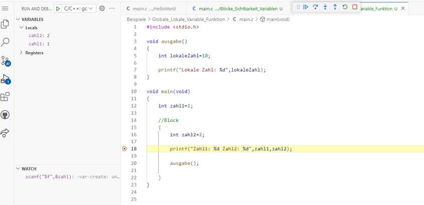

|                             |                          |                                        |
| --------------------------- | ------------------------ | -------------------------------------- |
| **Elektrotechniker/-in HF** | **Programmiertechnik B** |  |

- [1. Blöcke](#1-blöcke)
- [2. Einleitung](#2-einleitung)
  - [2.1. Schachtelung von Codeblöcken in C](#21-schachtelung-von-codeblöcken-in-c)
  - [2.2. Sichtbarkeit in Block](#22-sichtbarkeit-in-block)
  - [2.3. Sichtbarkeit lokal und global](#23-sichtbarkeit-lokal-und-global)
- [3. Aufgaben](#3-aufgaben)
  - [3.1. Sichbarkeit von lokalen Variablen](#31-sichbarkeit-von-lokalen-variablen)
  - [3.2. Zugriff auf globale Variablen](#32-zugriff-auf-globale-variablen)
  - [Einfacher Taschenrechner in C programmieren](#einfacher-taschenrechner-in-c-programmieren)
    - [Anforderungen](#anforderungen)
    - [Beispielablauf](#beispielablauf)
    - [Bonus (optional)](#bonus-optional)

---

# 1. Blöcke

# 2. Einleitung

- Ein Block stellt eine beliebige Folge von Anweisungen dar. 
- Diese Folge von Anweisungen wird sequenziell im Programmcode ausgeführt.

```c
{

Anweisung1; 
Anweisung2;

}
```

## 2.1. Schachtelung von Codeblöcken in C

- Die Schachtelung von **Codeblöcken** in C ermöglicht eine detailliertere Steuerung des Programmablaufs. 
- Sie ist besonders wichtig, um die Logik eines Programms klar zu strukturieren. 
- **Schachtelung** bedeutet, dass Codeblöcke innerhalb anderer Codeblöcke enthalten sind. 
- Zu den wichtigsten Mechanismen gehören:
  - Bedingte Anweisungen (if, else, else if)
  - Schleifen (for, while, do-while)
  - Funktionen

```c
#include <stdio.h>

int myFunc()
{

  return 0;
}

void myFunc2()
{

}

void main(void)
{
  int zahl1 = 1;

  // Block
  {
    int zahl2 = 2;
    printf("Zahl1: %d Zahl2: %d", zahl1, zahl2);
  }
}

```

## 2.2. Sichtbarkeit in Block

- Ein Variable welche innerhalb eines Blockes definiert wurde ist nur sichtbar
- Ein Varialbe ausserhalb des Blockes ist auch innerhalb des Blockes sichtbar

```c
void main(void)
{
  int zahl1 = 1;

  // Block
  {
    int zahl2 = 2;
    printf("Zahl1: %d Zahl2: %d", zahl1, zahl2);
  }

  zahl2 = 0;  // Fehler, Variable steht nicht mehr im Zugriff
}
```

```c
#include <stdio.h>

void main(void)
{
  int zahl1=1;

  //Block
  {
     int zahl2=2;
     printf("Zahl1: %d Zahl2: %d",zahl1,zahl2);  // Zugriff auf lokale Variable zahl2 funktioniert
  }
}
```

## 2.3. Sichtbarkeit lokal und global

- Eine lokale Variable einer Funktion lebt nur so lange wie die Funktion läuft
- Eine globale Variable ist verfügbar und läuft so lange wie das Programm läuft. (ist aber nicht sichtbar in der Funktion)



Beispiel:

```c
#include <stdio.h>

void ausgabe(void)
{
  int lokaleZahl = 10;

  printf("Lokale Zahl ist: %d", lokaleZahl);
}

void main(void)
{
  int zahl1 = 1;

  {
    int zahl2 = 2;

    printf("Zahl1: %d, Zahl2: %d", zahl1, zahl2);
  }
}
```

---

</br>

# 3. Aufgaben

## 3.1. Sichbarkeit von lokalen Variablen

| **Vorgabe**         | **Beschreibung**                                                                |
| :------------------ | :------------------------------------------------------------------------------ |
| **Lernziele**       | Kennt die Sichbarkeit von Variablen (lokal u. global)                           |
|                     | Kenn die Sichbarkeit von Variablen in Code Blöcken                              |
|                     | Kann Entscheiden, wann eine lokale oder golbale Variable eingesetzt werden soll |
| **Sozialform**      | Einzelarbeit                                                                    |
| **Auftrag**         | siehe unten                                                                     |
| **Hilfsmittel**     |                                                                                 |
| **Zeitbedarf**      | 20min                                                                           |
| **Lösungselemente** |                                                                                 |

**Auftrag:**

- Kopieren den Programmcode unten in dein Editor und führe das Programm mit dem Debugger Schritt für Schrit aus.
- Kontrolliere im VARIABLES-Fenster (links) wann welche lokale Variablen zur Verfügung stehen und wann der Zugriff verloren geht.

```c
#include <stdio.h>

void ausgabe(void)
{
  // welche Variablen stehen zur Verfügung?
  
  int lokaleZahl = 10;

  printf("Lokale Zahl ist: %d", lokaleZahl);
}

void main(void)
{
  int zahl1 = 1;

  // Funktion wird augerufen
  ausgabe();

  // Ein neuer Block beginnt
  {
    int zahl2 = 2;

    printf("Zahl1: %d, Zahl2: %d", zahl1, zahl2);
  }

  // Steht die Variable zahl1 noch zur Verfügung?
  // Steht die Variable zahl2 noch zur Verfügüng?
  
  printf("Ende");
}
```

## 3.2. Zugriff auf globale Variablen

| **Vorgabe**         | **Beschreibung**                                                                |
| :------------------ | :------------------------------------------------------------------------------ |
| **Lernziele**       | Kennt die Sichbarkeit von Variablen (lokal u. global)                           |
|                     | Kenn die Sichbarkeit von Variablen in Code Blöcken                              |
|                     | Kann Entscheiden, wann eine lokale oder golbale Variable eingesetzt werden soll |
| **Sozialform**      | Einzelarbeit                                                                    |
| **Auftrag**         | siehe unten                                                                     |
| **Hilfsmittel**     |                                                                                 |
| **Zeitbedarf**      | 20min                                                                           |
| **Lösungselemente** |                                                                                 |

**Auftrag:**

- Das nachfolgende C-Progamm funktioniert noch nicht.
- Überlege auf welcher Ebene die Variable des Kontostands (kontostand) deklariert sein muss.
- Stelle das Programm fertig, sodass die Ein- und Auszahlungen funktionieren und der korrekte Kontostand angezeigt wird.

```c
#include <stdio.h>

// Funktion zum Einzahlen eines Betrags
void einzahlen()
{
  float betrag; // Lokale Variable
  printf("Geben Sie den Betrag zum Einzahlen ein: ");
  scanf("%f", &betrag);

  // Einzahlen
  kontostand += betrag; // Der globale Kontostand wird verändert

  printf("Neuer Kontostand nach Einzahlung: %.2f\n", kontostand);
}

// Funktion zum Abheben eines Betrags
void abheben()
{
  float betrag; // Lokale Variable
  printf("Geben Sie den Betrag zum Abheben ein: ");
  scanf("%f", &betrag);

  // Abheben
  if (betrag <= kontostand)
  {
    kontostand -= betrag; // Der globale Kontostand wird verändert
    printf("Neuer Kontostand nach Abhebung: %.2f\n", kontostand);
  }
  else
  {
    printf("Nicht genügend Guthaben!\n");
  }
}

int main()
{
  printf("Startkontostand: %.2f\n", kontostand);

  // Einzahlung durchführen
  einzahlen();

  // Abhebung durchführen
  abheben();

  // Endkontostand anzeigen
  printf("Endkontostand: %.2f\n", kontostand);

  return 0;
}
```
