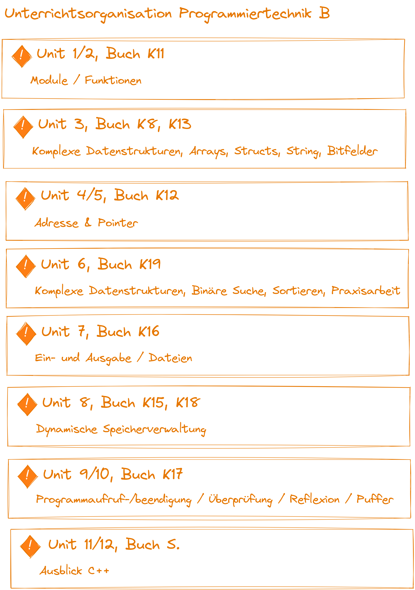

|                             |                          |                                        |
| --------------------------- | ------------------------ | -------------------------------------- |
| **Elektrotechniker/-in HF** | **Programmiertechnik B** |  |

# Einführung

## Handlungskompetenz

- Die Dipl. Elektrotechniker/-in HF müssen sich bei Diskussionen im Fachgebiet Programmiertechnik kompetent einbringen können. 
- Sie können den technischen Argumentationen folgen und sie verstehen die technischen Zusammenhänge. Damit sind sie in der Lage, Grundlagen für Entscheidungen zu erarbeiten. 
- Sie entwerfen, programmieren und bauen neue Geräte, Anlagen und Systeme.

---

## Curriculum

| **Vorgabe**   | **Beschreibung** |
| :------------ | :--------------- |
| **Fachcode**  | PROB.TI1A        |
| **Lektionen** | 60               |
| **Semester**  | D                |
| **Prüfung**   | 1 x Teilprüfung  |

---

## Lehrgang

[Ausschreibung](https://www.ipso.ch/angebote/dipl-elektrotechnikerin-hf?school=ibz)

---

## Unterrichtsorganisation

- Lektionen: 60 Lektionen
  - 50% Theorie, 50% Übungen
  - Gruppenarbeiten
  - Einzelarbeiten
  - Gemeinsames lösen von Aufgaben
- Prüfungen
  - 1 TP (Teilpfrüfung)
  - 1 FP (Fachprüfung)
  - 1 PA (Praxisarbeit)
- Hausaufgaben
  - Werden im Unterricht oder per Mail angekündigt
  - Richtgrösse: 2h / Block
- Erreichbarkeit
  - <lukas.mueller@dozent.ipso.ch> innerhalb von 3 Tagen (Antwort)

---

## Unterrichtsstrukturierung

