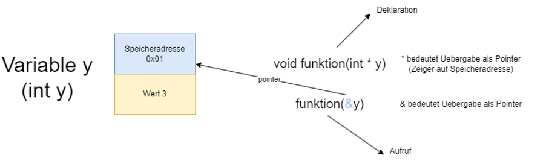
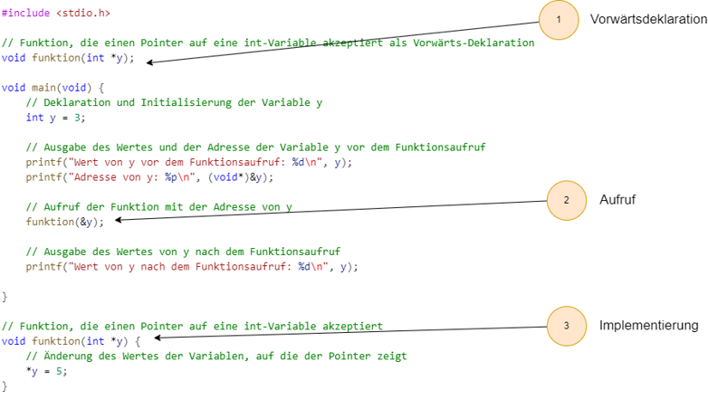

|                             |                          |                                        |
| --------------------------- | ------------------------ | -------------------------------------- |
| **Elektrotechniker/-in HF** | **Programmiertechnik B** |  |

- [1. Funktionen](#1-funktionen)
  - [1.1. Funktionsdefinition](#11-funktionsdefinition)
  - [1.2. Funktionsdeklaration (Prototyp)](#12-funktionsdeklaration-prototyp)
  - [1.3. Funktionsaufruf](#13-funktionsaufruf)
  - [1.4. Rückgabewert einer Funktion](#14-rückgabewert-einer-funktion)
  - [1.5. Funktionen ohne Rückgabewert (`void` Funktionen)](#15-funktionen-ohne-rückgabewert-void-funktionen)
  - [1.6. Übergabe von Parametern an Funktionen](#16-übergabe-von-parametern-an-funktionen)
    - [1.6.1. Definition von call-by-value](#161-definition-von-call-by-value)
    - [1.6.2. Definition von call-by-reference](#162-definition-von-call-by-reference)
    - [1.6.3. Beispiel call-by-value](#163-beispiel-call-by-value)
    - [1.6.4. Beispiel call-by-reference (Zeiger)](#164-beispiel-call-by-reference-zeiger)
  - [1.7. Variablenbereich (Scope)](#17-variablenbereich-scope)
  - [1.8. Standardbibliotheken und Funktionen](#18-standardbibliotheken-und-funktionen)
  - [1.9. Beispielprogramm mit Funktion](#19-beispielprogramm-mit-funktion)
  - [1.10. Beispielprogramm mit mehreren Funktionen](#110-beispielprogramm-mit-mehreren-funktionen)
  - [1.11. Vorwärtsdeklarationen von Fuktionen](#111-vorwärtsdeklarationen-von-fuktionen)
- [2. Aufgaben](#2-aufgaben)
  - [2.1. Trennstriche](#21-trennstriche)
  - [2.2. Ersatzwiderstand](#22-ersatzwiderstand)
  - [2.3. Blöcke](#23-blöcke)
  - [2.4. Swap-Funktion](#24-swap-funktion)

---

</br>

# 1. Funktionen

- **Funktionen** sind ein zentraler Bestandteil der C-Programmierung, da sie es ermöglichen, Code zu **modularisieren** und zu **strukturieren**.
- Eine **Funktion** in C ist ein Block von Code, der eine **bestimmte Aufgabe ausführt**.
- **Funktionen** kann Daten empfangen (Argumente) und ein Ergebnis zurückgeben.
- **Funktionen** in C bieten eine Möglichkeit zur **Wiederverwendbarkeit** von Code.
- Eine **Funktion** hat immer einen **Rückgabetyp**, einen **Namen** und ggf. **Parameter**.
- **Funktionen** können Parameter nach **Wert** oder nach **Referenz** übergeben (mit Zeigern).
- Rekursive **Funktionen** rufen sich selbst auf und lösen wiederkehrende Probleme.


## 1.1. Funktionsdefinition

- Eine Funktion wird durch ihre **Signatur** und **Implementierung** definiert.
- Die Signatur umfasst den **Rückgabetyp** der Funktion, ihren **Namen** und die **Parameter** (Eingabewerte).

**Syntax der Funktionsdefinition:**

```c
Rückgabetyp Funktionsname(Parameter1, Parameter2, ...) {
    // Funktionskörper
}
```

- **Rückgabetyp:**
  - Gibt an, welchen Typ von Wert die Funktion zurückgibt (z. B. `int`, `float`, `void` für keine Rückgabe).
- **Funktionsname:**
  - Der Name der Funktion, der verwendet wird, um sie aufzurufen.
- **Parameter:**
  - Die Werte, die an die Funktion übergeben werden (optional).

## 1.2. Funktionsdeklaration (Prototyp)

- Bevor eine **Funktion** verwendet wird, muss sie entweder definiert oder ihr Prototyp deklariert werden.
- Der Funktionsprototyp wird häufig am Anfang einer Datei oder in einer Header-Datei (`.h`) platziert.

**Syntax des Funktionsprototyps:**

```c
Rückgabetyp Funktionsname(Parameter1, Parameter2, ...);
```

- Ein Funktionsprototyp gibt an, welche Parameter die Funktion erwartet und welchen Rückgabetyp sie hat.
- Es ist nicht notwendig, den Funktionskörper zu definieren.

**Beispiel eines Prototyps:**

```c
int addiere(int a, int b);
```

## 1.3. Funktionsaufruf

- Ein Funktionsaufruf erfolgt durch den Funktionsnamen und Übergabe der Argumente (falls vorhanden).

**Syntax des Funktionsaufrufs:**

```c
Funktionsname(Argument1, Argument2, ...);
```

**Beispiel eines Funktionsaufrufs:**

```c
int ergebnis = addiere(5, 3);
```

## 1.4. Rückgabewert einer Funktion

- Eine Funktion kann einen Wert zurückgeben, der an den Funktionsaufrufer übergeben wird.
- Der Rückgabewert wird durch das Schlüsselwort `return` angegeben.

**Syntax:**

```c
return Wert;
```

Der Rückgabetyp der Funktion muss mit dem Datentyp des Wertes übereinstimmen.

**Beispiel:**

```c
int addiere(int a, int b) {
    return a + b;  // Gibt die Summe von a und b zurück
}
```

## 1.5. Funktionen ohne Rückgabewert (`void` Funktionen)

- Wenn eine Funktion keinen Wert zurückgeben soll, wird der Rückgabetyp mit `void` angegeben.
- Diese Funktionen werden oft verwendet, um eine Aufgabe auszuführen, ohne etwas zurückzugeben.

**Beispiel:**

```c
void druckeGruss() {
    printf("Hallo, Welt!\n");
}
```

**Aufruf:**

```c
druckeGruss();  // Ruft die Funktion auf, die nichts zurückgibt
```

## 1.6. Übergabe von Parametern an Funktionen

In C gibt es zwei Hauptmethoden, um Parameter an eine Funktion zu übergeben: **Pass-by-Value** und **Pass-by-Reference**.

### 1.6.1. Definition von call-by-value

- **call-by-value** ist ein Übergabemechanismus von Parametern in Funktionen oder Methoden, bei dem der Wert der Argumente **kopiert** und in die aufrufende Funktion eingefügt wird.
- Dies bedeutet, dass Änderungen an den Parametern innerhalb der Funktion die ursprünglichen Variablen ausserhalb der Funktion **nicht** beeinflussen.

### 1.6.2. Definition von call-by-reference

- Bei **call-by-reference** wird im Gegensatz zum **call-by-value** die **Adresse** einer Variablen übergeben.
- Dies ermöglicht es der aufgerufenen Funktion oder Methode, direkt auf die übergebene Variable zuzugreifen und ihre Werte zu modifizieren.
- Folglich sind alle Änderungen an der Variable in der Funktion auch ausserhalb dieser sichtbar.

> **C hat keine Referenzen - Eine Parameterübergabe und gleichzeitige Verwendung von einer Variablen in einer Funktion ist bei C nur über einen Pointer möglich**



```c
#include <stdio.h>

// Funktion, die einen Pointer auf eine int-Variable akzeptiert
void funktion(int *y) {
    // Änderung des Wertes der Variablen, auf die der Pointer zeigt
    *y = 5;
}

void main(void) {
    // Deklaration und Initialisierung der Variable y
    int y = 3;
    
    // Ausgabe des Wertes und der Adresse der Variable y vor dem Funktionsaufruf
    printf("Wert von y vor dem Funktionsaufruf: %d\n", y);
    printf("Adresse von y: %p\n", (void*)&y);
    
    // Aufruf der Funktion mit der Adresse von y
    funktion(&y);
    
    // Ausgabe des Wertes von y nach dem Funktionsaufruf
    printf("Wert von y nach dem Funktionsaufruf: %d\n", y);
    
}
```

### 1.6.3. Beispiel call-by-value

- Beim **call-by-Value** wird eine **Kopie** der übergebenen Variablen an die Funktion übergeben.
- Änderungen an der Kopie haben **keine** Auswirkungen auf die Originalvariable.

**Beispiel:**

```c
void verdoppeln(int x) {
    x = x * 2;
}

int main() {
    int a = 5;
    verdoppeln(a);  // a bleibt 5
    printf("%d\n", a);  // Ausgabe: 5
    return 0;
}
```

### 1.6.4. Beispiel call-by-reference (Zeiger)

Beim **call-by-reference** wird die **Adresse** der Variablen an die Funktion übergeben, sodass die Funktion die Originalvariable ändern kann.

**Beispiel:**

```c
void verdoppleMitZeiger(int *x) {
    *x = *x * 2;
}

int main() {
    int a = 5;
    verdoppleMitZeiger(&a);  // a wird auf 10 gesetzt
    printf("%d\n", a);  // Ausgabe: 10
    return 0;
}
```

## 1.7. Variablenbereich (Scope)

- Der **Scope** einer Variablen gibt an, in welchem Bereich des Programms sie **sichtbar** und **verfügbar** ist.
- Variablen, die innerhalb einer Funktion deklariert werden, haben nur in dieser Funktion Gültigkeit (lokaler Scope).

**Beispiel:**

```c
void meineFunktion() {
    int a = 10;  // 'a' ist nur innerhalb von meineFunktion sichtbar
}

int main() {
    // 'a' ist hier nicht sichtbar, es führt zu einem Fehler
    return 0;
}
```

## 1.8. Standardbibliotheken und Funktionen

Die C-Standardbibliothek enthält viele nützliche Funktionen, die in Programmen verwendet werden können, z. B. Funktionen zur Eingabe/Ausgabe, String-Manipulation oder mathematische Funktionen.

**Beispiel (Eingabe/Ausgabe):**

```c
#include <stdio.h>

int main() {
    int zahl;

    printf("Gib eine Zahl ein: ");
    scanf("%d", &zahl);

    printf("Die eingegebene Zahl ist: %d\n", zahl);
    return 0;
}
```

**Beispiel (Mathematische Funktionen):**

```c
#include <math.h>

int main() {
    double wurzel = sqrt(16);  // Berechnet die Quadratwurzel von 16

    printf("Die Quadratwurzel von 16 ist: %.2f\n", wurzel);
    return 0;
}
```

## 1.9. Beispielprogramm mit Funktion

```c
#include <stdio.h>

int inkrementiere(int i) 
{
    i++;//i=i+1
    return i;
}

void main(void)
{
    int y = 10;  // Initialwert für y
    y=inkrementiere(y);
    printf("Ende, y = %d\n", y);
}
```

- Dieses Programm definiert eine Funktion `inkrementiere`, die eine Ganzzahlen als Eingabe erhält, diese inkrementiert und  zurückgibt.
- Das Beispiel zeigt, wie man Funktionen definiert, aufruft und mit Rückgabewerten umgeht.

---

## 1.10. Beispielprogramm mit mehreren Funktionen

```c
#include <stdio.h>

// Deklaration der Funktionen
int summe(int a, int b);
int produkt(int a, int b);
void ausgabe(int ergebnis);

// Definition der Funktion zur Berechnung der Summe
int summe(int a, int b) {
    return a + b;
}

// Definition der Funktion zur Berechnung des Produkts
int produkt(int a, int b) {
    return a * b;
}

// Definition der Funktion zur Ausgabe
void ausgabe(int ergebnis) {
    printf("Das Ergebnis ist %d.\n", ergebnis);
}

void main(void) {
    int zahl1, zahl2, ergebnisSumme, ergebnisProdukt;

    // Eingabe der zwei Zahlen
    printf("Geben Sie die erste Zahl ein: ");
    scanf("%d", &zahl1);
    printf("Geben Sie die zweite Zahl ein: ");
    scanf("%d", &zahl2);

    // Aufruf der Funktionen und Speichern der Ergebnisse
    ergebnisSumme = summe(zahl1, zahl2);
    ergebnisProdukt = produkt(zahl1, zahl2);

    // Ausgabe der Ergebnisse
    printf("Die Summerechnung von %d und %d:\n", zahl1, zahl2);
    ausgabe(ergebnisSumme);
    printf("Das Produktrechnung von %d und %d:\n", zahl1, zahl2);
    ausgabe(ergebnisProdukt);
}
```

## 1.11. Vorwärtsdeklarationen von Fuktionen

- Der Compiler kennt dank Vorwärtsdeklaration der Rumpf (Funktionsprototyp) der Funktion
- Die Funktion wird erst nach dem Aufruf implementiert.
- Ohne Vorwärtsdeklaration gibt es einen Compilerfehler



---

</br>

# 2. Aufgaben

## 2.1. Trennstriche

| **Vorgabe**         | **Beschreibung**                                                        |
| :------------------ | :---------------------------------------------------------------------- |
| **Lernziele**       | Kennt die Möglichkeiten zur Modularisierung und Strukturierung von Code |
|                     | Kann Funktionen mit und ohne Parameter implementieren                   |
|                     | Kann Funktionen korrekt aufrufen                                        |
| **Sozialform**      | Einzelarbeit                                                            |
| **Auftrag**         | siehe unten                                                             |
| **Hilfsmittel**     |                                                                         |
| **Zeitbedarf**      | 30min                                                                   |
| **Lösungselemente** | Funktionierendes Programm                                               |

Schreibe ein C-Programm, dass Trennstricht auf die Konsole ausgibt.

Das Programm soll die Funktion trennstriche() implementieren.

- Programmiere die Funktion `trennstriche80()`, die immer 80 Trennstriche ausgibt.
- Programmiere die Funktion `trennstriche` so, dass die Anzahl der auszugebehen Trennsriche an die Funktion als Parameter übergeben werden kann.
- Teste die Funktionsaufrufe im Haupprogramm (`main`)
- Prüfe, welche der beiden Funktion betreffend der Wiederverwendbarkeit obsiegt.

---

## 2.2. Ersatzwiderstand

| **Vorgabe**         | **Beschreibung**                                                        |
| :------------------ | :---------------------------------------------------------------------- |
| **Lernziele**       | Kennt die Möglichkeiten zur Modularisierung und Strukturierung von Code |
|                     | Kann Funktionen mit und ohne Parameter implementieren                   |
|                     | Kann Funktionen korrekt aufrufen                                        |
|                     | Kann zwischen "call by value" und "call by reference" unterscheiden     |
| **Sozialform**      | Einzelarbeit                                                            |
| **Auftrag**         | siehe unten                                                             |
| **Hilfsmittel**     |                                                                         |
| **Zeitbedarf**      | 20min                                                                   |
| **Lösungselemente** | Funktionierendes Programm                                               |

Schreiben Sie eine Funktion, welche den Ersatzwiderstand `R` einer Parallelschaltung aus zwei Widerständen `R1` und `R2` bestimmt.
Die Funktion soll in der main-Funktion aufgerufen und dort das Resultat ausgegeben werden.

Die Formel lautet:

> **`1/R = 1/R1 + 1/R2`**

oder

> **`R = (R1 * R2) / (R1 + R2)`**

Schreiben Sie die Funktion mehrmals mit unterschiedlicher Signatur:

- Die Funktion erwartet die Parameter R1 und R2 und gibt das Resultat als **Rückgabewert** zurück.
- Die Funktion erwartet die Parameter R1 und R2 und das Resultat mittels **call-by-pointer**.
- Die Funktion erwartet die Parameter R1 und R2 und nutzt eine **globale Variable** für das Resultat.

---

## 2.3. Blöcke

| **Vorgabe**         | **Beschreibung**                                                        |
| :------------------ | :---------------------------------------------------------------------- |
| **Lernziele**       | Kennt die Möglichkeiten zur Modularisierung und Strukturierung von Code |
|                     | Kann Funktionen mit und ohne Parameter implementieren                   |
|                     | Kann Funktionen korrekt aufrufen                                        |
|                     | Kann zwischen "call by value" und "call by reference" unterscheiden     |
| **Sozialform**      | Einzelarbeit                                                            |
| **Auftrag**         | siehe unten                                                             |
| **Hilfsmittel**     |                                                                         |
| **Zeitbedarf**      | 20min                                                                   |
| **Lösungselemente** | Funktionierendes Programm                                               |

Analysieren Sie das folgende Programm und sagen Sie voraus, welchen Wert `x` an den Stellen mit `printf()` haben wird.
Starten Sie das Programm erst nach Ihrer Analyse.

```c
#include <stdio.h>

int x = 5;

void function1(int* u) 
{
  int x = 4;
  *u = 6;
  printf("f1 - der Wert von x ist %d\n", x);
}

void function2(int x) 
{
  printf("f2 - der Wert von x ist %d\n", x);
}

int main(void) 
{
  printf("main - der Wert von x ist %d\n", x);
  function1(&x);
  function2(7);
  printf("main - der Wert von x ist %d\n", x); 
  return 0;
}
```

---

## 2.4. Swap-Funktion

| **Vorgabe**         | **Beschreibung**                                                        |
| :------------------ | :---------------------------------------------------------------------- |
| **Lernziele**       | Kennt die Möglichkeiten zur Modularisierung und Strukturierung von Code |
|                     | Kann Funktionen mit und ohne Parameter implementieren                   |
|                     | Kann Funktionen korrekt aufrufen                                        |
|                     | Kann zwischen "call by value" und "call by reference" unterscheiden     |
| **Sozialform**      | Einzelarbeit                                                            |
| **Auftrag**         | siehe unten                                                             |
| **Hilfsmittel**     |                                                                         |
| **Zeitbedarf**      | 30min                                                                   |
| **Lösungselemente** | Funktionierendes Programm                                               |

Schreibe ein C-Programm, dass in einer Funktion `swap()` zwei Ganzzahlen tauscht.

Vervollständige das nachfolgende C-Programm mit folgenden Elementen:

- Erweitere die `swap()` Funktion, sodass diese zwei Ganzzahlen als Parameter erhalteen kann.
- Tausche die beiden Ganzahlen in der Funktion
- Überlege, wie die Ganzzahlen an die Funktion zu übergeben sind, sodass die Zahlen im `main` vertauscht ausgegeben werden.

```c
#include <stdio.h>

void swap()
{
}

void main(void)
{
  int Zahl1 = 10,
      Zahl2 = 20;

  printf("Vor Swap(): Zahl1=%d, Zahl2=%d\n", Zahl1, Zahl2);

  // Hier ist die Funktion swap() aufzurufen

  printf("Nach Swap(): Zahl1=%d, Zahl2=%d\n", Zahl1, Zahl2);
}
```
