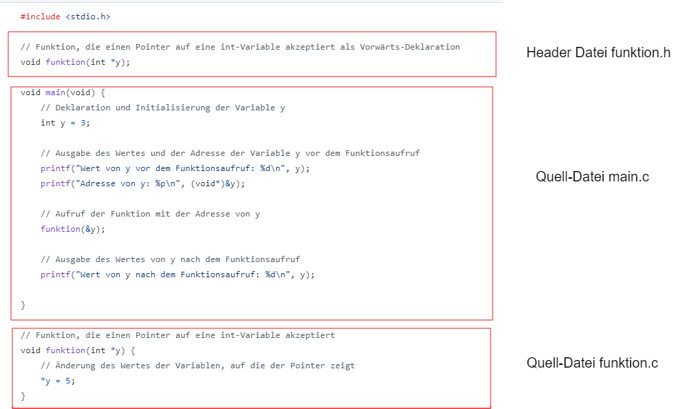

|                             |                          |                                        |
| --------------------------- | ------------------------ | -------------------------------------- |
| **Elektrotechniker/-in HF** | **Programmiertechnik B** |  |

- [1. Module](#1-module)
  - [1.1. Module mit Header Dateien](#11-module-mit-header-dateien)
    - [1.1.1. Beispiel](#111-beispiel)
    - [1.1.2. Build mit mehreren Dateien](#112-build-mit-mehreren-dateien)
- [2. Aufgaben](#2-aufgaben)
  - [2.1. Separates Module für Trennstrich-Funktionen](#21-separates-module-für-trennstrich-funktionen)
  - [2.2. Ersatzwiderstandsberechnung in Modul](#22-ersatzwiderstandsberechnung-in-modul)

---

</br>

# 1. Module

## 1.1. Module mit Header Dateien

Das Definieren eigener Module in C ist sinnvoll aus mehreren Gründen:

- **Wiederverwendbarkeit**: Code kann in verschiedenen Projekten wiederverwendet werden, ohne ihn neu schreiben zu müssen.
- **Modularität**: Der Code wird in logische Einheiten unterteilt, die leichter zu verstehen und zu warten sind.
- **Kapselung**: Interne Implementierungsdetails werden verborgen, nur die notwendigen Schnittstellen werden offengelegt.
- **Wartbarkeit**: Änderungen in einem Modul haben weniger Auswirkungen auf andere Teile des Programms.
- **Lesbarkeit**: Der Code wird klarer und strukturierter, was das Verständnis und die Zusammenarbeit erleichtert.
- **Fehlervermeidung**: Modularer Code fördert eine klare Trennung der Verantwortlichkeiten, was die Wahrscheinlichkeit von Fehlern reduziert.
- **Kompilierungszeit**: Änderungen in einem Modul erfordern nur die Neukompilierung dieses Moduls und nicht des gesamten Projekts.
- **Testbarkeit**: Einzelne Module können isoliert getestet werden, was die Fehlerfindung und -behebung vereinfacht.
- **Teamarbeit**: Verschiedene Teammitglieder können an unterschiedlichen Modulen gleichzeitig arbeiten, ohne Konflikte zu verursachen.
- **Erweiterbarkeit**: Neue Funktionen können durch Hinzufügen neuer Module einfach integriert werden, ohne den bestehenden Code wesentlich zu ändern.

### 1.1.1. Beispiel

Aufteilen bestehendes Beispiel in mehrere Module



Headerdatei: `funktion.h`

```c
#ifndef _FUNKTION_H_H
#define _FUNKTION_H_H

// Vorwärtsdeklaration
extern void funktion(int *y);

#endif
```

Implementierungsdatei: `funktion.c`

```c
#include "funktion.h"

// Vorwärtsdeklaration
void funktion(int *y)
{
  *y = 5;
}
```

Hauptprogramm: `main.c`

```c
#include <stdio.h>
#include "funktion.h"

void main(void) 
{
  // Deklaration und Initialisierung der Variable y
  int y = 3;

  // Ausgabe des Wertes und der Adresse der Variable y vor dem Funktionsaufruf
  printf("Wert von y vor dem Funktionsaufruf: %d\n", y);
  printf("Adresse von y: %p\n", (void*)&y);

  // Aufruf der Funktion mit der Adresse von y
  funktion(&y);

  // Ausgabe des Wertes von y nach dem Funktionsaufruf
  printf("Wert von y nach dem Funktionsaufruf: %d\n", y);
}
```

### 1.1.2. Build mit mehreren Dateien

```console
gcc *.c -o main.exe & ./main.exe
```

Beispiel Visual Studio Code (tasks.json)

```json
{
    "tasks": [
        {
            "type": "cppbuild",
            "label": "C/C++: gcc Aktive Datei kompilieren",
            "command": "/usr/bin/gcc",
            "args": [
                "-fdiagnostics-color=always",
                "-g",
                "${fileDirname}/*.c",
                "${fileDirname}/*.h",
                "-o",
                "${fileDirname}/${fileBasenameNoExtension}"
            ],
            "options": {
                "cwd": "${fileDirname}"
            },
            "problemMatcher": [
                "$gcc"
            ],
            "group": {
                "kind": "build",
                "isDefault": true
            },
            "detail": "Vom Debugger generierte Aufgabe."
        }
    ],
    "version": "2.0.0"
}
```

---

</br>

# 2. Aufgaben

## 2.1. Separates Module für Trennstrich-Funktionen

| **Vorgabe**         | **Beschreibung**                                                        |
| :------------------ | :---------------------------------------------------------------------- |
| **Lernziele**       | Kennt die Möglichkeiten zur Modularisierung und Strukturierung von Code |
|                     | Kann Funktionen in separate Dateien auslagern                           |
|                     | Kann Funktionen korrekt aufrufen                                        |
| **Sozialform**      | Einzelarbeit                                                            |
| **Auftrag**         | siehe unten                                                             |
| **Hilfsmittel**     |                                                                         |
| **Zeitbedarf**      | 30min                                                                   |
| **Lösungselemente** | Funktionierendes Programm                                               |

Lagere die beiden Trennstrich-Funtionen (siehe Aufgaben U01) in einem separates Modul aus z.B. `func.c`.
Erstelle für die beiden Funktionen ein Headerdatei z.B. `func.h`
Rufe die die beiden Funktionen im `main` Programm auf.

---

## 2.2. Ersatzwiderstandsberechnung in Modul

| **Vorgabe**         | **Beschreibung**                                                        |
| :------------------ | :---------------------------------------------------------------------- |
| **Lernziele**       | Kennt die Möglichkeiten zur Modularisierung und Strukturierung von Code |
|                     | Kann Funktionen in separate Dateien auslagern                           |
|                     | Kann Funktionen korrekt aufrufen                                        |
| **Sozialform**      | Einzelarbeit                                                            |
| **Auftrag**         | siehe unten                                                             |
| **Hilfsmittel**     |                                                                         |
| **Zeitbedarf**      | 30min                                                                   |
| **Lösungselemente** | Funktionierendes Programm                                               |

Lagere die beiden Ersatzwiderstandberechnungsfunktionen (siehe Aufgaben U01) in einem separates Modul aus z.B. `calc.c`.

Erstelle für die beiden Funktionen ein Headerdatei z.B. `calc.h`
Rufe alle Funktionen im `main` Programm auf und gebe das Resultat in der Konsole aus.
