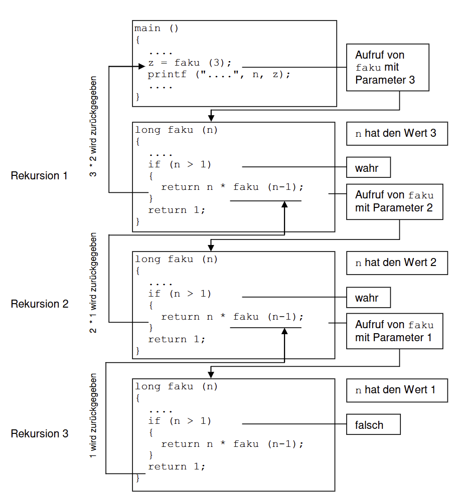
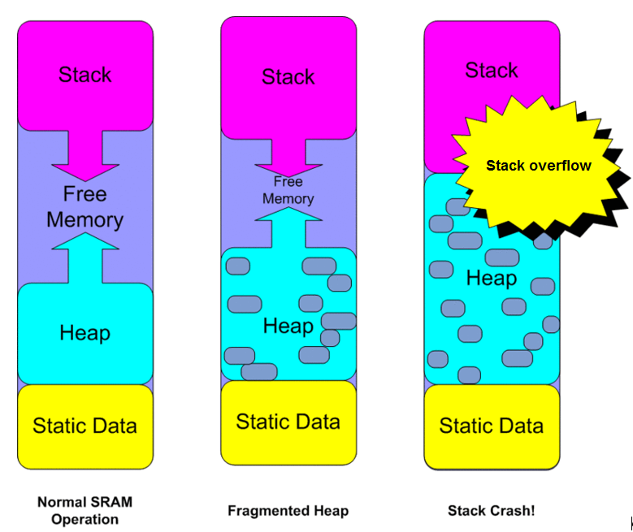
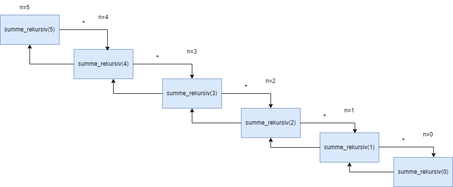

|                             |                          |                                        |
| --------------------------- | ------------------------ | -------------------------------------- |
| **Elektrotechniker/-in HF** | **Programmiertechnik B** |  |

- [1. Rekursive Funktionen](#1-rekursive-funktionen)
  - [1.1. Einleitung](#11-einleitung)
  - [1.2. Stack](#12-stack)
  - [1.3. E-Book](#13-e-book)
- [2. Aufgaben](#2-aufgaben)
  - [2.1. Analysiere rekursiven Programmcode](#21-analysiere-rekursiven-programmcode)
  - [2.2. Summe iterativ und rekursiv berechnen](#22-summe-iterativ-und-rekursiv-berechnen)
  - [2.3. Potenz iterativ und rekursiv berechnen](#23-potenz-iterativ-und-rekursiv-berechnen)

---

</br>

# 1. Rekursive Funktionen

## 1.1. Einleitung

- Eine Funktion kann sich **selbst** aufrufen, was als **Rekursion** bezeichnet wird.
- **Rekursive** Funktionen werden verwendet, um Probleme zu lösen, die sich in kleinere Teilprobleme zerlegen lassen.
- Bei jedem Aufruf werden die lokalen Variablen auf dem **Stack** abgelegt.
- Ein Algorithmus heisst rekursiv, wenn er Bereiche enthält, die sich **selbst** wiederum aufrufen
- Jeder **rekursiv** gelöste Algorithmus kann auch iterativ gelöst werden



**Beispiel: Berechnung der Fakultät (n!):**

```c
int fakultät(int n) {
    if (n <= 1) {
        return 1;  // Basisfall
    } else {
        return n * fakultät(n - 1);  // Rekursiver Aufruf
    }
}

int main() {
    int result = fakultät(5);  // Berechnet 5! = 120
    printf("%d\n", result);  // Ausgabe: 120
    return 0;
}
```

> **Wichtig: Eine zu hohe Zahl von rekursiven Aufrufen führt zum Überlauf des Stacks.**



## 1.2. Stack

Der Stack dient dazu, den Speicherbereich für Funktionsaufrufe zu verwalten. Dieser Speicherbereich ist dynamisch, was bedeutet, dass der Speicher bei Bedarf automatisch anwächst und wieder schrumpft. Der Compiler, der diesen Stack verwaltet, legt hier alle Daten ab, die er zur Verwaltung von Funktionsaufrufen benötigt.

Wenn eine Funktion aufgerufen wird, erweitert der Compiler den Stack um einen Datenblock. In diesem Datenblock werden die Parameter, die lokalen Variablen und die Rücksprungadresse zur aufrufenden Funktion angelegt. Dieser Datenblock wird als Stack-Frame oder Stackrahmen bezeichnet.

## 1.3. E-Book


---

</br>

# 2. Aufgaben

## 2.1. Analysiere rekursiven Programmcode

| **Vorgabe**         | **Beschreibung**                                   |
| :------------------ | :------------------------------------------------- |
| **Lernziele**       | Vershehen wie eine Rekursion programmiert wird     |
|                     | Kann ein rekursiver Code analysieren und erläutern |
|                     | Keine eine Logik rekursiv implementieren           |
| **Sozialform**      | Einzelarbeit                                       |
| **Auftrag**         | siehe unten                                        |
| **Hilfsmittel**     |                                                    |
| **Zeitbedarf**      | 20min                                              |
| **Lösungselemente** | Funktionierendes Programm                          |

Studieren Sie das folgende Programm:

```c
#include <stdio.h>

void unbekannteFunktion(void) 
{
  int c = getchar(); 
  if (c != '\n') 
  {
    unbekannteFunktion();
  }
  putchar(c);
}

int main(void) 
{ 
  unbekannteFunktion();
  return 0;
}
```

- Welche Ausgabe erwarten Sie von dem Programm, wenn Sie 123 eintippen?
- Schreiben Sie das Ergebnis auf.
- Testen Sie anschließend das Programm.

---

## 2.2. Summe iterativ und rekursiv berechnen

| **Vorgabe**         | **Beschreibung**                                   |
| :------------------ | :------------------------------------------------- |
| **Lernziele**       | Vershehen wie eine Rekursion programmiert wird     |
|                     | Kann ein rekursiver Code analysieren und erläutern |
|                     | Keine eine Logik rekursiv implementieren           |
| **Sozialform**      | Einzelarbeit                                       |
| **Auftrag**         | siehe unten                                        |
| **Hilfsmittel**     |                                                    |
| **Zeitbedarf**      | 30min                                              |
| **Lösungselemente** | Funktionierendes Programm                          |

- Schreibe ein C-Programm, wo ich eine Ganzahl eingeben muss und mir die Summe der ganzen Zahlen von 0 bis zu dieser Ganzahl berechnet.
- Mache für die Summenrechnung zuerst eine iterative Funktion und dann eine Rekursive.
- Schaue, dass das Ergebnis von beiden Funktionen gleich ist.



---

## 2.3. Potenz iterativ und rekursiv berechnen

| **Vorgabe**         | **Beschreibung**                                   |
| :------------------ | :------------------------------------------------- |
| **Lernziele**       | Vershehen wie eine Rekursion programmiert wird     |
|                     | Kann ein rekursiver Code analysieren und erläutern |
|                     | Keine eine Logik rekursiv implementieren           |
| **Sozialform**      | Einzelarbeit                                       |
| **Auftrag**         | siehe unten                                        |
| **Hilfsmittel**     |                                                    |
| **Zeitbedarf**      | 30min                                              |
| **Lösungselemente** | Funktionierendes Programm                          |

Die Potenz an soll für ein reellwertiges `a` und ein ganzzahliges positives `n` berechnet werden.

- Schreiben Sie eine Funktion, welche die Potenz mittels der `pow()`-Funktion berechnet.
- Berechnen Sie die Potenz mittels einer **Schleife**.
- Berechnen Sie die Potenz mittels einer **Rekursion**.

Alle drei Funktionen sollten dasselbe Resultat ergeben.
Nehmen Sie die Funktion mit der `pow()`-Funktion als Referenz, sie gibt das korrekte Resultat zurück.

Testen Sie Ihr Programm mit folgenden Eingabewerten:

- 5^2  2.5^8  1000^3  3^1000  7^1  1^7  1^777777  0^1  1^0  0^0
- Wenn die Resultate der Funktionen nicht übereinstimmen, überlegen Sie sich wieso.
- Es könnte sogar sein, dass etwas gänzlich unerwartetes passiert.
