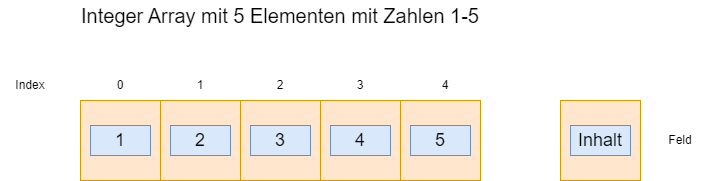

|                             |                          |                                        |
| --------------------------- | ------------------------ | -------------------------------------- |
| **Elektrotechniker/-in HF** | **Programmiertechnik B** |  |

- [1. Eindimensionale Arrays (Datenfelder)](#1-eindimensionale-arrays-datenfelder)
  - [1.1. E-Book](#11-e-book)
  - [1.2. Definition von Arrays](#12-definition-von-arrays)
  - [1.3. Deklaration von Arrays](#13-deklaration-von-arrays)
  - [1.4. Initialisierung von Arrays](#14-initialisierung-von-arrays)
  - [1.5. Zugriff auf ein Element](#15-zugriff-auf-ein-element)
  - [1.6. Arrays und Schleifen](#16-arrays-und-schleifen)
- [2. Aufgaben](#2-aufgaben)
  - [2.1. Aufgabe Pointer](#21-aufgabe-pointer)
  - [2.2. Fehlende Überprüfung auf Überschreitung der Feldgrenzen bei Arrays](#22-fehlende-überprüfung-auf-überschreitung-der-feldgrenzen-bei-arrays)
  - [2.3. Aufgabe Temperaturstatistik](#23-aufgabe-temperaturstatistik)

---

# 1. Eindimensionale Arrays (Datenfelder)

## 1.1. E-Book


## 1.2. Definition von Arrays

- Arrays sind in C ein grundlegender Datentyp, mit dem sich mehrere Werte des gleichen Typs unter einem gemeinsamen Namen speichern lassen.
- Sie sind besonders nützlich, wenn man eine Sammlung von Daten bearbeiten oder strukturieren möchte – z.B. eine Liste von Zahlen oder Zeichen.
- Ein Array ist eine Sammlung von Daten gleichen Typs, die im zusammenhängenden Speicherbereich abgelegt sind.
- Jedes Element im Array ist über einen **Index** zugreifbar, wobei die Zählung bei **0** beginnt.

```c
// Deklaration von 5 Zahlen
int zahlen[5];

// Zugriff Zuweisung Wert (erstes Element)
zahlen[0]=1;

// Zugriff Zuweisung Wert (letztes Element)
zahlen[4]=5;
```

Dies reserviert Speicher für 5 Ganzzahlen (int). Die einzelnen Elemente sind:

- zahlen[0]
- zahlen[1]
- zahlen[2]
- zahlen[3]
- zahlen[4]



```c
/*...*/

for (int index = 1 ; index < 5 ; index++) 
{
  printf("%d\n", zahlen[index]);
}
```

## 1.3. Deklaration von Arrays

Ein Array wird deklariert, indem der Datentyp, der Name des Arrays und die Größe in eckigen Klammern angegeben werden.

Allgemeine Syntax: `<Datentyp> <Arrayname>[<Grösse>];`

**Beispiele:**

```c
int zahlen[10];         // Array aus 10 int-Werten
float noten[5];         // Array aus 5 float-Werten
char buchstaben[26];    // Array aus 26 Zeichen
```

> **Hinweis: Die Größe muss zur Kompilierzeit bekannt sein (es sei denn, du nutzt dynamische Arrays mit malloc)**

## 1.4. Initialisierung von Arrays

Ein Array kann direkt bei der Deklaration initialisiert werden.

```c
int zahlen[5] = {10, 20, 30, 40, 50};
```

**Automatische Größenbestimmung:**

```c
int zahlen[] = {4, 8, 12};  // Compiler setzt Grösse auf 3
char name[] = "Max";  // = {'M', 'a', 'x', '\0'}
```

## 1.5. Zugriff auf ein Element

Auf Array-Elemente wird mit dem Index zugegriffen. Dabei gilt: Index 0 ist das erste Element.

```c
int zahlen[3] = {5, 10, 15};

int x = zahlen[1];  // x = 10
zahlen[2] = 20;     // Das dritte Element wird auf 20 gesetzt
```

> **Der Zugriff ausserhalb des gültigen Bereichs (zahlen[3] in obigem Beispiel) führt zu undefiniertem Verhalten!**
> **Es gibt keinen automatischen Schutz vor Indexüberläufen in C.**

## 1.6. Arrays und Schleifen

Arrays werden häufig mit Schleifen verwendet – besonders for-Schleifen – um alle Elemente effizient zu durchlaufen.

```c
#include <stdio.h>

int main() {
    int zahlen[5];

    // Einlesen der Werte
    for (int i = 0; i < 5; i++) {
        printf("Geben Sie Zahl %d ein: ", i + 1);
        scanf("%d", &zahlen[i]);
    }

    // Ausgabe der Werte
    printf("Sie haben eingegeben: ");
    for (int i = 0; i < 5; i++) {
        printf("%d ", zahlen[i]);
    }

    return 0;
}
```

**Beispiel: Durchschnitt einer Notenliste berechnen:**

```c
#include <stdio.h>

int main() {
    float noten[4] = {2.3, 1.7, 3.0, 2.0};
    float summe = 0;

    for (int i = 0; i < 4; i++) {
        summe += noten[i];
    }

    float durchschnitt = summe / 4;
    printf("Durchschnitt: %.2f\n", durchschnitt);

    return 0;
}
```

---

# 2. Aufgaben

## 2.1. Aufgabe Pointer

| **Vorgabe**         | **Beschreibung**                                          |
| :------------------ | :-------------------------------------------------------- |
| **Lernziele**       | Verstehen wie Array's deklariert und initialisiert werden |
|                     | Kann auf einzelne Elemente eines Array's zugreifen        |
|                     | Kann ein Wert in einem Array setzen                       |
| **Sozialform**      | Einzelarbeit                                              |
| **Auftrag**         | siehe unten                                               |
| **Hilfsmittel**     |                                                           |
| **Zeitbedarf**      | 10min                                                     |
| **Lösungselemente** | Ausgabeliste der Zahlen                                   |

Überlegen Sie, was das folgende Programm ausgibt. Überzeugen Sie sich durch einen Programmlauf.

```c
#include <stdio.h>

int main(void) {
  size_t i;
  int ar[100];

  for (i = 0; i < 100; i = i + 1)
    ar[i] = 1;

  ar[11] = -5;
  ar[12] = ar[12] + 1;
  ar[13] = ar[0] + ar[11] + 4;

  for (i = 10; i <= 14; i = i + 1) 
    printf("ar[%2d] = %4d\n", (int)i, ar[i]);

  return 0;
}
```

## 2.2. Fehlende Überprüfung auf Überschreitung der Feldgrenzen bei Arrays

| **Vorgabe**         | **Beschreibung**                                          |
| :------------------ | :-------------------------------------------------------- |
| **Lernziele**       | Verstehen wie Array's deklariert und initialisiert werden |
|                     | Kann auf einzelne Elemente eines Array's zugreifen        |
|                     | Kann ein Wert in einem Array setzen                       |
| **Sozialform**      | Einzelarbeit                                              |
| **Auftrag**         | siehe unten                                               |
| **Hilfsmittel**     |                                                           |
| **Zeitbedarf**      | 10min                                                     |
| **Lösungselemente** | Ergebnis Analyse                                          |

- Führen Sie einen Programmlauf mit dem folgenden Programm durch.
- Analysieren Sie das Ergebnis!

```c
#include <stdio.h>

int main(void) {

  int i = 16; 
  int k = 21; 
  int l = 22; 
  int p = 23; 
  int q = 24;

  int ar[100];

  for (size_t i = 0; i < 100; i = i + 1)
    ar[i] = 27;

  printf("i ist %d\n", i); 
  printf("ar[-1] ist %d\n", ar[-1]); 
  printf("ar[0] ist %d\n", ar[0]); 
  printf("ar[100] ist %d\n", ar[100]); 
  printf("ar[101] ist %d\n", ar[101]); 
  printf("ar[102] ist %d\n", ar[102]); 
  printf("ar[103] ist %d\n", ar[103]); 
  printf("ar[-2] ist %d\n", ar[-2]); 
  printf("ar[-3] ist %d\n", ar[-3]); 
  printf("k ist %d\n", k);
  printf("l ist %d\n", l);
  printf("p ist %d\n", p);
  printf("q ist %d\n", q);

  return 0;
}
```

## 2.3. Aufgabe Temperaturstatistik

| **Vorgabe**         | **Beschreibung**                                          |
| :------------------ | :-------------------------------------------------------- |
| **Lernziele**       | Verstehen wie Array's deklariert und initialisiert werden |
|                     | Kann auf einzelne Elemente eines Array's zugreifen        |
|                     | Kann ein Array mit Schleifen verwenden                    |
| **Sozialform**      | Einzelarbeit                                              |
| **Auftrag**         | siehe unten                                               |
| **Hilfsmittel**     |                                                           |
| **Zeitbedarf**      | 30min                                                     |
| **Lösungselemente** | Lauffähiges Programm                                      |

Schreiben Sie ein C-Programm, das die Tageshöchsttemperaturen für eine Woche (7 Tage) in einem Array speichert und folgende Anforderungen erfüllt:

- Deklariere ein Array von 7 Gleitkommazahlen (float), das die Temperaturen speichert.
- Lasse den Benutzer über die Konsole die Temperaturen für jeden Wochentag eingeben.
- Geb alle eingegebenen Temperaturen in einer Zeile aus.
- Berechne den Durchschnitt der Temperaturen.
- Gebe die höchste und die niedrigste Temperatur aus.
- Hinweise: Verwende eine Schleife zur Eingabe und zur Ausgabe.
- Benutze Variablen für die `Summe`, das `Maximum` und das `Minimum`.
- Nutze eine Initialisierung von `max` mit einem sehr kleinen Wert und von `min` mit einem sehr grossen Wert.

**Beispielausgabe:**

```console
Geben Sie die Temperatur für Tag 1 ein: 21.5
Geben Sie die Temperatur für Tag 2 ein: 23.0
...
Geben Sie die Temperatur für Tag 7 ein: 19.8

Eingegebene Temperaturen: 21.5 23.0 22.3 24.1 20.5 18.9 19.8

Durchschnittstemperatur: 21.43
Höchste Temperatur: 24.1
Niedrigste Temperatur: 18.9
```
