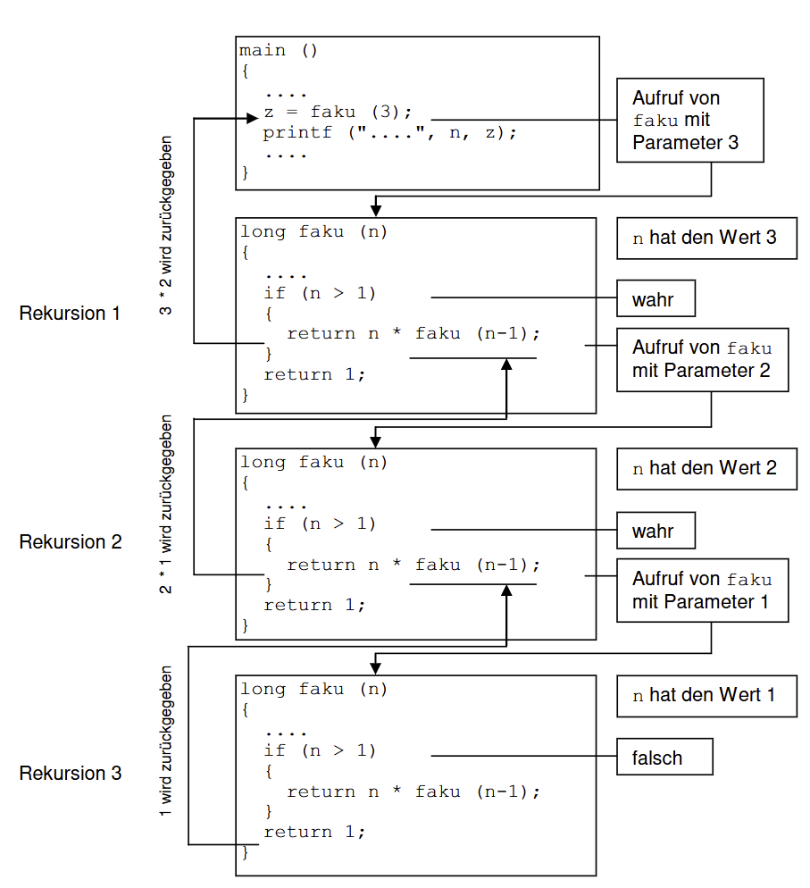
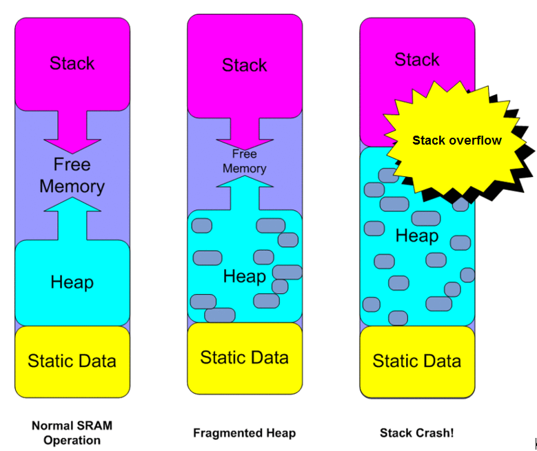
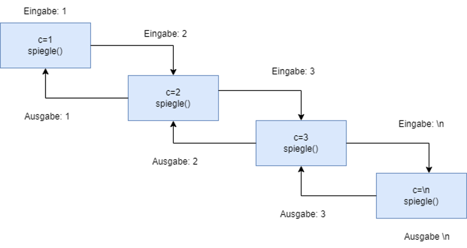
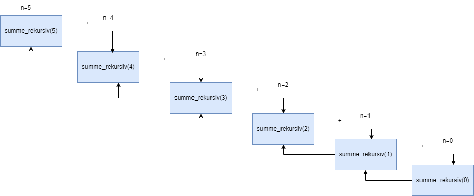

|                             |                          |                                        |
| --------------------------- | ------------------------ | -------------------------------------- |
| **Elektrotechniker/-in HF** | **Programmiertechnik B** |  |

- [1. Rekursive Funktionen](#1-rekursive-funktionen)
  - [1.1. Einleitung](#11-einleitung)
  - [1.2. Stack](#12-stack)
  - [1.3. E-Book](#13-e-book)
- [2. Aufgaben](#2-aufgaben)
  - [2.1. Analysiere rekursiven Programmcode](#21-analysiere-rekursiven-programmcode)
  - [2.2. Potenz iterativ berechnen](#22-potenz-iterativ-berechnen)
  - [2.3. Potenz rekursiv berechnen](#23-potenz-rekursiv-berechnen)
  - [2.4. Summe iterativ und rekursiv berechnen](#24-summe-iterativ-und-rekursiv-berechnen)

---

</br>

# 1. Rekursive Funktionen

## 1.1. Einleitung

- Eine Funktion kann sich **selbst** aufrufen, was als **Rekursion** bezeichnet wird.
- **Rekursive** Funktionen werden verwendet, um Probleme zu lösen, die sich in kleinere Teilprobleme zerlegen lassen.
- Bei jedem Aufruf werden die lokalen Variablen auf dem **Stack** abgelegt.
- Ein Algorithmus heisst rekursiv, wenn er Bereiche enthält, die sich **selbst** wiederum aufrufen
- Jeder **rekursiv** gelöste Algorithmus kann auch iterativ gelöst werden



**Beispiel: Berechnung der Fakultät (n!):**

```c
int fakultät(int n) {
    if (n <= 1) {
        return 1;  // Basisfall
    } else {
        return n * fakultät(n - 1);  // Rekursiver Aufruf
    }
}

int main() {
    int result = fakultät(5);  // Berechnet 5! = 120
    printf("%d\n", result);  // Ausgabe: 120
    return 0;
}
```

> **Wichtig: Eine zu hohe Zahl von rekursiven Aufrufen führt zum Überlauf des Stacks.**



## 1.2. Stack

Der Stack dient dazu, den Speicherbereich für Funktionsaufrufe zu verwalten. Dieser Speicherbereich ist dynamisch, was bedeutet, dass der Speicher bei Bedarf automatisch anwächst und wieder schrumpft. Der Compiler, der diesen Stack verwaltet, legt hier alle Daten ab, die er zur Verwaltung von Funktionsaufrufen benötigt.

Wenn eine Funktion aufgerufen wird, erweitert der Compiler den Stack um einen Datenblock. In diesem Datenblock werden die Parameter, die lokalen Variablen und die Rücksprungadresse zur aufrufenden Funktion angelegt. Dieser Datenblock wird als Stack-Frame oder Stackrahmen bezeichnet.

## 1.3. E-Book


---

</br>

# 2. Aufgaben

## 2.1. Analysiere rekursiven Programmcode

| **Vorgabe**         | **Beschreibung**                                   |
| :------------------ | :------------------------------------------------- |
| **Lernziele**       | Vershehen wie eine Rekursion programmiert wird     |
|                     | Kann ein rekursiver Code analysieren und erläutern |
|                     | Keine eine Logik rekursiv implementieren           |
| **Sozialform**      | Einzelarbeit                                       |
| **Auftrag**         | siehe unten                                        |
| **Hilfsmittel**     |                                                    |
| **Zeitbedarf**      | 20min                                              |
| **Lösungselemente** | Funktionierendes Programm                          |

Studieren Sie das folgende Programm:

```c
#include <stdio.h>

void spiegle(void) 
{
  int c = getchar(); 
  if (c != '\n') 
  {
    spiegle();
  }
  putchar(c);
}

int main(void) 
{ 
  spiegle();
  return 0;
}
```

- Welche Ausgabe erwarten Sie von dem Programm, wenn Sie 123 eintippen?
- Schreiben Sie das Ergebnis auf.
- Testen Sie anschließend das Programm.
- 

---

## 2.2. Potenz iterativ berechnen

| **Vorgabe**         | **Beschreibung**                               |
| :------------------ | :--------------------------------------------- |
| **Lernziele**       | Vershehen wie eine Rekursion programmiert wird |
|                     | Kann eine Iteration erläutern                  |
|                     | Keine eine Logik iterativ implementieren       |
| **Sozialform**      | Einzelarbeit                                   |
| **Auftrag**         | siehe unten                                    |
| **Hilfsmittel**     |                                                |
| **Zeitbedarf**      | 30min                                          |
| **Lösungselemente** | Funktionierendes Programm                      |

- Die Potenz (a  b)^n soll für ganzzahliges positives n iterativ berechnet werden.
- Hierzu dient das folgende Programm. Fehlende Teile sind durch .... gekennzeichnet.
- Ergänzen Sie die fehlenden Teile der Funktion iter(), welche (a  b)n iterativ berechnen soll.

```c
.... iter (....) 
{ 
   .... 
} 
 
void eingabe (float * ptr_alpha, float * ptr_beta, int * ptr_hoch) 
{ 
   printf ("\nGib einen Wert fuer a ein [float]: "); 
   scanf ("%f", ptr_alpha); 

   printf ("\nGib einen Wert fuer b ein [float]: "); 
   scanf ("%f", ptr_beta); 
   
   printf ("\nGib einen positiven Wert fuer n ein [int]: "); 
   scanf ("%d", ptr_hoch); 
} 
 
int main (void) 
{  
   float a; 
   float b; 
   float resultat_iterativ; 
   int n; 
 
   eingabe (&a, &b, &n); 
   printf ("\n\n a %6.2f, b %6.2f, n %d", a, b, n); 
   resultat_iterativ = iter (a, b, n); 
   printf ("\nErgebnis iterativ: %14.6f", resultat_iterativ); 
   return 0; 
} 
```

---

## 2.3. Potenz rekursiv berechnen

| **Vorgabe**         | **Beschreibung**                                   |
| :------------------ | :------------------------------------------------- |
| **Lernziele**       | Vershehen wie eine Rekursion programmiert wird     |
|                     | Kann ein rekursiver Code analysieren und erläutern |
|                     | Keine eine Logik rekursiv implementieren           |
| **Sozialform**      | Einzelarbeit                                       |
| **Auftrag**         | siehe unten                                        |
| **Hilfsmittel**     |                                                    |
| **Zeitbedarf**      | 30min                                              |
| **Lösungselemente** | Funktionierendes Programm                          |

- Die Potenz `(a  b)^n` soll für ganzzahliges positives n rekursiv berechnet werden.
- Hierzu dient das folgende Programm. Fehlende Teile sind durch .... gekennzeichnet.
- Ergänzen Sie die fehlenden Teile der Funktion `reku()`, welche `(a  b)^n` rekursiv berechnen soll.

Alle drei Funktionen sollten dasselbe Resultat ergeben.
Nehmen Sie die Funktion mit der `pow()`-Funktion als Referenz, sie gibt das korrekte Resultat zurück.

Testen Sie Ihr Programm mit folgenden Eingabewerten:

- 5^2  2.5^8  1000^3  3^1000  7^1  1^7  1^777777  0^1  1^0  0^0
- Wenn die Resultate der Funktionen nicht übereinstimmen, überlegen Sie sich wieso.
- Es könnte sogar sein, dass etwas gänzlich unerwartetes passiert.

```c
#include <stdio.h> 
 
.... reku (....) 
{  
   .... 
} 
 
void eingabe (float * ptr_alpha, float * ptr_beta, int * ptr_hoch) 
{ 
   printf ("\nGib einen Wert fuer a ein [float]: "); 
   scanf ("%f", ptr_alpha); 
   printf ("\nGib einen Wert fuer b ein [float]: "); 
   scanf ("%f", ptr_beta); 
   printf ("\nGib einen positiven Wert fuer n ein [int]: "); 
   scanf ("%d", ptr_hoch); 
} 

{  
   float a; 
   float b; 
   float resultat_rekursiv; 
   int n; 

   eingabe (&a, &b, &n); 
   printf ("\n\n a %6.2f, b %6.2f, n %d", a, b, n); 

   resultat_rekursiv = reku (a, b, n); 
   printf ("\nErgebnis rekursiv: %14.6f", resultat_rekursiv); 
   
   return 0; 
} 
```

---

## 2.4. Summe iterativ und rekursiv berechnen

| **Vorgabe**         | **Beschreibung**                                   |
| :------------------ | :------------------------------------------------- |
| **Lernziele**       | Vershehen wie eine Rekursion programmiert wird     |
|                     | Kann ein rekursiver Code analysieren und erläutern |
|                     | Keine eine Logik rekursiv implementieren           |
| **Sozialform**      | Einzelarbeit                                       |
| **Auftrag**         | siehe unten                                        |
| **Hilfsmittel**     |                                                    |
| **Zeitbedarf**      | 30min                                              |
| **Lösungselemente** | Funktionierendes Programm                          |

- Schreibe ein C-Programm, wo ich eine Ganzahl eingeben muss und mir die Summe der ganzen Zahlen von 0 bis zu dieser Ganzahl berechnet.
- Mache für die Summenrechnung zuerst eine iterative Funktion und dann eine Rekursive.
- Schaue, dass das Ergebnis von beiden Funktionen gleich ist.


