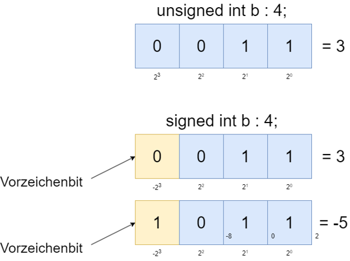

|                             |                          |                                        |
| --------------------------- | ------------------------ | -------------------------------------- |
| **Elektrotechniker/-in HF** | **Programmiertechnik B** |  |

- [1. Bitfelder](#1-bitfelder)
  - [1.1. E-Book](#11-e-book)
  - [1.2. Was sind Bitfelder (Bitfields)?](#12-was-sind-bitfelder-bitfields)
  - [1.3. Einsatzbereiche von Bitfeldern](#13-einsatzbereiche-von-bitfeldern)
  - [1.4. Vorteile von Bitfeldern](#14-vorteile-von-bitfeldern)
  - [1.5. Definition \& Deklaration von Bitfeldern](#15-definition--deklaration-von-bitfeldern)
  - [1.6. Initialisierung von Bitfeldern](#16-initialisierung-von-bitfeldern)
  - [1.7. Zugriff auf Bitfelder](#17-zugriff-auf-bitfelder)
  - [1.8. Beispiel: Flags für Systemstatus](#18-beispiel-flags-für-systemstatus)
  - [1.9. Bitfelder und Platzersparnis – Beispielvergleich](#19-bitfelder-und-platzersparnis--beispielvergleich)
  - [1.10. Einschränkungen und Hinweise](#110-einschränkungen-und-hinweise)
- [2. Aufgaben](#2-aufgaben)
  - [2.1. Aufgabe SmartLight](#21-aufgabe-smartlight)

---

# 1. Bitfelder

## 1.1. E-Book


## 1.2. Was sind Bitfelder (Bitfields)?

- Ein **Bitfeld** in C ist eine Möglichkeit, mehrere Werte (normalerweise Flags oder kleine Ganzzahlen) in einer Struktur platzsparend auf Bit-Ebene zu speichern.
- Statt jedem Wert ein ganzes Byte oder Word zuzuweisen, kann man z.B. sagen: "Dieser Wert braucht nur 1 Bit."
- Ein **Bitfeld** ist also eine strukturierte Variable, bei der einzelne Mitglieder eine bestimmte Anzahl von Bits belegen.



## 1.3. Einsatzbereiche von Bitfeldern

**Bitfelder** werden häufig eingesetzt, wenn:

- Speicher gespart werden soll (z. B. in eingebetteten Systemen).
- Flags oder Schalter effizient gespeichert werden sollen.
- Daten mit fester Bitstruktur (z. B. Hardware-Register, Netzwerkprotokolle) verarbeitet werden.
- Bits für Zugriffsrechte, Statusinformationen, Zustände usw. verwaltet werden.

## 1.4. Vorteile von Bitfeldern

| **Vorteil**                             | **Erklärung**                              |
| :-------------------------------------- | :----------------------------------------- |
| **Speicherersparnis**                   | Statt ganzer Bytes/Ints nur benötigte Bits |
| **Lesbarer und strukturierter Code**    | Besser als manuelle Bitmasken              |
| **Ideal für Zustände, Flags, Hardware** | Genau abgestimmte Bitrepräsentation        |
| **Einfacher Zugriff über Feldnamen**    | Kein manuelles Bitshifting notwendig       |

## 1.5. Definition & Deklaration von Bitfeldern

**Bitfelder** werden innerhalb einer `struct` deklariert. Die Syntax lautet:

```c
struct name {
    typ feldname : anzahl_bits;
};
```

```c
struct Status {
    unsigned int fehler : 1;
    unsigned int bereit : 1;
    unsigned int aktiv  : 1;
};
```

Hier werden 3 Flags (fehler, bereit, aktiv) definiert, jeweils mit nur 1 Bit.
> **Typischerweise wird unsigned int oder unsigned verwendet, um unerwünschte Vorzeichenverhalten zu vermeiden.**

## 1.6. Initialisierung von Bitfeldern

**Bitfelder** können beim Anlegen eines Objekts initialisiert werden – ähnlich wie bei normalen Strukturen:

```c
struct Status {
    unsigned int fehler : 1;
    unsigned int bereit : 1;
    unsigned int aktiv  : 1;
};

struct Status systemStatus = {1, 0, 1};  // fehler=1, bereit=0, aktiv=1
```

## 1.7. Zugriff auf Bitfelder

Der Zugriff erfolgt wie bei normalen Strukturelementen:

```c
if (systemStatus.fehler) {
    printf("Fehler erkannt!\n");
}

systemStatus.bereit = 1;
```

> **Man kann Bitfelder lesen und schreiben wie normale Variablen. Werte außerhalb der Bitgröße werden automatisch abgeschnitten.**

## 1.8. Beispiel: Flags für Systemstatus

```c
#include <stdio.h>

struct Status {
    unsigned int fehler : 1;
    unsigned int bereit : 1;
    unsigned int aktiv  : 1;
    unsigned int reserviert : 5;  // z.B. Platz für Erweiterung
};

int main() {
    struct Status status = {0, 1, 1, 0};

    printf("System bereit: %d\n", status.bereit);
    printf("System aktiv: %d\n", status.aktiv);

    status.fehler = 1;

    if (status.fehler) {
        printf("Achtung: Fehler erkannt!\n");
    }

    return 0;
}
```

```console
System bereit: 1
System aktiv: 1
Achtung: Fehler erkannt!
```

## 1.9. Bitfelder und Platzersparnis – Beispielvergleich

```c
struct FlagsNormal {
    unsigned char fehler;
    unsigned char bereit;
    unsigned char aktiv;
};  // benötigt 3 Bytes

struct FlagsBitfield {
    unsigned char fehler : 1;
    unsigned char bereit : 1;
    unsigned char aktiv  : 1;
};  // benötigt in der Praxis oft nur 1 Byte
```

## 1.10. Einschränkungen und Hinweise

| **Einschränkung**             | **Beschreibung**                                                                                               |
| :---------------------------- | :------------------------------------------------------------------------------------------------------------- |
| **Plattformabhängigkeit**     | Bitreihenfolge (MSB/LSB) ist **nicht standardisiert** – Vorsicht bei Datenübertragung oder Speicherabbildungen |
| **Kein Zeiger auf Bitfelder** | Man kann **keine Adresse** eines Bitfelds nehmen (`&struct.bf` ist nicht erlaubt)                              |
| **Nur ganze Typen**           | Nur `int`, `unsigned int`, `signed int` (und Varianten wie `short`, `char`) erlaubt                            |
| **Kein Array von Bitfeldern** | Bitfelder können **nicht direkt** als Arrays verwendet werden                                                  |

---

# 2. Aufgaben

## 2.1. Aufgabe SmartLight

| **Vorgabe**         | **Beschreibung**                              |
| :------------------ | :-------------------------------------------- |
| **Lernziele**       | Bitfelder deklariert und initialisiert werden |
|                     | Kann eine Struktur an eine Funktion übergeben |
|                     | Kann auf Bitfelder zugreifen                  |
| **Sozialform**      | Einzelarbeit                                  |
| **Auftrag**         | siehe unten                                   |
| **Hilfsmittel**     |                                               |
| **Zeitbedarf**      | 50min                                         |
| **Lösungselemente** | Funktionierendes Programm                     |

**Auftrag:**

- Erstelle ein Steuerungssystem für smarte Beleuchtungen.
- Jede Leuchte hat verschiedene Attribute, die gespeichert und verwaltet werden müssen.
- Jedes Attribut wird durch ein **Bitfeld** dargestellt, um Speicherplatz zu sparen.

**Anforderungen:**

- Definiere eine Struktur `SmartLight`, die die folgenden Felder enthält:
  - `unsigned int brightness: 4` (Helligkeit 0-15)
  - `unsigned int color : 3` (Farbe, Wertebereich 0-7, wobei jede Zahl eine bestimmte Farbe repräsentiert)
  - `unsigned int isOn: 1` (Status, an oder aus)
  - `unsigned int mode : 2` (Modus, Wertebereich 0-3 z.B. 0 = Normal, 1 = Nachtmodus, 2 = Party-Modus, 3 = Lesemodus)
- Schreibe eine Funktion void `printLightStatus(struct SmartLight light)`, die den Status einer Leuchte ausgibt
- Schreibe eine Funktion `struct SmartLight createLight(unsigned in brightness, unsigned in color, unsigned in isOn, unsigned int mode)`, die eine neue Leuchte erstellt und zurückgibt.
- Erstelle im `main`-Programm ein Array von SmartLight-Strukturen, um die Information von 5 Leuchten zu speichern
- Fülle die Informationen der 5 Leuchten aus und gebe diese anschliessend mit der Funktion `printLightStatus()` aus.
