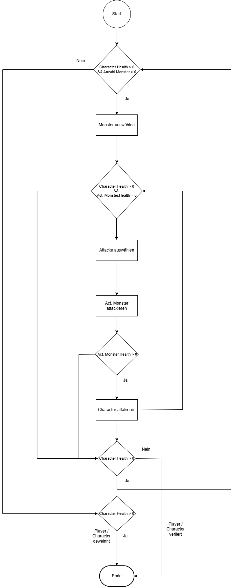

|                             |                          |                                        |
| --------------------------- | ------------------------ | -------------------------------------- |
| **Elektrotechniker/-in HF** | **Programmiertechnik B** |  |

# Agenda Unit 5

## [Lernziele](./lernziele.md)

- Was lernen wir?

## [Fortgeschrittene Programmierung mit Pointern](pointer-array.md)

- Eindimensionale Pointer Array's
- Deklaration un Initialisierung von Pointer Array's
- Pointer auf Pointer
- Deklaration un Initialisierung von Pointer auf Pointer
- Übungsaufgaben

## 

- Konsolenspiel (Spieler/Monster)
- [GitHub Repository, siehe U05/rollenspiel](https://github.com/INFEFZ/PROT-B.git)
  - [Projektdateien](https://github.com/INFEFZ/PROT-B/tree/main/U05/rollenspiel)
- 
- [Gruppeneiteilung](https://ipsobildung.sharepoint.com/sites/TE.X.BA.3_4.46ZHS2504PROB.TA1A/_layouts/Doc.aspx?sourcedoc={98FF990D-EEB6-4CD0-830A-F5F5B3E32E8C}&wd=target%28_Platz%20zur%20Zusammenarbeit%2FAllgemein.one%7C71EC3917-A356-4CCF-8555-DF2FE14312E9%2FGruppeneinteilung%20Rollenspiel%7C9D2BBC4B-CB1E-4BDF-93B7-BFE63D7CABCA%2F%29&wdpartid={30E5DFA6-4550-017D-10C8-B56553EFF6D9}{1}&wdsectionfileid={46F227A8-9D9A-4CD5-BA9C-73205824021C})
- **Abgabetermin, 15.08.2025, 23:59 Uhr, GitHub Link in OneNote, Hausaufgaben**
