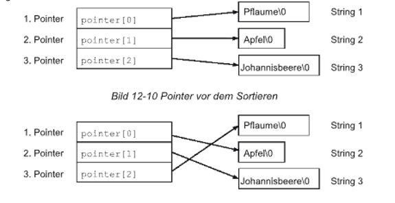

|                             |                          |                                        |
| --------------------------- | ------------------------ | -------------------------------------- |
| **Elektrotechniker/-in HF** | **Programmiertechnik B** |  |

- [1. Fortgeschrittene Programmierung mit Pointer](#1-fortgeschrittene-programmierung-mit-pointer)
  - [1.1. E-Book](#11-e-book)
  - [1.2. Was ist ein Array von Pointer?](#12-was-ist-ein-array-von-pointer)
  - [1.3. Deklaration u. Initialisierung](#13-deklaration-u-initialisierung)
  - [1.4. Eindimensionale Arrays von Pointer](#14-eindimensionale-arrays-von-pointer)
  - [1.5. Zugriff auf Elemente im Array von Pointer](#15-zugriff-auf-elemente-im-array-von-pointer)
  - [1.6. Typische Einsatzzwecke](#16-typische-einsatzzwecke)
  - [1.7. Pointer auf Pointer](#17-pointer-auf-pointer)
    - [1.7.1. Deklaration und Initialisierung](#171-deklaration-und-initialisierung)
    - [1.7.2. Kompaktes Beispiel zum Verstehen](#172-kompaktes-beispiel-zum-verstehen)
    - [1.7.3. Beispiel sortieren](#173-beispiel-sortieren)
- [2. Aufgaben](#2-aufgaben)
  - [2.1. Aufgabe Pointer Array sortieren](#21-aufgabe-pointer-array-sortieren)
  - [2.2. Wörterliste mit Zeiger-Array](#22-wörterliste-mit-zeiger-array)
  - [2.3. Pointer auf Pointer verstehen und anwenden](#23-pointer-auf-pointer-verstehen-und-anwenden)

---

# 1. Fortgeschrittene Programmierung mit Pointer

## 1.1. E-Book


## 1.2. Was ist ein Array von Pointer?

- Ein Array von Pointer ist ein Array, dessen Elemente **Zeiger (Pointer)** auf **Daten** sind – meist auf andere Variablen oder Strings.
- Jeder Eintrag im Array enthält also die **Adresse eines Objekts**, nicht das Objekt selbst.

```c
char *woerter[3];
```

## 1.3. Deklaration u. Initialisierung

```c
// Deklaration
int *zahlen[5];        // Array mit 5 int-Zeigern
char *namen[4];        // Array mit 4 Zeigern auf Strings

// Initialisierung bei Deklaration (mit Stringliteralen):
char *farben[] = {"Rot", "Grün", "Blau"};
```

Hier zeigt:

- `farben[0]` auf "Rot"
- `farben[1]` auf "Grün"
- `farben[2]` auf "Blau"
- Jeder Eintrag ist ein Zeiger auf den Anfang eines Stringliterals im Speicher (also auf ein char-Array mit `'\0`-Terminierung).

## 1.4. Eindimensionale Arrays von Pointer

- Array von Pointer-Variablen zeigen alle Pointer auf bestimmte Speicheradresse
- Erlaubt einfache Sortierung von Strings (Häufigster Anwendungsfall) – Keine Kopie nötig

```c
char *pointer[3];
```



## 1.5. Zugriff auf Elemente im Array von Pointer

```c
// Zugriff auf die Werte:
printf("%s\n", farben[0]);     // gibt: Rot
printf("%c\n", farben[0][1]);  // gibt: o

// Zugriff auf int-Werte:
printf("%d\n", *pointer_array[1]);  // gibt: 20
```

## 1.6. Typische Einsatzzwecke

**Array von Strings:**

```c
char *woerter[] = {"Apfel", "Birne", "Banane"};

for (int i = 0; i < 3; i++) {
    printf("%s\n", woerter[i]);
}
```

**Kommandozeilenargumente (argc/argv):**

```c
int main(int argc, char *argv[]) {
    for (int i = 0; i < argc; i++) {
        printf("Argument %d: %s\n", i, argv[i]);
    }
}
```

**Dynamisches 2D-Array mit Pointern:**

```c
int *matrix[3];  // 3 Zeilen
for (int i = 0; i < 3; i++) {
    matrix[i] = malloc(4 * sizeof(int));  // jede Zeile hat 4 int-Werte
}
```

**Beispielprogramm: Wörterliste mit Zeiger-Array:**

```c
#include <stdio.h>

int main() {
    // Array von 4 Zeigern auf Zeichenketten (Strings)
    char *woerter[] = {"Haus", "Baum", "Auto", "Fluss"};

    // Ausgabe aller Wörter
    for (int i = 0; i < 4; i++) {
        printf("Wort %d: %s\n", i + 1, woerter[i]);
    }

    // Zugriff auf einzelne Buchstaben
    printf("Erster Buchstabe vom zweiten Wort: %c\n", woerter[1][0]);  // B

    return 0;
}
```

**Beispiel Array von Pointer-Variablen – Sortieren:**

```c
#include <stdio.h>
#include <string.h>

void sortierePointer(char *arr[], int n) 
{
    char *temp;
    for (int i = 0; i < n-1; i++) 
    {
        for (int j = i+1; j < n; j++) 
        {
            if (strcmp(arr[i], arr[j]) > 0) 
            {
                temp = arr[i];
                arr[i] = arr[j];
                arr[j] = temp;
            }
        }
    }
}

void textausgabe(char *textPointer[], int anz_Zeilen) 
{
    for (int zahl = 0; zahl < anz_Zeilen; zahl++) 
    {
        printf("%s\n", textPointer[zahl]);
    }
}

void main() 
{
    char *pointer[] = {"Pflaume", "Apfel", "Johannisbeere"};
    int anz_Zeilen = 3;

    printf("Vor dem Sortieren:\n");
    textausgabe(pointer, anz_Zeilen);

    sortierePointer(pointer, anz_Zeilen);

    printf("\nNach dem Sortieren:\n");
    textausgabe(pointer, anz_Zeilen);
}
```

## 1.7. Pointer auf Pointer

- Ein **Pointer** auf **Pointer** (oder Doppelzeiger) ist ein Zeiger auf einen Zeiger, also eine Variable, die die Adresse eines anderen Zeigers speichert.
- Während ein normaler Zeiger auf eine Speicheradresse eines Wertes zeigt, zeigt ein Pointer auf Pointer auf die Adresse eines anderen Zeigers.
- Nützlich für komplexe Datenstrukturen für eine allgemeine Definition, **erlaubt höhere Flexibilität – Verwendet bei Listen, Bäumen anderen dynamischen Datenstrukturen**


**Beispiel in Worten:**

```c
int a = 42;     // a ist eine Variable.
int *p = &a;    // p ist ein Pointer, der auf a zeigt.
int **pp = &p;  // pp ist ein Pointer auf den Pointer p.
```

### 1.7.1. Deklaration und Initialisierung

```c
int a = 5;
int *p = &a;
int **pp = &p;
```

| **Ausdruck** | **Bedeutung**           | **Inhalt**      |
| :----------- | :---------------------- | :-------------- |
| `a`          | normale Variable        | 5               |
| `p`          | zeigt auf `a`           | Adresse von `a` |
| `*p`         | Wert an Adresse von `a` | 5               |
| `pp`         | zeigt auf `p`           | Adresse von `p` |
| `*pp`        | ergibt `p`              | Adresse von `a` |
| `**pp`       | ergibt Wert von `a`     | 5               |

### 1.7.2. Kompaktes Beispiel zum Verstehen

```c
#include <stdio.h>

int main() {
    int wert = 42;
    int *ptr = &wert;
    int **pptr = &ptr;

    printf("Wert: %d\n", wert);      // 42
    printf("*ptr: %d\n", *ptr);      // 42
    printf("**pptr: %d\n", **pptr);  // 42

    return 0;
}
```

### 1.7.3. Beispiel sortieren

```c
#include <stdio.h>
#include <stdlib.h>
#include <string.h>

void sortierePointerAufPointer(char **arr[], int n) 
{
  char **temp;
  for (int i = 0; i < n-1; i++) 
  {
    for (int j = i+1; j < n; j++) 
    {
        if (strcmp(*arr[i], *arr[j]) > 0) 
        {
            temp = arr[i];
            arr[i] = arr[j];
            arr[j] = temp;
      }
    }
  }
}

void textausgabe(char **textPointer[], int anz_Zeilen) 
{
    for (int zahl = 0; zahl < anz_Zeilen; zahl++) 
    {
       printf("%s\n", *textPointer[zahl]);
   }
}

void main() 
{
    char *string1 = "Pflaume";
    char *string2 = "Apfel";
    char *string3 = "Johannisbeere";
    char **pointerArray[3] = {&string1, &string2, &string3};
    int anz_Zeilen = 3;

    printf("Vor dem Sortieren:\n");
    textausgabe(pointerArray, anz_Zeilen);

    sortierePointerAufPointer(pointerArray, anz_Zeilen);

    printf("\nNach dem Sortieren:\n");
    textausgabe(pointerArray, anz_Zeilen);*/
}
```

---

</br>

# 2. Aufgaben

## 2.1. Aufgabe Pointer Array sortieren

| **Vorgabe**         | **Beschreibung**                                                     |
| :------------------ | :------------------------------------------------------------------- |
| **Lernziele**       | Verstehen wie Arrays von Pointer deklariert und initialisiert werden |
|                     | Kann auf Daten über ein Array von Pointers zugreifen                 |
|                     | Kann Elemente in einem Array von Pointers verändert                  |
| **Sozialform**      | Einzelarbeit                                                         |
| **Auftrag**         | siehe unten                                                          |
| **Hilfsmittel**     |                                                                      |
| **Zeitbedarf**      | 30min                                                                |
| **Lösungselemente** | Funktionierendes Programm                                            |

- Ändere das vorherige Beispiel (Array von Pointer-Variablen – Sortieren) so ab, dass die Strings nicht alphabetisch sondern nach der Länge sortiert werden.

---

</br>

## 2.2. Wörterliste mit Zeiger-Array

| **Vorgabe**         | **Beschreibung**                                                     |
| :------------------ | :------------------------------------------------------------------- |
| **Lernziele**       | Verstehen wie Arrays von Pointer deklariert und initialisiert werden |
|                     | Kann auf Daten über ein Array von Pointers zugreifen                 |
|                     | Kann Elemente in einem Array von Pointers verändert                  |
| **Sozialform**      | Einzelarbeit                                                         |
| **Auftrag**         | siehe unten                                                          |
| **Hilfsmittel**     |                                                                      |
| **Zeitbedarf**      | 40min                                                                |
| **Lösungselemente** | Funktionierendes Programm                                            |

- Erstelle ein C-Programm, das eine Liste von **5 Wochentagen** mit Hilfe eines Arrays von Zeigern auf char speichert.
- Gebe alle Tage in einer nummerierten Liste aus.
- Ermittle mit einer Schleife die Länge jedes Tagesnamens (mit `strlen`) und gebe diese mit aus.
- Schreibe eine Funktion `drucke_tag_info(char *tag)`, die den Namen des Tages und dessen ersten Buchstaben und die Länge des Strings ausgibt.
- Rufe diese Funktion für alle Wochentage aus dem Array auf.

---

</br>

## 2.3. Pointer auf Pointer verstehen und anwenden

| **Vorgabe**         | **Beschreibung**                                                      |
| :------------------ | :-------------------------------------------------------------------- |
| **Lernziele**       | Verstehen wie Pointer auf Pointer deklariert und initialisiert werden |
|                     | Kann auf Daten über Pointer auf Pointer zugreifen                     |
|                     | Kann Elemente über Pointer auf Pointers verändert                     |
| **Sozialform**      | Einzelarbeit                                                          |
| **Auftrag**         | siehe unten                                                           |
| **Hilfsmittel**     |                                                                       |
| **Zeitbedarf**      | 30min                                                                 |
| **Lösungselemente** | Funktionierendes Programm                                             |

Schreibe ein C-Programm, das die folgenden Anforderungen erfüllt:

- Deklarieren und initialisiere:
  - eine Ganzzahl `a = 25`
  - einen Pointer `p1`, der auf `a` zeigt
  - einen Pointer `p2`, der auf`p1` zeigt (Pointer auf Pointer)
- Gebe mit Hilfe der Zeiger folgende Informationen auf der Konsole aus:
  - Wert von `a` direkt
  - Wert von `a` über `*p1`
  - Wert von `a` über `**p2`
  - Adresse von `a`
  - Adresse von `p1`
  - Adresse von `p2`

- Schreibe eine Funktion void `verdopple(int **ptr)`, die den Wert, auf den der Pointer zeigt, verdoppelt.
- Rufe die Funktion aus `main()` auf und gebe danach den neuen Wert von `a` aus.

> **Hinweis zur Funktion**
> Die Funktion `verdopple()` muss `**ptr` verwenden, um auf den Wert von `a` zuzugreifen und diesen zu ändern.
