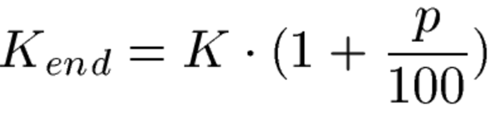
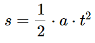

|                             |                          |                                        |
| --------------------------- | ------------------------ | -------------------------------------- |
| **Elektrotechniker/-in HF** | **Programmiertechnik B** |  |

---

# 1. Kapitalbildung II

Ein Kapital von 2800 CHF wird angelegt. Der Zinssatz sei 3.2 Prozent. 
Wie hoch ist das Endkapital nach einem Jahr?
Lösen Sie die Aufgabe mit einen C-Konsolen-Programm. Uebergeben sie die Parameter via Konsole.

Die Formel dafür ist folgende:



---

# 2. Volumenberechnung

Berechnen Sie das Volumen eines Körpers.
Es wird die Länge, Breite und Höhe in m als Parameter übergeben.
Lösen Sie die Aufgabe als C-Konsolen-Programm.

---

# 3. Bremswegberechnung

Berechne Sie den Bremsweg bei einer vorgegebenen Verzögerung in m/s2 und mit einer Zeit in s mit der Formel.
Lösen Sie die Aufgabe mit einem C-Konsolen-Programm.



---

# 4. Erweiterter Taschenrechner

Implementieren Sie einen Taschenrechner der zuerst nach der 1. Zahl fragt. Dann nach dem Operanden und dann nach der 2. Zahl. 
Es sind folgende Operationen möglich: +, -, * u. /. (Addition. Subtraktion, Multiplikation u. Division). 
**Tipp**: Sie müssen nach der Eingabe den Eingangspuffer leeren mit `getchar()` Grund: `scanf` leert den Eingangspuffer nicht vollständig, wenn Zahlen eingelesen werden

---

# 5. Wechselkurs

Schreiben Sie ein Programm, dass den Wechselkurs rechnet. Das Programm fragt den Betrag in Schweizer Franken und in welche Währung es umrechnen soll. Unterstütz werden sollen ‘ $’, ‘£’, ‘e’ und ‘E’ für Euro.
Lösen Sie die Aufgabe mit einem C-Programm. Tipp: Nicht vergessen hier den Eingangspuffer mit `getchar()` zu leeren. Nach jeder Eingabe.

---

# 6. Kreisberechnung

Schreiben Sie eine Funktion `rechne_kreisdaten()`, die den Umfang und die Fläche eines Kreises aus dem Radius berechnet.

- Die Funktion erhält drei Übergabeparameter:
  - den Radius und zwei Zeiger auf double-Variablen, in welche die Funktion `rechne_kreisdaten()` die Fläche und den Umfang des Kreises zurückschreibt.  
- Die Ein- und Ausgabe erfolgt in main().
- Für einen Kreis mit Radius R gilt:
  - Fläche = `PI * R * R`
  - Umfang = `2 * PI * R`

---

# 7. Zahlen einlesen

- Das folgende Programm soll zwei float-Zahlen `a` und `b` einlesen und ihren Wert am Bildschirm ausgeben.
- Für das Einlesen wird die Funktion `einlesen()` verwendet.
- Fehlende Stellen im Programm sind mit .... gekennzeichnet. Bringen Sie das Programm zum Laufen!

```c
#include <stdio.h> 
 
void einlesen (float *, float *); /* Funktionsprototyp */ 
 
int main (void) 
{ 
   float a, b; 
   einlesen (...., ....); 
   printf ("\na ist %6.2f", a); 
   printf ("\nb ist %6.2f", b); 
   return 0; 
} 
 
void einlesen (float * x, float * y) 
{ 
   printf ("\nGib einen float-Wert fuer a ein: "); 
   scanf ("%e", ....); 
   printf ("\nGib einen float-Wert fuer b ein: "); 
   scanf ("%e", ....); 
} 
```

---

# 8. Durchschnittsberechnung

- Das folgende Programm dient zur Berechnung des Durchschnitts von 10 int-Zahlen, die im Dialog eingegeben werden.
- Der berechnete Durchschnitt wird von der Funktion `durchschnitt1()` über die Parameterliste und von der Funktion `durchschnitt2()` mit return zurückgegeben.

Schreiben Sie die Funktionen `einlesen()`, `durchschnitt1()` und `durchschnitt2()`.
Fehlende Teile sind mit .... gekennzeichnet.
Es wird mit dem globalen Array `a` gearbeitet.

```c
#include <stdio.h>

#define MAX 10

int summe(???) { ??? }

int maximum(???) { ??? }

double durchschnitt(???) { ??? }

void statistik(int* sum, int* max, double* avg, ???) { ??? }

int main(void) {
  int a[MAX] = {1, 2, 3, 4, 5, 6, 7, 8, 9, 10};

  int sum;
  int max;
  double avg;
  
  statistik(???);
  
  printf("Summe: %d\n", sum);
  printf("Maximum: %d\n", max);
  printf("Durchschnitt: %f\n", avg);

  return 0;
}
```
