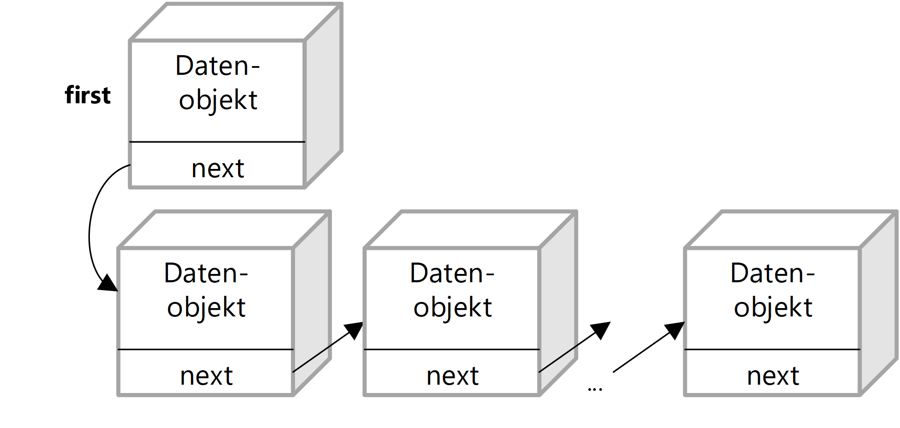
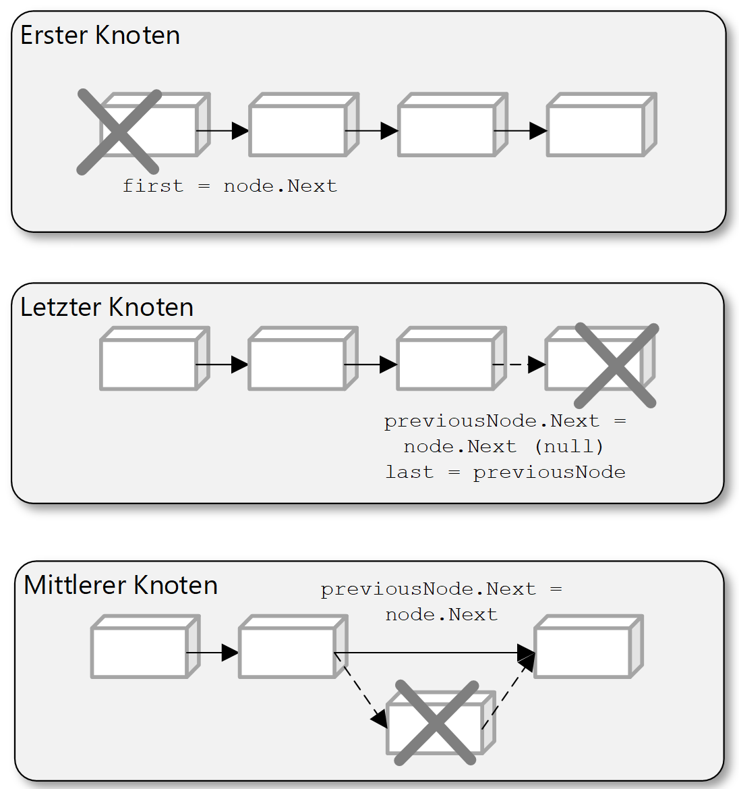
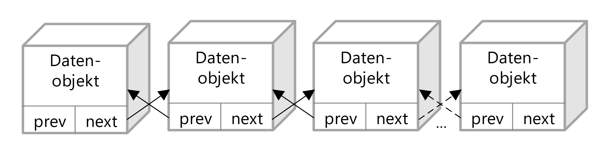
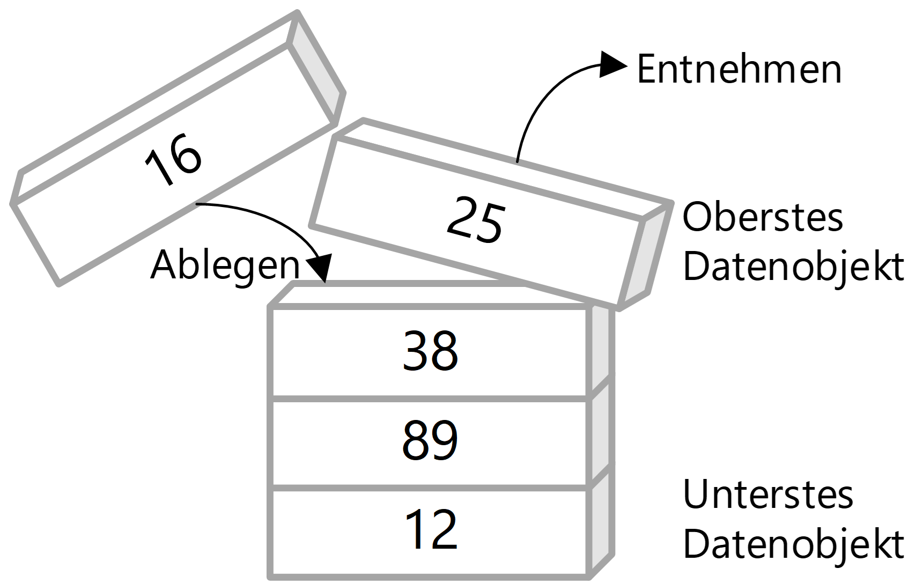
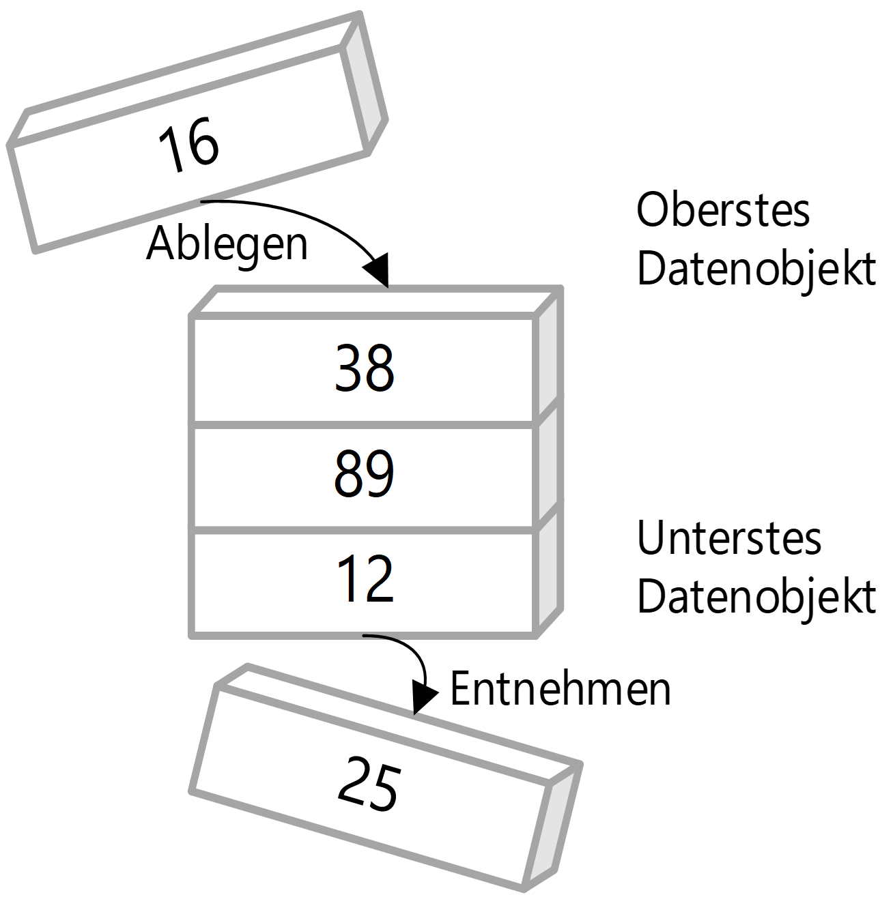

|                             |                          |                                        |
| --------------------------- | ------------------------ | -------------------------------------- |
| **Elektrotechniker/-in HF** | **Programmiertechnik B** |  |

- [1. Datenstrukturen](#1-datenstrukturen)
  - [1.1. E-Book](#11-e-book)
  - [1.2. Was sind Datenstrukturen](#12-was-sind-datenstrukturen)
  - [1.3. Dynamische Datenstrukturen](#13-dynamische-datenstrukturen)
    - [1.3.1. Lineare Datenstrukturen](#131-lineare-datenstrukturen)
    - [1.3.2. List](#132-list)
      - [1.3.2.1. Einfach verkettete Liste](#1321-einfach-verkettete-liste)
      - [1.3.2.2. Doppelt verkettete Liste](#1322-doppelt-verkettete-liste)
    - [1.3.3. Stack](#133-stack)
    - [1.3.4. Queue](#134-queue)
    - [1.3.5. Mobile App "Algorithms"](#135-mobile-app-algorithms)
- [2. Aufgaben](#2-aufgaben)
  - [2.1. Datenstrukturen](#21-datenstrukturen)

---

 

# 1. Datenstrukturen

## 1.1. E-Book

## 1.2. Was sind Datenstrukturen

**Datenstrukturen** sind spezielle Formate zur Organisation, Verwaltung und Speicherung von Daten in einem Computer, sodass sie effizient genutzt und verarbeitet werden können.
Sie sind ein **fundamentaler Bestandteil** der Informatik und Softwareentwicklung, da sie bestimmen, wie Daten gespeichert, abgerufen und manipuliert werden.
**Datenstrukturen** sind ein **zentrales Konzept** in der Informatik. Ein tiefes Verständnis dieser Strukturen ermöglicht es Entwicklern, **effizientere, schnellere und robustere Programme** zu schreiben. Egal ob Anfänger oder Profi – wer programmiert, arbeitet unweigerlich mit **Datenstrukturen**.

Anforderungen, wo Datenstrukturen eingesetzt werden sind u.a.:

- Wie können riesige Menge an Informationen effizient sortiert werden?
- Wie können Daten schnell gesucht werden?

Datenstrukturen sind wichtig, weil sie:

- Effizienz verbessern (z.B. bei der Suche, Einfügen oder Löschen von Daten)
- Speicher optimieren
- und geeignete Modelle für reale Probleme bieten, z. B. Warteschlangen in Systemen oder Beziehungen zwischen Objekten.

Datenstrukturen kommen überall in der Informatik vor, z.B.:

- In Datenbanken zur Organisation von Datensätzen.
- In Suchmaschinen, um Milliarden von Webseiten effizient zu durchsuchen.
- In Spielen, um Objekte, Karten und Ereignisse zu verwalten.
- In Betriebssystemen, um Prozesse, Dateien und Speicher zu managen.

## 1.3. Dynamische Datenstrukturen

Eine **Datenstruktur** setzt sich immer aus mehreren einzelnen Werten zusammen und den darauf auszuführenden Methoden und Operationen.
In der allgemeinen Literatur wird der Begriff enger gefasst als allgemein einsetzbare Datentypen. Zu diesen gehören u.a.

- Listen
- Baumstrukturen
- Warteschlangen
- Stapel
- Hashtabellen
- Graphen

[Wiki Datenstrukturen](https://de.wikipedia.org/wiki/Datenstruktur)

### 1.3.1. Lineare Datenstrukturen

Diese ordnen Daten in einer linearen Reihenfolge:

- **Liste** (z. B. verkettete Liste)
  - Besteht aus Knoten, die Daten und einen Verweis auf den nächsten Knoten enthalten.
  - Vorteil: Dynamische Grösse.
  - Nachteil: Kein direkter Zugriff (langsamer als Array).
  - [Listen](https://dditools.inf.tu-dresden.de/ovk/Informatik/Algorithmen/Datenstrukturen/Listen.html)
- **Stack** (Stapel)
  - Prinzip: Last In, First Out (LIFO).
  - Beispiel: Rückgängig-Funktion in Programmen.
- **Queue** (Warteschlange)
  - Prinzip: First In, First Out (FIFO).
  - Beispiel: Druckaufträge in einer Druckerwarteschlange.
- **Baum** (Tree)
  - Hierarchische Struktur mit „Wurzel“ und „Kindern“.
  - Spezialform: Binärbaum, AVL-Baum, B-Baum etc.
  - Anwendung: Datei-Systeme, Datenbanken.
  - [Baumstruktur](https://dditools.inf.tu-dresden.de/ovk/Informatik/Algorithmen/Datenstrukturen/Baeume.html)
- **Graph** (Graphenstruktur)
  - Besteht aus Knoten (Vertices) und Kanten (Edges).
  - Anwendung: Soziale Netzwerke, Routenplanung, Webcrawler.

### 1.3.2. List

- Liste, in die im Gegensatz zum Array beliebig viele Objekte eingefügt werden können.
- Implementierung über verkettete Liste oder Array

#### 1.3.2.1. Einfach verkettete Liste

#### 1.3.2.2. Doppelt verkettete Liste

### 1.3.3. Stack

- Ablegen und Entnahme der Elemente von **oben**, d.h. die Elemente, die **zuletzt eingefügt wurden, werden als nächstes wieder entnommen** (**Last-in-First-out, LIFO**).

### 1.3.4. Queue

- Ablegen der Elemente erfolgt von **oben** und Entnahme von **unten**, d.h. die Elemente, die zuletzt eingefügt wurden, werden als letzte wieder entnommen (**First-in-First-out, FIFO**).

---

### 1.3.5. Mobile App "Algorithms"

Ausgezeichnete mobile Anwendung zum Verständnis verschiedener Algorithmen (The best way to learn algorithms!).

[Algorithm.Wiki](http://algorithm.wiki/en/app/)

---

 

# 2. Aufgaben

## 2.1. Datenstrukturen

| **Vorgabe**         | **Beschreibung**                                                                                |
| :------------------ | :---------------------------------------------------------------------------------------------- |
| **Lernziele**       | Kennt den Einsatzbereich von komplexen Datenstrukturen                                          |
|                     | Kann die Funktionsweise der Datenstrukturen (Liste, Stack, Queue, Baum) erklären                |
| **Sozialform**      | Gruppenarbeit                                                                                   |
| **Auftrag**         | siehe unten                                                                                     |
| **Hilfsmittel**     | [Data Structure Visualizations](https://www.cs.usfca.edu/~galles/visualization/Algorithms.html) |
| **Zeitbedarf**      | 40min Arbeit, 10min Präsentation                                                                |
| **Lösungselemente** |                                                                                                 |

Der beste Weg, komplexe Datenstrukturen zu verstehen, ist, sie in Aktion zu sehen.
Eine Vielzahl von Datenstrukturen und Algorithmen werden auf [Data Structure Visualizations](https://www.cs.usfca.edu/~galles/visualization/Algorithms.html) als interaktive Animationen dargestellt.

Setze dich intensiv mit der zugeteilten Datenstruktur auseinander, analysiere deren Aufbau und Funktionsweise und präsentiere deine Ergebnisse in einer kurzen Präsentation.

- **Liste (einfach und doppelt verkettet)**
  - [Linked List Visualizer](https://vonvista.github.io/Linked-List/)
  - [Visualgo](https://visualgo.net/en/list?slide=3)
- **Stack**
  - [Stack (Array)](https://www.cs.usfca.edu/~galles/visualization/StackArray.html)
  - [Stack (Linked List)](https://www.cs.usfca.edu/~galles/visualization/StackLL.html)
- **Queue**
  - [Queue (Array)](https://www.cs.usfca.edu/~galles/visualization/QueueArray.html)
  - [Queue (List)](https://www.cs.usfca.edu/~galles/visualization/QueueLL.html)
- **Baum Binärbaum**
  - [AVL Tree](https://www.cs.usfca.edu/~galles/visualization/AVLtree.html)
- **B+ Baum**
  - [B Trees](https://www.cs.usfca.edu/~galles/visualization/BTree.html)
  - [B+ Trees](https://www.cs.usfca.edu/~galles/visualization/BPlusTree.html)
