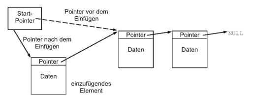
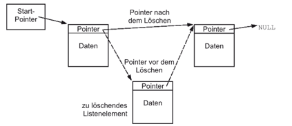

|                             |                          |                                        |
| --------------------------- | ------------------------ | -------------------------------------- |
| **Elektrotechniker/-in HF** | **Programmiertechnik A** |  |

- [1. Verkettete Listen](#1-verkettete-listen)
  - [1.1. Varianten verketteter Listen](#11-varianten-verketteter-listen)
  - [1.2. Eigenschaften](#12-eigenschaften)
  - [1.3. Beispiel der Grundstruktur](#13-beispiel-der-grundstruktur)
  - [1.4. Hinzufügen von einem Listenelement](#14-hinzufügen-von-einem-listenelement)
  - [1.5. Löschen von einem Listenelement](#15-löschen-von-einem-listenelement)
  - [1.6. Listenelemente ausgeben](#16-listenelemente-ausgeben)
  - [1.7. Doppelt verkettete Liste](#17-doppelt-verkettete-liste)
- [2. Aufgaben](#2-aufgaben)
  - [2.1. Datenstrukturen](#21-datenstrukturen)
  - [2.2. Einfach verkettete Liste implementieren](#22-einfach-verkettete-liste-implementieren)

---

</br>

# 1. Verkettete Listen

Eine **verkettete Liste (linked list)** ist eine dynamische Datenstruktur, bei der die Elemente – oft **Knoten** genannt – nicht in einem zusammenhängenden Speicherbereich liegen müssen, wie es z. B. bei Arrays der Fall ist.
Stattdessen enthält jeder **Knoten** einen **Verweis (Pointer)** auf den nächsten Knoten in der Liste.
Dadurch können Listen **flexibel wachsen oder schrumpfen**, ohne dass Speicherblöcke umkopiert werden müssen.

> **Eine verkettete Liste ist wie eine Schnitzeljagd im Speicher – jeder Knoten verrät, wo der nächste zu finden ist. Das macht sie flexibel, aber etwas langsamer, wenn man einen bestimmten Punkt erreichen möchte.**

Ein Knoten in einer einfachen verketteten Liste besteht typischerweise aus:

- **Datenfeld** – der eigentliche Wert (z. B. eine Zahl, ein String, ein komplexes Objekt).
- **Zeiger/Referenz** – ein Verweis auf den nächsten Knoten in der Liste.
- Der letzte Knoten zeigt auf null (Ende der Liste).
- Der erste Knoten wird als Kopf (Head) der Liste bezeichnet.

[Knoten 1: Wert | →] → [Knoten 2: Wert | →] → [Knoten 3: Wert | →] → null

## 1.1. Varianten verketteter Listen

Es gibt mehrere Ausprägungen:

- **Einfach verkettete Liste**
  - Jeder Knoten zeigt nur auf den nächsten Knoten.
  - Einfache Implementierung, aber Rückwärtsnavigation ist nicht möglich.
  - 
- **Doppelt verkettete Liste**
  - Jeder Knoten hat zwei Verweise
    - next → nächster Knoten
    - prev → vorheriger Knoten
    - Ermöglicht Navigation in beide Richtungen.
    - Benötigt mehr Speicher pro Knoten.
- **Zirkuläre verkettete Liste**
  - Der letzte Knoten zeigt nicht auf null, sondern wieder auf den ersten Knoten.
  - Kann einfach oder doppelt verkettet sein.
  - Geeignet für zyklische Datenverarbeitung (z. B. Ringpuffer).

## 1.2. Eigenschaften

- **Dynamische Grösse**: Kann während der Laufzeit beliebig wachsen oder schrumpfen.
- **Kein fester Speicherbereich**: Elemente können im Speicher verstreut liegen.
- **Einfügen/Löschen effizient**: O(1) (konstant), wenn die Position bereits bekannt ist.
- **Zugriff auf Elemente ineffizient**: O(n), da sequentiell durchlaufen werden muss.
- **Speicher-Overhead**: Jeder Knoten benötigt zusätzlich zum Datenfeld mindestens einen Zeiger.


## 1.3. Beispiel der Grundstruktur

```c
struct Node {
    int data;
    struct Node* next;
};

// Beispielerstellung:
struct Node* head = NULL;
struct Node* node1 = malloc(sizeof(struct Node));
node1->data = 10;
node1->next = NULL;

head = node1; // Kopf zeigt auf ersten Knoten
```

## 1.4. Hinzufügen von einem Listenelement



```c
#include <stdio.h>

#define MAX_NODES 100

// Definition eines Knotens der verketteten Liste
struct Node {
    int data;
    struct Node* next;
};

// Array von Knoten zur statischen Speicherzuweisung
struct Node nodes[MAX_NODES];
int node_count = 0;

// Funktion zum Hinzufügen eines neuen Knotens am Anfang der Liste
void push(struct Node** head_ref, int new_data) {
    if (node_count >= MAX_NODES) {
        printf("Keine weiteren Knoten verfügbar.\n");
        return;
    }
    // Initialisierung des neuen Knotens
    nodes[node_count].data = new_data;
    nodes[node_count].next = *head_ref;
    
    // Kopf-Zeiger auf den neuen Knoten setzen
    *head_ref = &nodes[node_count];
    
    // Erhöhen der Anzahl der verwendeten Knoten
    node_count++;
}
```

## 1.5. Löschen von einem Listenelement



```c
// Funktion zum Löschen eines Knotens mit einem bestimmten Wert
void deleteNode(struct Node** head_ref, int key) {
    struct Node* temp = *head_ref;
    struct Node* prev = NULL;

    // Falls das Kopf-Element gelöscht werden soll
    if (temp != NULL && temp->data == key) {
        *head_ref = temp->next; // Kopf ändern
        printf("Knoten mit Wert %d gelöscht.\n", key);
        return;
    }

    // Suchen des Knotens, der gelöscht werden soll
    while (temp != NULL && temp->data != key) {
        prev = temp;
        temp = temp->next;
    }

    // Falls der Knoten nicht gefunden wurde
    if (temp == NULL) {
        printf("Knoten mit Wert %d nicht gefunden.\n", key);
        return;
    }

    // Knoten aus der Liste entfernen
    prev->next = temp->next;
    printf("Knoten mit Wert %d gelöscht.\n", key);
}
```

## 1.6. Listenelemente ausgeben

```c
// Funktion zum Drucken der Liste
void printList(struct Node* n) {
    while (n != NULL) {
        printf("%d -> ", n->data);
        n = n->next;
    }
    printf("NULL\n");
}

// Hauptprogramm
void main() {
    struct Node* head = NULL;

    // Elemente zur Liste hinzufügen
    push(&head, 1);
    push(&head, 2);
    push(&head, 3);
    push(&head, 4);

    // Liste ausdrucken
    printList(head);
}
```

## 1.7. Doppelt verkettete Liste


---

</br>

# 2. Aufgaben

## 2.1. Datenstrukturen

| **Vorgabe**         | **Beschreibung**                                                                                |
| :------------------ | :---------------------------------------------------------------------------------------------- |
| **Lernziele**       | Kennt den Einsatzbereich von komplexen Datenstrukturen                                          |
|                     | Kann die Funktionsweise der Datenstrukturen (Liste, Stack, Queue, Baum) erklären                |
| **Sozialform**      | Gruppenarbeit                                                                                   |
| **Auftrag**         | siehe unten                                                                                     |
| **Hilfsmittel**     | [Data Structure Visualizations](https://www.cs.usfca.edu/~galles/visualization/Algorithms.html) |
| **Zeitbedarf**      | 40min Arbeit, 10min Präsentation                                                                |
| **Lösungselemente** |                                                                                                 |

Der beste Weg, komplexe Datenstrukturen zu verstehen, ist, sie in Aktion zu sehen.
Eine Vielzahl von Datenstrukturen und Algorithmen werden auf [Data Structure Visualizations](https://www.cs.usfca.edu/~galles/visualization/Algorithms.html) als interaktive Animationen dargestellt.

Setze dich intensiv mit der zugeteilten Datenstruktur auseinander, analysiere deren Aufbau und Funktionsweise und präsentiere deine Ergebnisse in einer kurzen Präsentation.

- Liste (einfach und doppelt verkettet)
  - [Linked List Visualizer](https://vonvista.github.io/Linked-List/)
  - [Visualgo](https://visualgo.net/en/list?slide=3)

---

## 2.2. Einfach verkettete Liste implementieren

| **Vorgabe**         | **Beschreibung**                                                          |
| :------------------ | :------------------------------------------------------------------------ |
| **Lernziele**       | Kennt die Datenstruktur einer verketteten Liste                           |
|                     | Kann eine verkettete Liste mit den erforderlichen Methoden implementieren |
|                     | Kann eine verkettete Listenstruktur auslesen                              |
| **Sozialform**      | Einzelarbeit                                                              |
| **Auftrag**         | siehe unten                                                               |
| **Hilfsmittel**     | [Wiki Datenstrukturen](https://de.wikipedia.org/wiki/Datenstruktur)       |
| **Zeitbedarf**      | 50min                                                                     |
| **Lösungselemente** |                                                                           |

Erstelle ein C-Programm, das die Datenstruktur einer verketteten Liste mit folgenden Funktionen implementiert:

- Knoten hinzufügen (`push(node)`)
- Knoten entfernen (`deleteNode(node)`)
- Alle Knoten ausgeben (`printList(head)`)
- Liste umkehren (`reverse(head)`)
