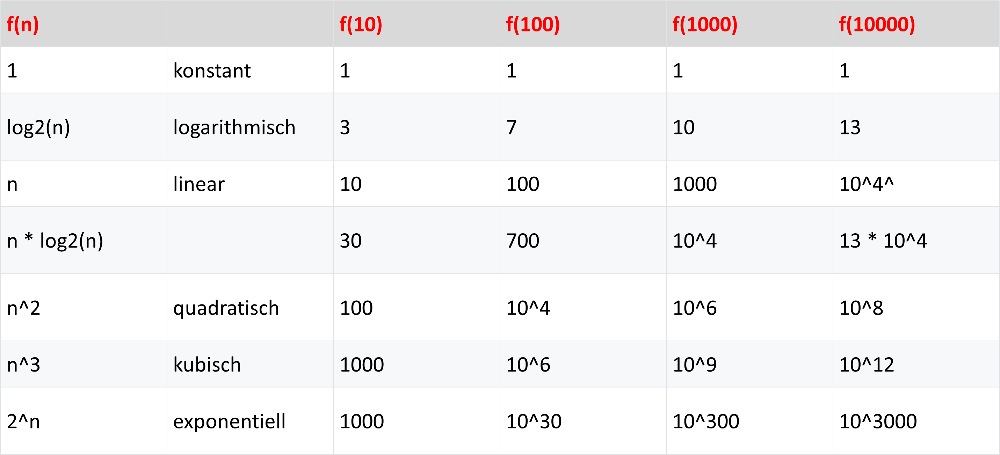
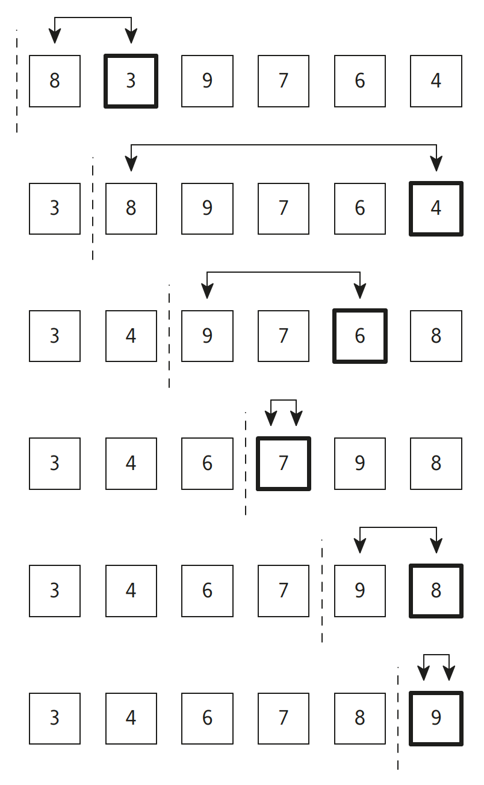

|                             |                          |                                        |
| --------------------------- | ------------------------ | -------------------------------------- |
| **Elektrotechniker/-in HF** | **Programmiertechnik A** |  |

- [1. Sortieren und Suchen](#1-sortieren-und-suchen)
  - [1.1. E-Book](#11-e-book)
  - [1.2. Einführung](#12-einführung)
  - [1.3. Ziele des Sortierens](#13-ziele-des-sortierens)
  - [1.4. Gross O-Notation](#14-gross-o-notation)
  - [1.5. Direktes Auswählen (Selection-Sort)](#15-direktes-auswählen-selection-sort)
  - [1.6. Implementierung](#16-implementierung)
  - [1.7. Wichtige Sortierverfahren](#17-wichtige-sortierverfahren)
    - [1.7.1. Bubblesort (einfach, aber langsam)](#171-bubblesort-einfach-aber-langsam)
    - [1.7.2. Selectionsort](#172-selectionsort)
    - [1.7.3. Insertionsort](#173-insertionsort)
    - [1.7.4. Mergesort](#174-mergesort)
    - [1.7.5. Quicksort](#175-quicksort)
    - [1.7.6. Heapsort](#176-heapsort)
  - [1.8. Komplexitätsklasse (O-Notation)](#18-komplexitätsklasse-o-notation)
  - [1.9. Implementierung](#19-implementierung)
    - [1.9.1. Quicksort](#191-quicksort)
- [2. Aufgaben](#2-aufgaben)
  - [2.1. Vergleich Quicksort – Selectionsort](#21-vergleich-quicksort--selectionsort)

---

</br>

# 1. Sortieren und Suchen

## 1.1. E-Book


## 1.2. Einführung

**Sortieren** und **Suchen** sind fundamentale Operationen in der Informatik und spielen eine zentrale Rolle bei der Verarbeitung von Daten.
Während Sortieren bedeutet, eine Menge von Elementen in eine bestimmte Reihenfolge zu bringen (z. B. aufsteigend oder absteigend nach einem Schlüssel), bezeichnet Suchen das Auffinden eines bestimmten Elements oder einer Teilmenge innerhalb einer Datenmenge.

Effiziente Sortier- und Suchalgorithmen sind entscheidend für:

- die Performance von Programmen
- die Datenanalyse
- Datenbankabfragen
- die Speicher- und Rechenoptimierung

## 1.3. Ziele des Sortierens

- **Schnelleres Suchen** (z.B. binäre Suche funktioniert nur auf sortierten Daten)
- **Einfache Auswertung** (z.B. Ranglisten, Statistiken)
- **Datenorganisation** (z.B. in Datenbanken oder Dateisystemen)

## 1.4. Gross O-Notation

- Die **Gross-O-Notation** (Big-O-Notation) beschreibt, wie schnell der Rechenaufwand eines Algorithmus im schlimmsten Fall wächst, wenn die Eingabemenge **𝑛** grösser wird.
- Sie betrachtet dabei nur den dominanten Term und ignoriert konstante Faktoren und kleinere Terme.
- Die Notation dient zum Vergleichen von Algorithmen hinsichtlich ihrer Skalierbarkeit und Effizienz, ohne sich an konkrete Hardware oder Programmiersprachen zu binden.


- **O(1)** → Konstante Zeit, unabhängig von der Eingabegrösse
- **O(log n)** → Logarithmisch, wächst sehr langsam
- **O(n)** → Linear, Aufwand steigt proportional zu
- **O(n log n)** → „Fast linear“, oft bei effizienten Sortierverfahren
- **O(n^2)** → Quadratisch, Aufwand wächst stark bei grösseren Datenmengen




## 1.5. Direktes Auswählen (Selection-Sort)

**Verfahren:**

- Leere sortierte Liste, volle unsortierte Liste
- Suche nach Element mit dem kleinsten Wert
- Element tauschen unsortiert zu sortiert




## 1.6. Implementierung

```c
#include <stdio.h>

// Funktion zum Vertauschen von zwei Werten
void swap(int *xp, int *yp) {
    int temp = *xp;
    *xp = *yp;
    *yp = temp;
}

// Funktion zur Durchführung von Selection Sort
void selectionSort(int arr[], int n) {
    int i, j, min_idx;
    // Ein Element nach dem anderen im unsortierten Array verschieben
    for (i = 0; i < n-1; i++) {
        // Das kleinste Element im unsortierten Array finden
        min_idx = i;
        for (j = i+1; j < n; j++) {
            if (arr[j] < arr[min_idx])
                min_idx = j;
        }

        // Das gefundene kleinste Element mit dem ersten Element vertauschen
        swap(&arr[min_idx], &arr[i]);
    }
}

// Funktion zum Drucken eines Arrays
void printArray(int arr[], int size) {
    int i;
    for (i = 0; i < size; i++)
        printf("%d ", arr[i]);
    printf("\n");
}

// Hauptprogramm zur Demonstration von Selection Sort
void main() {
    int arr[] = {64, 25, 12, 22, 11};
    int n = sizeof(arr)/sizeof(arr[0]);
    printf("Unsortiertes Array: \n");
    printArray(arr, n);

    selectionSort(arr, n);
    printf("Sortiertes Array: \n");
    printArray(arr, n);
}
```

## 1.7. Wichtige Sortierverfahren

### 1.7.1. Bubblesort (einfach, aber langsam)

- **Prinzip**
  - Vergleicht benachbarte Elemente und vertauscht sie, wenn sie in der falschen Reihenfolge stehen. Wiederholen, bis keine Vertauschungen mehr nötig sind.
- **Laufzeit**
  - Best Case: 𝑂(𝑛) (bereits sortiert)
    - Average/Worst Case: 𝑂(𝑛2)
- **Einsatz**
  - Nur für kleine Datenmengen oder Lehrzwecke.

### 1.7.2. Selectionsort

- **Prinzip**
  - Findet das kleinste Element und tauscht es mit dem ersten Element, dann mit dem zweiten usw.
  - **Laufzeit**
    - 𝑂(𝑛2)
    - (unabhängig von der Ausgangsreihenfolge)
- **Einsatz**
  - Einfach zu implementieren, aber ineffizient bei grossen Daten.

### 1.7.3. Insertionsort

- **Prinzip**
  - Baut schrittweise eine sortierte Liste auf, indem jedes Element an der richtigen Stelle eingefügt wird.
- **Laufzeit**
  - Best Case: 𝑂(𝑛) (fast sortiert)
  - Average/Worst Case: 𝑂(𝑛2)
- **Einsatz**
  - Gut bei kleinen oder fast sortierten Datenmengen.

### 1.7.4. Mergesort

- **Prinzip**
  - Teilt die Liste rekursiv in zwei Hälften, sortiert diese und fügt sie wieder zusammen.
- **Laufzeit**
  - 𝑂(𝑛 log⁡𝑛)
- **Einsatz**
  - Grosse Datenmengen, besonders bei externer Sortierung.

### 1.7.5. Quicksort

- Das Quicksort-Verfahren wurde von **Hoare** entwickelt. Es ist ein **effizientes Sortierverfahren** und ein gutes Beispiel für die Anwendung eines rekursiven Algorithmus.
- Das Verfahren arbeitet nach dem Prinzip „**teile und herrsche**“ (auf Englisch „divide and conquer“): Man teilt das Array in zwei Teile – oder genauer gesagt – in zwei Teilarrays auf.
- Wähle ein Element als **Pivot** (z.B. erstes, letztes, zufälliges oder Median-ähnliches Element).
- Partitioniere das Array so, dass auf der linken Seite **alle Elemente ≤ Pivot und auf der rechten Seite alle Elemente ≥ Pivot stehen** (genaue Invarianten hängen von der Partition-Variante ab).
- Sortiere rekursiv die linke und rechte Teilmenge
- In der Praxis sehr schnell (durchschnittlich O(n log n)), aber im schlechtesten Fall O(n^2).


- **Prinzip**
  - Wählt ein Pivot-Element, teilt die Liste in kleiner/gleich und grösser, sortiert rekursiv.
- **Laufzeit**
  - Best/Average Case: 𝑂(𝑛 log⁡𝑛)
  - Worst Case: 𝑂(𝑛2) (ungünstige Pivot-Wahl)
- **Einsatz**
  - Häufig in Standardbibliotheken, **sehr effizient** in der Praxis.

### 1.7.6. Heapsort

- **Prinzip**
  - Bildet einen Heap (Max-Heap oder Min-Heap) und entnimmt schrittweise das grösste/kleinste Element.
- **Laufzeit**
  - 𝑂(𝑛log⁡𝑛)
- **Einsatz**
  - Effizient, benötigt keinen zusätzlichen Speicher wie **Mergesort**.

## 1.8. Komplexitätsklasse (O-Notation)

| **Verfahren** | **Best Case** | **Average Case** | **Worst Case** | **Speicherbedarf** | **Stabil** | **Geeignet für**           |
| ------------- | ------------- | ---------------- | -------------- | ------------------ | ---------- | -------------------------- |
| Bubblesort    | O(n)          | O(n²)            | O(n²)          | O(1)               | Ja         | Sehr kleine Listen         |
| Selectionsort | O(n²)         | O(n²)            | O(n²)          | O(1)               | Nein       | Sehr kleine Listen         |
| Insertionsort | O(n)          | O(n²)            | O(n²)          | O(1)               | Ja         | Kleine oder fast sortierte |
| Mergesort     | O(n log n)    | O(n log n)       | O(n log n)     | O(n)               | Ja         | Grosse Datenmengen         |
| Quicksort     | O(n log n)    | O(n log n)       | O(n²)          | O(log n)           | Nein       | Allgemein, sehr schnell    |
| Heapsort      | O(n log n)    | O(n log n)       | O(n log n)     | O(1)               | Nein       | Speicherarme Anwendungen   |
| Counting Sort | O(n + k)      | O(n + k)         | O(n + k)       | O(n + k)           | Ja         | Ganzzahlen mit kleinem k   |

## 1.9. Implementierung

### 1.9.1. Quicksort

```c
#include <stdio.h>
#include <stdlib.h>

// Vergleichsfunktion für qsort
int compare(const void *a, const void *b) {
    return (*(int*)a - *(int*)b);
}

// Funktion zum Drucken eines Arrays
void printArray(int arr[], int size) {
    for (int i = 0; i < size; i++)
        printf("%d ", arr[i]);
    printf("\n");
}

// Hauptprogramm zur Demonstration von qsort
void main() {
    int arr[] = {10, 7, 8, 9, 1, 5};
    int n = sizeof(arr) / sizeof(arr[0]);

    printf("Unsortiertes Array: \n");
    printArray(arr, n);

    // Verwenden von qsort zum Sortieren des Arrays
    qsort(arr, n, sizeof(int), compare);

    printf("Sortiertes Array: \n");
    printArray(arr, n);
    
}
```

---

</br>

# 2. Aufgaben

## 2.1. Vergleich Quicksort – Selectionsort

| **Vorgabe**         | **Beschreibung**                                                                  |
| :------------------ | :-------------------------------------------------------------------------------- |
| **Lernziele**       | Kann die beiden Sortierverfahren selection-sort und quick-sort implementieren     |
|                     | Kein die beiden Sortierverfahren mit Datenwerten testen und die Rechenzeit messen |
| **Sozialform**      | Einzelarbeit                                                                      |
| **Auftrag**         | siehe unten                                                                       |
| **Hilfsmittel**     | [Wiki Datenstrukturen](https://de.wikipedia.org/wiki/Datenstruktur)               |
| **Zeitbedarf**      | 50min                                                                             |
| **Lösungselemente** |                                                                                   |

Vergleich die Leistung von Quicksort und Selection-Sort

Generiere ein Zufallsarray benutze den nachfolgenden Code

```c
#include <stdio.h>
#include <stdlib.h>
#include <time.h>

// Funktion zur Generierung eines Arrays zufälliger Zahlen
void generateRandomArray(int *array, int size)
{
    for (int i = 0; i < size; i++)
    {
        array[i] = rand() % 100;    // Zahlen zwischen 0 und 99
    }
}
```

Messe die Zeit für die Sortierung der beiden Algorithmen benutze nachfolgenden Code

```c
clock_t start = clock();
sortFunction(arrayCopy, size, sizeof(int), compare)
clock_t end = clock();
```

**Ausgabe:**

```console
qsort took 0.000161 seconds to sort the array.
selection-sort took 0.000734 seconds to sort the array.
```
