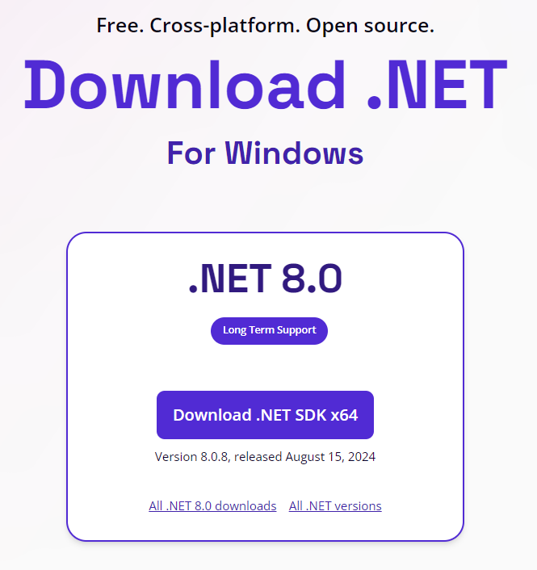
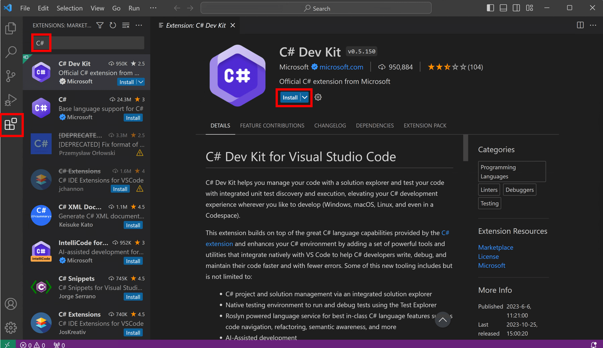

|                             |                          |                                        |
| --------------------------- | ------------------------ | -------------------------------------- |
| **Elektrotechniker/-in HF** | **Programmiertechnik A** |  |

- [1. Windows GUI Anwendung (Grafische Benutzeroberfläche)](#1-windows-gui-anwendung-grafische-benutzeroberfläche)
  - [1.1. Einführung](#11-einführung)
  - [1.2. Voraussetzungen](#12-voraussetzungen)
    - [1.2.1. Installation .NET 8 SDK](#121-installation-net-8-sdk)
    - [1.2.2. Installation C# Dev Kit Extension](#122-installation-c-dev-kit-extension)
    - [1.2.3. Optionale VSC Erweiterungen](#123-optionale-vsc-erweiterungen)
  - [1.3. Projekt erstellen](#13-projekt-erstellen)
  - [1.4. Build and run](#14-build-and-run)
  - [1.5. WPF (Windows Presentation Foundation)](#15-wpf-windows-presentation-foundation)
    - [1.5.1. Wichtige Merkmale](#151-wichtige-merkmale)
    - [1.5.2. Typischer Aufbau einer WPF-App](#152-typischer-aufbau-einer-wpf-app)
  - [1.6. Beispiel](#16-beispiel)
    - [1.6.1. MainWindow.xaml (Benutzeroberfläche)](#161-mainwindowxaml-benutzeroberfläche)
    - [1.6.2. MainWindow.xaml.cs (Code behind)](#162-mainwindowxamlcs-code-behind)
  - [1.7. Code behind](#17-code-behind)
- [2. Aufgaben](#2-aufgaben)
  - [2.1. Einfache WPF-Rechner-App](#21-einfache-wpf-rechner-app)

---

</br>

# 1. Windows GUI Anwendung (Grafische Benutzeroberfläche)

## 1.1. Einführung


## 1.2. Voraussetzungen

### 1.2.1. Installation .NET 8 SDK

- [.NET 6/7/8 SDK](https://dotnet.microsoft.com/download)
- 
- (check with `dotnet --version` in terminal).

### 1.2.2. Installation C# Dev Kit Extension

- 

### 1.2.3. Optionale VSC Erweiterungen

- XAML Styler
- XML Tools extensions for better XAML editing.

## 1.3. Projekt erstellen

Im Terminal von Visual Studio Code kann ein neues Projekt wie folgt erstellt werden:

```console
dotnet new wpf -n MyWpfApp
cd MyWpfApp
```

Damit werden folgende Dateien erstellt:

- `App.xaml` / `App.xaml.cs` → entry point
- `MainWindow.xaml` / `MainWindow.xaml.cs` → default window

## 1.4. Build and run

Mit folgenden Befehlen kann die Anwendung erstellt und gestartet werden.

```console
dotnet build
dotnet run
```

## 1.5. WPF (Windows Presentation Foundation)

WPF (Windows Presentation Foundation) ist ein Framework von Microsoft zur Entwicklung von grafischen Benutzeroberflächen (GUI) für Windows-Anwendungen.
Es ist Teil des .NET-Frameworks bzw. .NET (Core/5/6/7/8) und wurde entwickelt, um moderne, flexible und anpassbare Desktop-Anwendungen zu erstellen.

WPF ist ein mächtiges **UI-Framework** für Windows-Desktopanwendungen, das XAML + C# kombiniert, sehr flexibel ist und sich besonders für Anwendungen mit komplexem User Interface eignet.

### 1.5.1. Wichtige Merkmale

- **XAML (Extensible Application Markup Language)**
  - Beschreibt das User Interface in einer deklarativen XML-Syntax.
  - Ermöglicht eine klare Trennung von Oberfläche (XAML) und Logik (C# oder VB.NET).
- **Layout-System**
  - Flexibles Anordnen von Steuerelementen mit Containern wie `Grid`, `StackPanel`, `DockPanel`.
- **Datenbindung (Data Binding)**
  - UI-Elemente können direkt an Datenquellen (z. B. Objekte, Listen, Datenbanken) gebunden werden.
  - Unterstützt **MVVM (Model-View-ViewModel)** als Architekturpattern.
- **Styling & Templating**
  - Ähnlich wie CSS für Webanwendungen: einheitliche Styles für Buttons, Textboxen etc.
  - Templates ermöglichen das komplette Umgestalten von Controls.
- **Grafiken, Animationen und Multimedia**
  - Unterstützung für 2D-/3D-Grafiken, Vektorgrafiken, Animationen, Audio und Video.

### 1.5.2. Typischer Aufbau einer WPF-App

- `App.xaml`
  - Definiert globale Ressourcen und Einstiegspunkte.
- `MainWindow.xaml`
  - Beschreibt das Hauptfenster und die Oberfläche.
- `MainWindow.xaml.cs`
  - Enthält die C#-Logik (z. B. Event-Handler für Buttons).

## 1.6. Beispiel

### 1.6.1. MainWindow.xaml (Benutzeroberfläche)

```xml
<Window x:Class="WpfApp.MainWindow"
        xmlns="http://schemas.microsoft.com/winfx/2006/xaml/presentation"
        xmlns:x="http://schemas.microsoft.com/winfx/2006/xaml"
        Title="Meine WPF-App" Height="200" Width="300">
    <Grid>
        <Button Content="Klick mich"
                Width="100" Height="40"
                HorizontalAlignment="Center"
                VerticalAlignment="Center"
                Click="Button_Click"/>
    </Grid>
</Window>
```

### 1.6.2. MainWindow.xaml.cs (Code behind)

```c#
using System.Windows;

namespace WpfApp
{
    public partial class MainWindow : Window
    {
        public MainWindow()
        {
            InitializeComponent();
        }

        private void Button_Click(object sender, RoutedEventArgs e)
        {
            MessageBox.Show("Hallo WPF!");
        }
    }
}
```

## 1.7. Code behind

```c#
using System.Windows;

namespace MyWpfApp
{
    public partial class MainWindow : Window
    {
        public MainWindow()
        {
            InitializeComponent();
        }

        private void Button_Click(object sender, RoutedEventArgs e)
        {
            MessageBox.Show("Hello from WPF!");
        }
    }
}
```

# 2. Aufgaben

## 2.1. Einfache WPF-Rechner-App

| **Vorgabe**         | **Beschreibung**                                                                                 |
| :------------------ | :----------------------------------------------------------------------------------------------- |
| **Lernziele**       | Kann eine kleine grafische Benutzeroberfläche gestalten                                          |
|                     | Kann Steuerelemente einsetzen und mit Code behind eine Interaktion implementieren                |
| **Sozialform**      | Einzelarbeit                                                                                     |
| **Auftrag**         | siehe unten                                                                                      |
| **Hilfsmittel**     | [WPF](https://learn.microsoft.com/de-de/dotnet/desktop/wpf/get-started/create-app-visual-studio) |
| **Zeitbedarf**      | 50min                                                                                            |
| **Lösungselemente** |                                                                                                  |

Erstelle eine kleine WPF-Anwendung, die zwei Zahlen entgegennimmt und deren Summe berechnet.

**Anforderungen:**

- Erstelle ein WPF-Projekt (`dotnet new wpf -n SimpleCalculator`).
- Das Fenster (MainWindow) soll enthalten:
  - Zwei TextBoxen für Eingabe von Zahl 1 und Zahl 2.
  - Einen Button "Berechnen".
  - Ein Label/TextBlock, das das Ergebnis anzeigt.
- Wenn der Button geklickt wird, soll die App:
  - Beide Zahlen auslesen,
  - Die Summe berechnen,
  - Das Ergebnis im Label anzeigen.

- Bonus: Prüfe, ob die Eingaben gültige Zahlen sind. Wenn nicht, zeige eine Fehlermeldung (`MessageBox`).
