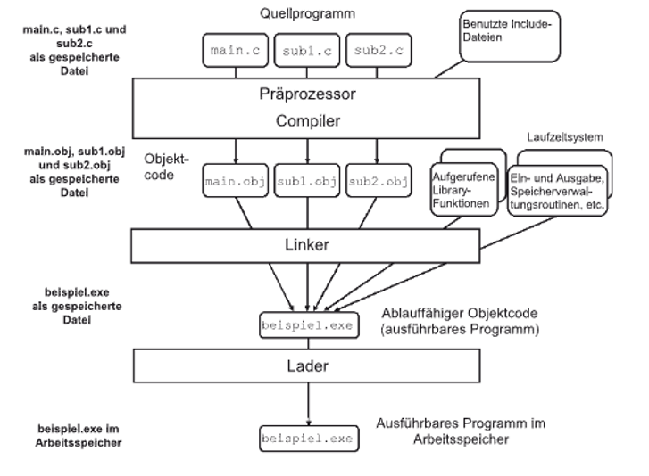
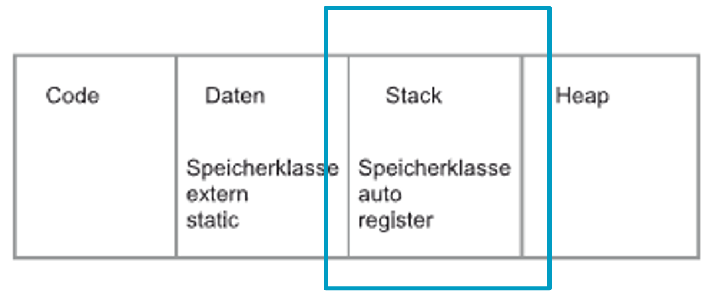
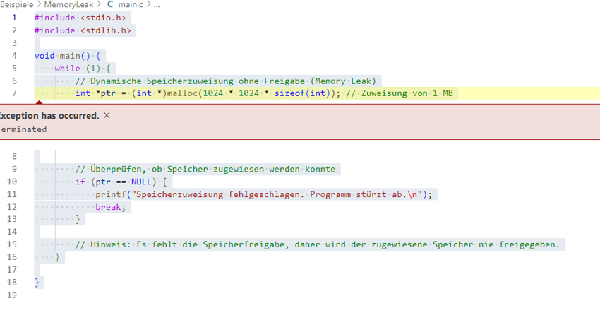

|                             |                          |                                        |
| --------------------------- | ------------------------ | -------------------------------------- |
| **Elektrotechniker/-in HF** | **Programmiertechnik B** |  |

- [1. Dynamische Speicherverwaltung (Allokation)](#1-dynamische-speicherverwaltung-allokation)
  - [1.1. E-Book](#11-e-book)
  - [1.2. Einführung](#12-einführung)
  - [1.3. Linker](#13-linker)
  - [1.4. Extern (globale Variablen)](#14-extern-globale-variablen)
    - [1.4.1. Beispiel externe Variablen / Funktionen](#141-beispiel-externe-variablen--funktionen)
  - [1.5. Speicherklasse **auto**](#15-speicherklasse-auto)
    - [1.5.1. Beispiel auto Speicherklasse](#151-beispiel-auto-speicherklasse)
  - [1.6. Speicherklasse **register**](#16-speicherklasse-register)
  - [1.7. Speicherklasse **static**](#17-speicherklasse-static)
    - [1.7.1. Beispiel static](#171-beispiel-static)
  - [1.8. Allokation **malloc()**](#18-allokation-malloc)
    - [1.8.1. Beispiel malloc](#181-beispiel-malloc)
  - [1.9. Memory Leaks](#19-memory-leaks)
- [2. Aufgaben](#2-aufgaben)
  - [2.1. Externe Variablen u. Funktionen](#21-externe-variablen-u-funktionen)
  - [2.2. Speicherverwaltung auto, register, static](#22-speicherverwaltung-auto-register-static)
  - [2.3. Speicherallokierung `malloc()`](#23-speicherallokierung-malloc)

---

# 1. Dynamische Speicherverwaltung (Allokation)

## 1.1. E-Book


## 1.2. Einführung

- Zur **Laufzeit** wird nicht mit Variablenname sondern mit Adressen der Variablen gearbeitet.
- Der Compiler reserviert anhand der Speicherklasse für jede Variable einen Speichergrösse.
- Folgende Speicherklassen sind bekannt: `extern`, `static`, `auto` und `register`.

Segmentes des Adressraumes eine Programms:


## 1.3. Linker

- Der **Compiler** kompiliert jedes Modul in eine Objektdatei in Maschinencode.
- Der **Linker** erstellt aus dem Objektdateien ausführbaren Maschinencode.
- Der **Linker** ordnet den Maschinencode in ein gültiges ausführbares Programm.

**Vorgehen Linker:**

- Aufbau virtuellen Adressraum (logischen Adressraum)
- Jede Funktion, Variable hat eine eindeutige Adresse
- Erstellung einer Linker Map (Symbol-Tabelle) (Enthält alle Adressen in der korrekten Reihenfolge)



## 1.4. Extern (globale Variablen)

- **`extern`** erlaubt die Definition von **globalen Variablen und globalen Funktionen**
- Variablen und Funktionen sind in der ganzen Datei gültig oder wenn das die externen Variablen und Funktionen mit `Include` inkludiert werden.
- **`extern`** ist pro Variable und Funktion nur einmal erlaubt.
- Variablen und Funktionen können so über mehre Files hinweg verwendet werden und sind global.


### 1.4.1. Beispiel externe Variablen / Funktionen

**`datei2.h`**

```c
#ifndef _DATEI2_H_
#define _DATEI2_H_

// Deklaration der externen Variable
extern int a;

// Deklaration der externen Funktion
extern void printA();
#endif
```

---

**`datei2.c`**

```c
#include <stdio.h>
#include "datei2.h"

//Definition der externen Variable (global)
int a;

// Definition der externen Funktion
void printA() {
    // Zugriff auf die externe Variable
    printf("Der Wert von a ist: %d\n", a);
}
```

---

**`main.c`**

```c
#include <stdio.h>
#include "datei2.h"

int main() {
    // Definition und Initialisierung der externen Variable
    a = 10;

    // Aufruf der externen Funktion, die die externe Variable verwendet
    printA();
    return 0;
}
```

## 1.5. Speicherklasse **auto**

- Automatische Variablen sind **lokale Variablen** mit der Angabe der Speicherklasse `auto` und `register` und Parameter ohne Angabe einer Speicherklasse
- Automatische Variablen wird bei jedem Blockeintritt neu angelegt
- Automatische Variablen rsp. Lokale Variablen werden auf dem **Stack** angelegt.
- Das Schlüsselwort `auto` wird in der Regel weggelassen



### 1.5.1. Beispiel auto Speicherklasse

```c
#include <stdio.h>

void beispielFunktion() 
{
    auto int a = 5;  // explizit als auto deklariert (normalerweise nicht notwendig)
    int b = 10;      // implizit auto (kein explizites auto nötig)
    printf("Wert von a: %d\n", a);
    printf("Wert von b: %d\n", b);
}

---

void main() 
{
    beispielFunktion();
}
```

## 1.6. Speicherklasse **register**

- Mit dem Schlüsselwort `register` werden lokale Variablen in Registern des Prozessors statt im Stack abgelegt
- Der Zugriff wird damit beschleunigt
- Das Schlüsselwort `register` sollte nur für sehr häufig verwendete Variablen eingesetzt werden (Neuere Compiler machen dies automatisch)


## 1.7. Speicherklasse **static**

- Mit dem Schlüsselwort `static` verliert eine lokale Variable ihren Wert innerhalb von 2 Aufrufen **nicht**
- Statische lokale Variablen werden auf dem Speicherbereich **Daten** gespeichert dadurch werden sie permanent (Manuelle Initialisierung wird nur beim 1. Aufruf ausgeführt)


### 1.7.1. Beispiel static

```c
#include <stdio.h>

void zaehlerFunktion() 
{
    static int zaehler = 0;  // Static-Variable, behält ihren Wert zwischen Funktionsaufrufen
    zaehler++;
    printf("Die Funktion wurde %d mal aufgerufen.\n", zaehler);
}

void main() 
{
    zaehlerFunktion();  // Ausgabe: Die Funktion wurde 1 mal aufgerufen.
    zaehlerFunktion();  // Ausgabe: Die Funktion wurde 2 mal aufgerufen.
    zaehlerFunktion();  // Ausgabe: Die Funktion wurde 3 mal aufgerufen.
}
```

## 1.8. Allokation **malloc()**

- Im **Heap** werden dynamische Speicherblöcke angelegt die während der Programmausführung benötigt werden.
- Die Lebensdauer der dynamischen Speicherblöcke eines Programmes ist von **Programmstart bis Programmende**.
- Die Funktion `malloc()` dient zur dynamischen Speicherallokierung im **Heap**.
- Wird `malloc()` verwendet muss der Speicher anschliessen mit `free()` wieder freigegeben werden ansonsten entstehen sogenannte **Memory Leaks**.


### 1.8.1. Beispiel malloc

```c
#include <stdio.h>
#include <stdlib.h>

void main() 
{
    int n;
    printf("Geben Sie die Anzahl der Elemente ein: ");
    scanf("%d", &n);

    // Dynamische Speicherzuweisung für ein Array von n ganzen Zahlen
    int *arr = (int *)malloc(n * sizeof(int));

    // Überprüfen, ob malloc erfolgreich war
    if (arr == NULL) {
        printf("Speicher konnte nicht zugewiesen werden.\n");
        return 1;
    }

    // Eingabe von Elementen in das Array
    for (int i = 0; i < n; i++) {
        printf("Geben Sie Element %d ein: ", i + 1);
        scanf("%d", &arr[i]);
    }

    // Ausgabe der Elemente
    printf("Die Elemente des Arrays sind: ");
    for (int i = 0; i < n; i++) {
        printf("%d ", arr[i]);
    }
    printf("\n");

    // Freigeben des dynamisch zugewiesenen Speichers
    free(arr);
}
```

## 1.9. Memory Leaks

- **Memory Leaks** entstehen wenn vergessen wird den Speicher freizugeben.
- Bei jeder Verwendung von `malloc()` planen wo der der Speicher wieder freigeben wird.
- Im Nachhinein schwer zu finden

```c
#include <stdio.h>
#include <stdlib.h>

void main() 
{
  while (1) 
  {
    // Dynamische Speicherzuweisung ohne Freigabe (Memory Leak)
    int *ptr = (int *)malloc(1024 * 1024 * sizeof(int));  // Zuweisung von 1 MB

    // Überprüfen, ob Speicher zugewiesen werden konnte
    if (ptr == NULL) {
      printf("Speicherzuweisung fehlgeschlagen. Programm stürzt ab.\n");
      break;
    }

    // Hinweis: Es fehlt die Speicherfreigabe, daher wird der zugewiesene Speicher nie freigegeben.
  }
}
```



[Memory Leak Finder Dr. Memory](https://drmemory.org/)


---

# 2. Aufgaben

## 2.1. Externe Variablen u. Funktionen

| **Vorgabe**         | **Beschreibung**                                               |
| :------------------ | :------------------------------------------------------------- |
| **Lernziele**       | Kann globale bzw. externe Variablen und Funktionen deklarieren |
|                     | Kann auf globale Variablen in verschiedenen Modulen zugreifen  |
|                     | Kann externe Funktionen aufrufen                               |
| **Sozialform**      | Einzelarbeit                                                   |
| **Auftrag**         | siehe unten                                                    |
| **Hilfsmittel**     |                                                                |
| **Zeitbedarf**      | 20min                                                          |
| **Lösungselemente** |                                                                |

Erstelle ein C-Programm, das 2 Module verwendet:

- ein Modul zur Definition einer **externen Variable** und einer **externen Funktion** und ein anderes Modul, um diese Variable und Funktion zu verwenden.
- Das Programm soll eine Zahl von der **externen** Variable einlesen, diese Zahl verdoppeln und das Ergebnis ausgeben.

## 2.2. Speicherverwaltung auto, register, static

| **Vorgabe**         | **Beschreibung**                                                           |
| :------------------ | :------------------------------------------------------------------------- |
| **Lernziele**       | Kann auto, register und static Variablen und Funktionen deklarieren        |
|                     | Kann die Speicherklassen `auto`, `register` und `static` korrekt einsetzen |
| **Sozialform**      | Einzelarbeit                                                               |
| **Auftrag**         | siehe unten                                                                |
| **Hilfsmittel**     |                                                                            |
| **Zeitbedarf**      | 20min                                                                      |
| **Lösungselemente** |                                                                            |

**Aufgabe:**

- Schreibe ein C-Programm, das die Verwendung der **Speicherklassen** `auto`, `register` und `static` demonstriert.
- Ziel ist es, ein Verständnis für die verschiedenen **Speicherklassen** und deren `auto`, `register` und `static` zu entwickeln.

**Anforderungen:**

1. **Teil 1: Verwendung von `auto`**
   - Schreibe eine Funktion `berechneSumme()`, die zwei lokale Variablen verwendet und die Summe von zwei Zahlen zu berechnen.
   - Die lokalen Variablen sollten standardmässig als `auto` behandelt werden (keine explizite Deklaration von `auto` notwendig).
   - Gebe die berechnete Summe innerhalb der Funktion aus.
2. **Teil 2: Verwendung von `register`**
   - Implementiere eine Funktion `fakultaet()`, die die Fakultät einer gegebenen Zahl berechnet. Verwende die Speicherklasse `register` für die Schleifenvariable.
   - Die Funktion soll das Ergebnis als Rückgabewert liefern.
   - Rufe die Funktion in der `main()` Funktion auf und gebe das Ergebnis aus.
3. **Teil 3: Verwendung von `static`**
   - Schreibe ein Funktion `zaehler()`, die zählt, wie oft sie aufgerufen wurde. Verwende eine `static` Variable, um die Anzahl der Aufrufe zu speichern.
   - Jeder Aufruf der Funktion soll die aktuelle Anzahl der Aufrufe ausgeben.
4. **Teil 4: Integration**
   - Integriere die Funktionen aus Teil 1, 2 und 3 in ein Programm und rufe sie in der `main` Funktion auf.
   - Teste das Programm und überprüfe die Ausgaben.

**Ausgabe:**

```console
Ausgabe des Programmes:
Die Summe von 5 und 3 ist: 8
Die Fakultät von 5 ist: 120
Die Funktion zaehler() wurde 1 mal aufgerufen.
Die Funktion zaehler() wurde 2 mal aufgerufen.
Die Funktion zaehler() wurde 3 mal aufgerufen.
```

## 2.3. Speicherallokierung `malloc()`

| **Vorgabe**         | **Beschreibung**                                                       |
| :------------------ | :--------------------------------------------------------------------- |
| **Lernziele**       | Kann im Programm dynamisch Speicher einer bestimmten Grösse allozieren |
|                     | Kann auf den allozierten Speicher zugreifen                            |
|                     | Kann den allozierten Speicher wieder freigeben                         |
| **Sozialform**      | Einzelarbeit                                                           |
| **Auftrag**         | siehe unten                                                            |
| **Hilfsmittel**     |                                                                        |
| **Zeitbedarf**      | 30min                                                                  |
| **Lösungselemente** |                                                                        |

**Aufgabe:**
Schreibe ein C-Programm, das dynamisch Speicher für ein Array von ganzen Zahlen mit der Funktion **`malloc()`** zuweist.
Das Programm soll die folgenden Schritte ausführen:

1. **Eingabe der Anzahl der Elemente**
   - Der Benutzer gibt die Anzahl der Elemente ein, die er mit Array speichern möchte.
2. **Dynamische Speicherzuweisung**
   - Weise mit `malloc()` den benötigten Speicher für das Array dynamisch zu.
3. **Eingabe der Array-Elemente**
   - Der Benutzer muss nun die Werte für die Elemente des Arrays eingeben.
4. **Berechne und Ausgabe des Durchschnitts**
   - Berechne den Durchschnitt der Elemente im Array und gebe diesen aus.
5. **Freigeben des dynamisch zugewiesenen Speichers:**
   - Geben den Speicher am Ende des Programms mit `free()` wieder frei

**Anforderungen:**

- Verwende `malloc()`, um den Speicher für das Array zuzuweisen.
- Stelle sicher, dass das Programm den zugewiesenen Speicher überprüft und ggf. eine Fehlermeldung ausgibt, wenn die Speicherzuweisung fehlschlägt.
- Berechne den Durchschnittswert der Elemente im Array korrekt.
- Vergesse nicht den zugewiesenen Speicher am Ende des Programms freizugeben.
