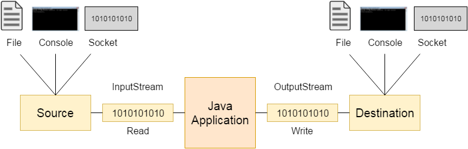

|                             |                          |                                        |
| --------------------------- | ------------------------ | -------------------------------------- |
| **Elektrotechniker/-in HF** | **Programmiertechnik B** |  |

- [1. Ein-/Ausgabe](#1-ein-ausgabe)
  - [1.1. E-Book](#11-e-book)
  - [1.2. EVA-Prinzip](#12-eva-prinzip)
  - [1.3. Grundlagen \& Begriffe](#13-grundlagen--begriffe)
  - [1.4. Input / Output – Dateien lesen](#14-input--output--dateien-lesen)
  - [1.5. Beispiel Datei öffnen](#15-beispiel-datei-öffnen)
  - [1.6. Beispiel Datei lesen](#16-beispiel-datei-lesen)
  - [1.7. Beispiel Datei formatiert schreiben](#17-beispiel-datei-formatiert-schreiben)
  - [1.8. Beispiel Literals (Umwandlungszeichen)](#18-beispiel-literals-umwandlungszeichen)
  - [1.9. Beispiel – Timestamp](#19-beispiel--timestamp)
  - [1.10. Beispiel Strukturen binär speichern](#110-beispiel-strukturen-binär-speichern)
  - [1.11. Übersicht der Dateifunktionen](#111-übersicht-der-dateifunktionen)
- [2. Aufgaben](#2-aufgaben)
  - [2.1. Textanalyse (Datei)](#21-textanalyse-datei)
  - [2.2. Formatierte Zeichenkette in Datei schreiben](#22-formatierte-zeichenkette-in-datei-schreiben)
  - [2.3. Formatierte Zeichenkette aus Datei lesen](#23-formatierte-zeichenkette-aus-datei-lesen)
  - [2.4. Einfache Logdatei schreiben und lesen](#24-einfache-logdatei-schreiben-und-lesen)
  - [2.5. Rollenspiel Persistenz](#25-rollenspiel-persistenz)

---

</br>

# 1. Ein-/Ausgabe

## 1.1. E-Book


## 1.2. EVA-Prinzip

- Eingabe – Verarbeitung - Ausgabe
- Standardbibliothek stdio.h – Konzept Streams (Datenströme)
- Grundprinzip von Unix – Streams können, Strings, Files sein



## 1.3. Grundlagen & Begriffe

- **Stream**
  - Abstraktion eines Datenflusses (Datei, Konsole, Socket). In C repräsentiert durch FILE* in <stdio.h>.
- **Pufferung**
  - stdio puffert Ein-/Ausgaben, um Systemaufrufe zu reduzieren.
- **Flushing**
  - `fflush(FILE*)` oder automatisch beim Schliessen (`fclose`).
- **Text vs. Binär**
  - Unter Windows unterscheidet `fopen` Modi bzgl. Zeilenenden (`"\r\n"` vs. `"\n"`).
  - Für Binärdaten unbedingt `"b"` verwenden (z.B. `"rb"`, `"wb"`).

## 1.4. Input / Output – Dateien lesen

- Zugriff auf eine Datei erfolgt über den **FILE-Pointer** mit `fopen` gibt `FILE*` zurück
- Struktur FILE hat einen Dateipuffer (Hauptspeicher), Status-Flags, Dateiende Status **EOF**
- Status-Abfrage: `feof` (Dateiendestatus) und `ferror` (Fehlerstatus)
- Öffnen der Datei: `fopen()` öffnet Datei mit definierte Zugriffsrechen wie lesend oder schreibend.
- Schliessen der Datei: `fclose()` schliesst die Datei und beendet alle Schreibvorgänge
- Lesen: `fgets(string, zeichen, file)` liest eine Zeile ein. Möchte man zeile für Zeile einlesen müss man mit dem EOF-Flag arbeiten.

## 1.5. Beispiel Datei öffnen

```c
include <stdio.h>
#include <errno.h>

int main(void) 
{
    // Modi: "r" "w" "a" + optional "b" und "+"
    FILE *f = fopen("daten.txt", "w"); 
    if (!f) 
    {
        perror("fopen"); // nutzt errno und gibt Systemfehlermeldung aus
        return 1;
    }
    fputs("Hallo Welt\n", f);

    if (fclose(f) != 0) // immer prüfen
    { 
        perror("fclose");
        return 1;
    }

    return 0;
}
```

**Häufige Modi:**

- `"r"` / `"rb"`: nur lesen, Datei muss existieren
- `"w"` / `"wb"`: neu schreiben (löscht existierende Datei)
- `"a"` / `"ab"`: anhängen
- `+` erlaubt Lesen und Schreiben: `"r+"`, `"w+"`, `"a+"` (vorsichtige Positionierung nötig)

## 1.6. Beispiel Datei lesen

```c
#include <stdio.h>
#include <stdlib.h>
void main() 
{
    FILE *file;
    char buffer[256];

    // Datei öffnen
    file = fopen("beispiel.txt", "r");
    if (file == NULL) 
    {
        perror("Fehler beim Öffnen der Datei");
        return EXIT_FAILURE;
    }

    // Zeilenweise lesen und ausgeben
    while (fgets(buffer, sizeof(buffer), file) != NULL) 
    {
        printf("%s", buffer);
    }

    // Datei schliessen
    fclose(file);
}
```

## 1.7. Beispiel Datei formatiert schreiben

```c
#include <stdio.h>

int main() 
{
  FILE *file = fopen("output.txt", "w");
  if (file != NULL) 
  {
    fprintf(file, "Name: %s\n", "Roman");
    fprintf(file, "Alter: %d\n", 30);
    fprintf(file, "Punktzahl: %.2f\n", 95.75);
    fclose(file);
  }

  return 0;
}
```

## 1.8. Beispiel Literals (Umwandlungszeichen)

```c
#include <stdio.h>
#include <stdlib.h>
int main() 
{
    FILE *file;

    // Beispielwerte für die verschiedenen Formate
    int int_value = 42;
    unsigned int uint_value = 3000000000U;
    char char_value = 'A';
    char str_value[] = "Hallo, Welt!";
    double double_value = 3.14159;
    void *ptr_value = &int_value;

    // Datei öffnen
    file = fopen("ausgabe.txt", "w");
    if (file == NULL) 
    {
        perror("Fehler beim Öffnen der Datei");
        return EXIT_FAILURE;
    }

    // Ausgabe von Ganzzahlen
    fprintf(file, "Dezimal: %d\n", int_value);
    fprintf(file, "Oktal: %o\n", uint_value);
    fprintf(file, "Hexadezimal (klein): %x\n", uint_value);
    fprintf(file, "Hexadezimal (gross): %X\n", uint_value);
    fprintf(file, "Unsigned Dezimal: %u\n", uint_value);
    fprintf(file, "Character: %c\n", char_value);

    // Ausgabe von Strings
    fprintf(file, "String: %s\n", str_value);

    // Ausgabe von Gleitpunktzahlen
    fprintf(file, "Dezimalzahl: %f\n", double_value);
    fprintf(file, "Exponentialzahl (klein): %e\n", double_value);
    fprintf(file, "Exponentialzahl (gross): %E\n", double_value);
    fprintf(file, "Allgemeines Format (klein): %g\n", double_value);
    fprintf(file, "Allgemeines Format (gross): %G\n", double_value);

    // Ausgabe von Pointern
    fprintf(file, "Pointer: %p\n", ptr_value);

    // Ausgabe des %% Zeichens
    fprintf(file, "Prozentzeichen: %%\n");

    // Speicherort der Anzahl geschriebener Zeichen
    int count;
    fprintf(file, "Anzahl der geschriebenen Zeichen: %n\n", &count);
    printf("Anzahl der geschriebenen Zeichen: %d\n", count);

    // Datei schliessen
    fclose(file);

    printf("Daten wurden in die Datei geschrieben.\n");
    return EXIT_SUCCESS;
}
```

## 1.9. Beispiel – Timestamp

```c
#include <stdio.h>
#include <stdlib.h>
#include <time.h>

void main() {
    FILE *file;
    time_t now;
    struct tm *timeinfo;
    char buffer[100];

    // Aktuelle Zeit ermitteln
    time(&now);
    timeinfo = localtime(&now);
    strftime(buffer, sizeof(buffer), "%Y-%m-%d-%H:%M:%S\n", timeinfo);

    // Datei öffnen zum Schreiben
    file = fopen("timestamp.txt", "w");
    if (file == NULL) {
        perror("Fehler beim Öffnen der Datei");
    }

    // Zeitstempel in die Datei schreiben
    fprintf(file, "%s\n", buffer);

    // Datei schliessen
    fclose(file);

    // Datei öffnen zum Lesen
    file = fopen("timestamp.txt", "r");
    if (file == NULL) {
        perror("Fehler beim Öffnen der Datei");
    }

    // Zeitstempel aus der Datei lesen
    fscanf(file, "%s", buffer);

    // Datei schliessen
    fclose(file);

    // Eingelesenen Zeitstempel ausgeben
    printf("Eingelesener Zeitstempel:\n");
    printf("%s\n", buffer);
}
```

## 1.10. Beispiel Strukturen binär speichern

```c
#include <stdint.h>
#include <stdio.h>

#pragma pack(push, 1) // nur wenn wirklich nötig; besser: Felder manuell schreiben
typedef struct {
    uint32_t id;
    int32_t  alter;
    double   kontostand;
} Kunde;
#pragma pack(pop)

void write_kunden(const char *pfad) {
    FILE *f = fopen(pfad, "wb");
    if (!f) { perror("fopen"); return; }
    Kunde k[2] = {{1, 30, 1234.56}, {2, 41, 9876.54}};
    if (fwrite(k, sizeof *k, 2, f) != 2) perror("fwrite");
    fclose(f);
}

void read_kunden(const char *pfad) {
    FILE *f = fopen(pfad, "rb");
    if (!f) { perror("fopen"); return; }
    Kunde k;
    while (fread(&k, sizeof k, 1, f) == 1) {
        printf("id=%u alter=%d saldo=%.2f\n", k.id, k.alter, k.kontostand);
    }
    if (!feof(f)) perror("fread");
    fclose(f);
}
```

## 1.11. Übersicht der Dateifunktionen

| Kategorie                     | Funktion                           | Beschreibung                                                                              |
| ----------------------------- | ---------------------------------- | ----------------------------------------------------------------------------------------- |
| **Datei öffnen / schliessen** | `fopen(pfad, modus)`               | Öffnet eine Datei (`"r"`, `"w"`, `"a"`, optional `b` für Binär, `+` für Lesen+Schreiben). |
|                               | `fclose(stream)`                   | Schliesst Datei, gibt 0 bei Erfolg zurück.                                                |
| **Schreiben**                 | `fputc(c, stream)`                 | Schreibt ein Zeichen.                                                                     |
|                               | `fputs(s, stream)`                 | Schreibt String (endet bei `\0`).                                                         |
|                               | `fprintf(stream, fmt, …)`          | Formatiertes Schreiben.                                                                   |
|                               | `fwrite(ptr, size, n, stream)`     | Schreibt `n` Blöcke à `size` Bytes (Binärdaten).                                          |
| **Lesen**                     | `fgetc(stream)`                    | Liest ein Zeichen (`EOF` bei Ende/Fehler).                                                |
|                               | `fgets(s, n, stream)`              | Liest bis `\n` oder max. `n-1` Zeichen.                                                   |
|                               | `fscanf(stream, fmt, …)`           | Formatiertes Lesen (fehleranfällig).                                                      |
|                               | `fread(ptr, size, n, stream)`      | Liest `n` Blöcke à `size` Bytes (Binärdaten).                                             |
| **Dateiposition**             | `fseek(stream, offset, origin)`    | Setzt Dateiposition relativ zu `SEEK_SET`, `SEEK_CUR`, `SEEK_END`.                        |
|                               | `ftell(stream)`                    | Gibt aktuelle Position zurück.                                                            |
|                               | `rewind(stream)`                   | Setzt Position auf Anfang.                                                                |
| **Status / Fehler**           | `feof(stream)`                     | Prüft, ob **Ende** erreicht.                                                              |
|                               | `ferror(stream)`                   | Prüft, ob **Fehler** aufgetreten ist.                                                     |
|                               | `clearerr(stream)`                 | Setzt Fehler-/EOF-Flags zurück.                                                           |
|                               | `perror(msg)`                      | Gibt Fehlermeldung zu `errno` aus.                                                        |
| **Pufferung**                 | `fflush(stream)`                   | Erzwingt Puffer-Schreiben.                                                                |
|                               | `setvbuf(stream, buf, mode, size)` | Legt Pufferungsmodus fest (`_IOFBF`, `_IOLBF`, `_IONBF`).                                 |
| **Temporäre Dateien**         | `tmpfile()`                        | Erstellt temporäre Datei (automatisch gelöscht bei `fclose`).                             |
|                               | `tmpnam(s)`                        | Erzeugt temporären Dateinamen (unsicher, vermeiden!).                                     |

---

# 2. Aufgaben

## 2.1. Textanalyse (Datei)

| **Vorgabe**         | **Beschreibung**                               |
| :------------------ | :--------------------------------------------- |
| **Lernziele**       | Kann das Ein-/Ausgabe Konzept korrekt anwenden |
|                     | Kann eine Datei korrekt lesen                  |
|                     | Kann den Textinhalt einer Datei anlaysieren    |
| **Sozialform**      | Einzelarbeit                                   |
| **Auftrag**         | siehe unten                                    |
| **Hilfsmittel**     |                                                |
| **Zeitbedarf**      | 40min                                          |
| **Lösungselemente** |                                                |

Schreibe ein C-Programm, welches eine `Beispieldatei.txt` einliest die Anzahl Wörter, Anzahl Zeichen und Anzahl Zeilen herausgibt.

## 2.2. Formatierte Zeichenkette in Datei schreiben

| **Vorgabe**         | **Beschreibung**                                      |
| :------------------ | :---------------------------------------------------- |
| **Lernziele**       | Kann das Ein-/Ausgabe Konzept korrekt anwenden        |
|                     | Kann formatierte Zeichenkette in eine Datei schreiben |
|                     | Kann den Textinhalt einer Datei anlaysieren           |
| **Sozialform**      | Einzelarbeit                                          |
| **Auftrag**         | siehe unten                                           |
| **Hilfsmittel**     |                                                       |
| **Zeitbedarf**      | 30min                                                 |
| **Lösungselemente** |                                                       |

Schreibe ein C-Programm, welches folgende formatierte Textzeilen in einer `Output.txt`-Datei speichert:

```console
Ganzzahl (dezimal): 20
Positive Ganzzahl (dezimal): 3000
Positive Ganzzahl (oktale Darstellung): 5670
Positive Ganzzahl (hexadezimale Darstellung): bb8
Zeichen: A
Zeichenkette: Hallo
Gleitkommazahl (dezimal): 141.123400
Gleitkommazahl (exponential): 1.411234e+02
Gleitkommazahl (allgemeines Format): 141.123
```

## 2.3. Formatierte Zeichenkette aus Datei lesen

| **Vorgabe**         | **Beschreibung**                               |
| :------------------ | :--------------------------------------------- |
| **Lernziele**       | Kann das Ein-/Ausgabe Konzept korrekt anwenden |
|                     | Kann formatierte Werte aus einer Datei lesen   |
| **Sozialform**      | Einzelarbeit                                   |
| **Auftrag**         | siehe unten                                    |
| **Hilfsmittel**     |                                                |
| **Zeitbedarf**      | 30min                                          |
| **Lösungselemente** |                                                |

Schreibe ein C-Programm, welches die Datei `Output.txt` der vorherigen Übung einliest und auf der Konsole ausgibt.

## 2.4. Einfache Logdatei schreiben und lesen

| **Vorgabe**         | **Beschreibung**                                      |
| :------------------ | :---------------------------------------------------- |
| **Lernziele**       | Kann das Ein-/Ausgabe Konzept korrekt anwenden        |
|                     | Kann formatierte Werte eine Datei schreiben und lesen |
| **Sozialform**      | Einzelarbeit                                          |
| **Auftrag**         | siehe unten                                           |
| **Hilfsmittel**     |                                                       |
| **Zeitbedarf**      | 30min                                                 |
| **Lösungselemente** |                                                       |

Schreibe ein C-Programm, welches eine einfache Log-Datei mit **Timestamps** erstellt und danach den Inhalt der Datei auf die Konsole ausgibt.
Das Programm soll die Funktionen `writeLog()` und `readLog()` enthalten und folgendes ausgeben:

```console
[2025-08-26 12:34:10] Programm gestartet 
[2025-08-26 12:34:10] Erstes Ereignis 
[2025-08-26 12:34:10] Zweites Ereignis 
[2025-08-26 12:34:10] Programm beendet
```

## 2.5. Rollenspiel Persistenz

| **Vorgabe**         | **Beschreibung**                                      |
| :------------------ | :---------------------------------------------------- |
| **Lernziele**       | Kann das Ein-/Ausgabe Konzept korrekt anwenden        |
|                     | Kann formatierte Werte eine Datei schreiben und lesen |
| **Sozialform**      | Einzelarbeit                                          |
| **Auftrag**         | siehe unten                                           |
| **Hilfsmittel**     |                                                       |
| **Zeitbedarf**      | 60min                                                 |
| **Lösungselemente** |                                                       |

- Erweitere das Rollenspiel damit ein Spielstand gespeichert und wieder geladen werden kann.
- Mache dazu ein neues Modul `persist.c` und implementiere die Methoden `loadGame(..)` und `saveGame(..)`.
- Benutze in der Spielmechanik die Methoden an der richtigen Stelle.
- Frage beim Spielstart, ob ein Spielstand geladen werden soll.
- Das Spiel kann immer vor der Monsterwahl mit `q` beendet werden.
- Beim Beenden wird der Spielstand in das File `saveGame.dat` gespeichert.
